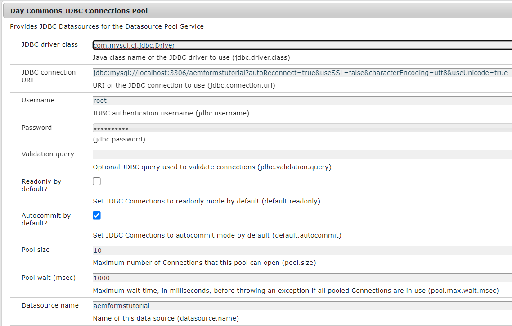

# Storing Adaptive Form Submissions in Database

There are number of ways to store the submitted form data in the database of your choice. A JDBC data source can be used to directly store the data into the database. A custom OSGI bundle can be written to store the data into the database. This article uses custom process step in AEM workflow to store the data.
The use case is to trigger a AEM workflow on an Adaptive Form submission and a step in the workflow stores the submitted data into the data base. 


## JDBC Connection Pool

* Go to [ConfigMgr](http://localhost:4502/system/console/configMgr)

  * Search for "JDBC Connection Pool". Create a new Day Commons JDBC Connection Pool. Specify the settings specific to your database.

  * 

## Specify Database Details

* Search for "**Specify Database details**"
* Specify the properties specific to your database.
    * DataSourceName:Name of the datasource you configured previously.
    * TableName - Name of the table in which you want to store the AF Data
    * FormName - Column name to hold the name of the Form
    * ColumnName - Column name to hold the AF Data

  


## Code for OSGi configuration

``` java
package com.aemforms.dbsamples.core.insertFormData;

import org.osgi.service.metatype.annotations.AttributeDefinition;
import org.osgi.service.metatype.annotations.ObjectClassDefinition;

@ObjectClassDefinition(name = "Specify Database details", description = "Specify Database details")

public @interface InsertFormDataConfiguration {
  @AttributeDefinition(name = "DataSourceName", description = "Data Source Name configured")
  String dataSourceName() default "";
  @AttributeDefinition(name = "TableName", description = "Name of the table")
  String tableName() default "";
  @AttributeDefinition(name = "FormName", description = "Column Name for form name")
  String formName() default "";
  @AttributeDefinition(name = "columnName", description = "Column Name for form data")
  String columnName() default "";

}
```

## Read Configuration Values

```java
package com.aemforms.dbsamples.core.insertFormData;
import org.osgi.service.component.annotations.Activate;
import org.osgi.service.component.annotations.Component;
import org.osgi.service.metatype.annotations.Designate;

@Component(service={InsertFormDataConfigurationService.class})
@Designate(ocd=InsertFormDataConfiguration.class)

public class InsertFormDataConfigurationService {
    public String TABLE_NAME;
    public String DATA_SOURCE_NAME;
    public String COLUMN_NAME;
    public String FORM_NAME;
    @Activate      
      protected final void activate(InsertFormDataConfiguration insertFormDataConfiguration)
      {
        TABLE_NAME = insertFormDataConfiguration.tableName();
        DATA_SOURCE_NAME = insertFormDataConfiguration.dataSourceName();
        COLUMN_NAME = insertFormDataConfiguration.columnName();
        FORM_NAME = insertFormDataConfiguration.formName();
      }
    public String getTABLE_NAME()
    {
        return TABLE_NAME;
    }
    public String getDATA_SOURCE_NAME()
    {
        return DATA_SOURCE_NAME;
    }
    public String getCOLUMN_NAME()
    {
        return COLUMN_NAME;
    }
    public String getFORM_NAME()
    {
        return FORM_NAME;
    }
}

```

## Code to implement the process step

``` java
package com.aemforms.dbsamples.core.insertFormData;
import java.io.InputStream;
import java.io.StringWriter;
import java.nio.charset.StandardCharsets;
import java.sql.Connection;
import java.sql.PreparedStatement;
import java.sql.SQLException;

import javax.jcr.Node;
import javax.jcr.Session;
import javax.sql.DataSource;

import org.apache.commons.io.IOUtils;
import org.osgi.framework.Constants;
import org.osgi.service.component.annotations.Component;
import org.osgi.service.component.annotations.Reference;
import org.slf4j.Logger;
import org.slf4j.LoggerFactory;

import com.adobe.granite.workflow.WorkflowException;
import com.adobe.granite.workflow.WorkflowSession;
import com.adobe.granite.workflow.exec.WorkItem;
import com.adobe.granite.workflow.exec.WorkflowProcess;
import com.adobe.granite.workflow.metadata.MetaDataMap;
import com.day.commons.datasource.poolservice.DataSourcePool;

@Component(property = {
  Constants.SERVICE_DESCRIPTION + "=Insert Form Data in Database",
  Constants.SERVICE_VENDOR + "=Adobe Systems",
  "process.label" + "=Insert Form Data in Database"
})

public class InsertAfData implements WorkflowProcess {
  @Reference
  InsertFormDataConfigurationService insertFormDataConfig;
  @Reference
  DataSourcePool dataSourcePool;
  private final Logger log = LoggerFactory.getLogger(getClass());
  @Override
  public void execute(WorkItem workItem, WorkflowSession session, MetaDataMap metaDataMap) throws WorkflowException {

    String proccesArgsVals = (String) metaDataMap.get("PROCESS_ARGS", (Object)
      "string");
    String[] values = proccesArgsVals.split(",");
    String AdaptiveFormName = values[0];
    String formDataFile = values[1];
    String payloadPath = workItem.getWorkflowData().getPayload().toString();
    Session jcrSession = (Session) session.adaptTo((Class) Session.class);
    String dataFilePath = payloadPath + "/" + formDataFile + "/jcr:content";
    log.debug("The data file path is " + dataFilePath);
    PreparedStatement ps = null;
    Connection con = null;
    DataSource dbSource = null;

    try {
      dbSource = (DataSource) dataSourcePool.getDataSource(insertFormDataConfig.getDATA_SOURCE_NAME());
      log.debug("Got db source");
      con = dbSource.getConnection();

      Node xmlDataNode = jcrSession.getNode(dataFilePath);
      InputStream xmlDataStream = xmlDataNode.getProperty("jcr:data").getBinary().getStream();
      StringWriter writer = new StringWriter();
      String encoding = StandardCharsets.UTF_8.name();
      IOUtils.copy(xmlDataStream, writer, encoding);
      String queryStmt = "insert into " + insertFormDataConfig.TABLE_NAME + "(" + insertFormDataConfig.COLUMN_NAME + "," + insertFormDataConfig.FORM_NAME + ") values(?,?)";
      log.debug("The query Stmt is " + queryStmt);
      ps = con.prepareStatement(queryStmt);
      ps.setString(1, writer.toString());
      ps.setString(2, AdaptiveFormName);
      ps.executeUpdate();

    } catch (Exception e) {
      log.debug("The error message is " + e.getMessage());
    } finally {
      if (ps != null) {
        try {
          ps.close();
        } catch (SQLException sqlException) {
          log.debug(sqlException.getMessage());
        }
      }
      if (con != null) {
        try {
          con.close();
        } catch (SQLException sqlException) {
          log.error("Unable to close connection to database", sqlException);
        }
      }
    }
  }

}
```

## Deploy the sample assets 

* Make sure you have configured your JDBC Connection pool
* Specify the database details using the configMgr
* [Download the Zip file and extract its contents on to your hard drive](assets/article-assets.zip)

  * Deploy the jar file using [AEM web console](http://localhost:4502/system/console/bundles). This jar file contains the code to store the form data in the database.

  * Import the two zip files into [AEM using package manager](http://localhost:4502/crx/packmgr/index.jsp). This will get you the [sample workflow](http://localhost:4502/editor.html/conf/global/settings/workflow/models/storeformdata.html) and the [sample adaptive form](http://localhost:4502/editor.html/content/forms/af/addformdataindb.html) that will trigger the workflow on form submission. Notice the process arguments in the workflow step. These arguments indicate the formname and the name of the data file that will contain the adaptive form data. The data file is stored under the payload folder in the crx repository. Notice how the [adaptive form](http://localhost:4502/editor.html/content/forms/af/addformdataindb.html) is configured to trigger the AEM workflow on submission and the data file configuration(data.xml)

  * Preview and fill in the form and submit. You should see a new row created in your database
  