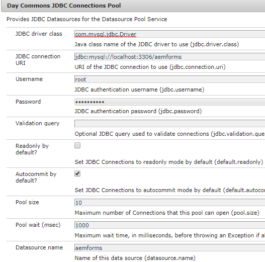
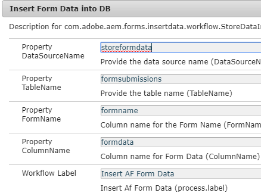
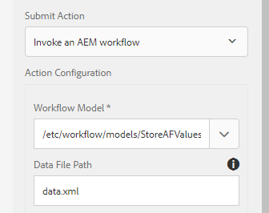

# Storing Adaptive Form Submissions in Database

There are number of ways to store the submitted form data in the database of your choice. A JDBC data source can be used to directly store the data into the database. A custom OSGI bundle can be written to store the data into the database. This article uses custom process step in AEM workflow to store the data.
The use case is to trigger a AEM workflow on an Adaptive Form submission and a step in the workflow stores the submitted data into the data base. 

**Please follow the steps mentioned below to get this working on your system**

* [Download the Zip file and extract its contents on to your hard drive](assets/storeafdataindb.zip)

  * Import the StoreAFInDBWorkflow.zip into AEM using package manager. Package has sample workflow which stores the AF data into DB. Open the workflow model. The workflow has only one step. This step calls the code written in the bundle to store the AF data into the Database. I am passing a single argument to the process. This is the name of the Adaptive Form whose data is being saved.
  * Deploy the insertdata.core-0.0.1-SNAPSHOT.jar using Felix web console. This bundle has the code to write the submitted form data to the database

* Go to [ConfigMgr](http://localhost:4502/system/console/configMgr)

  * Search for "JDBC Connection Pool". Create a new Day Commons JDBC Connection Pool. Specify the settings specific to your database.

  * 
  * Search for "**Insert Form Data Into DB**"
  * Specify the properties specific to your database.
    * DataSourceName:Name of the datasource you configured previously.
    * TableName - Name of the table in which you want to store the AF Data
    * FormName - Column name to hold the name of the Form
    * ColumnName - Column name to hold the AF Data

  

* Create an Adaptive Form.

* Associate the Adaptive Form with AEM Workflow(StoreAFValuesinDB) as shown in the screen shot below.

* Make sure you specify "data.xml" in the data file path as shown in the screen shot below

  

* Preview the form and submit

* If everything has gone well, you should see the Form Data being stored in the table and column specified by you

