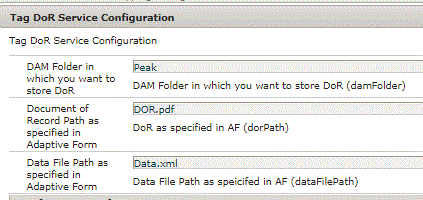

# Tagging and Storing AEM Forms DoR in DAM {#tagging-and-storing-aem-forms-dor-in-dam}

This article will walk through the use case of storing and tagging the DoR generated by AEM Forms in AEM DAM. The tagging of the document is done based on the submitted form data.

A common ask from customers is to store and tag the Document of Record(DoR) generated by AEM Forms in AEM DAM. The tagging of the document needs to be based on the Adaptive Forms' submitted data. For example, if the employment status in the submitted data is "Retired", we want to tag the document with "Retired" tag and store the document in DAM.

The use case is as follows:

* A user fills out Adaptive Form. In the adaptive form, the user's marital status(ex Single) and employment status (Ex Retired)is captured.
* On form submission, an AEM Workflow is triggered. This workflow tags the document with the marital status(Single) and employment status(Retired) and stores the document in DAM.
* Once the document is stored in DAM, the administrator should be able to search the document by these tags. For example search on Single or Retired would fetch the appropriate DoR's.

To satisfy this use case a custom process step was written. In this step we fetch the values of the appropriate data elements from the submitted data. We then construct the tag tile using this value. For example if the value of marital status element is "Single", the tag title becomes **Peak:EmploymentStatus/Single. **Using the TagManager API , we find the tag and apply the tag to the DoR.

The following code snippet show you how to find the tag and apply the tag to the document.

```java
Tag tagFound = tagManager.resolveByTitle(tagTitle+xmlElement.getTextContent());
//tagTitle is "Peak:EmploymentStatus/" and the xmlElement.getTextContent() will return the value Single. So the tag title becomes Peak:EmploymentStatus/Single. Once the tag is found we put the tag in array and apply the tags to the resource as shown below
tagArray[i] = tagFound;
tagManager.setTags(metadata, tagArray, true);
```

To get this sample working on your system,Please follow the steps listed below:
* [Deploy the Developingwithserviceuser bundle](/help/forms/assets/common-osgi-bundles/DevelopingWithServiceUser.jar)

* [Download and deploy the setvalue bundle](/help/forms/assets/common-osgi-bundles/SetValueApp.core-1.0-SNAPSHOT.jar). This is the custom OSGI bundle which sets the tags from the submitted form data.

* [Download the Sample Adaptive Form](assets/tag-and-store-in-dam-assets.zip)

* [Go to Forms And Documents](http://localhost:4502/aem/forms.html/content/dam/formsanddocuments)

* Click on Create | File Upload and upload the sampleadaptiveform.zip

* [Import the article assets](assets/tag-and-store-in-dam-assets.zip) using AEM package manager
* Open the [sample form in preview mode](http://localhost:4502/content/dam/formsanddocuments/summit/peakform/jcr:content?wcmmode=disabled). Fill in the People section and submit the form.
* [Navigate to Peak folder in DAM](http://localhost:4502/assets.html/content/dam/Peak). You should see DoR in the Peak folder. Check the properties of the document. It should be tagged appropriately.
Congratulations!! You have successfully installed the sample on your system

* Let's explore the [workflow](http://localhost:4502/editor.html/conf/global/settings/workflow/models/TagAndStoreDoRinDAM.html) which gets triggered on form submission.
* The first step in the workflow creates a unique file name by concatenating applicants name and county of residence. 
* The second step of the workflow passes the tag hierarchy and the form fields elements that need to be tagged. The process step extracts the value from the submitted data and constructs the tag title that needs to tag the document.
* If you want to store DoR in a different folder in the DAM, you specify the folder location using the configuration properties as specified in the screenshot below.

The other two parameters are specific to DoR and Data File Path as specified in the Adaptive Form submission options. Please make sure the values you specify here match with the values you specified in the Adaptive Form submission options.



