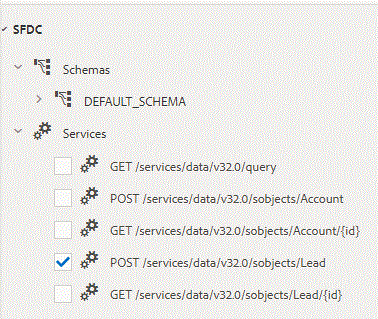
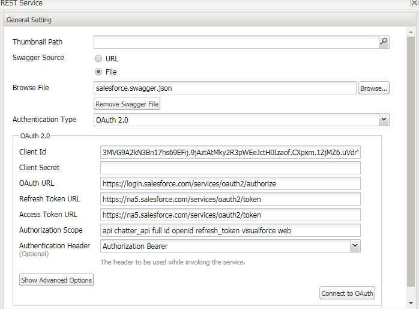

# Configuring DataSource with Salesforce in AEM Forms 6.3 and 6.4{#configuring-datasource-with-salesforce-in-aem-forms-and}

## Prerequisites {#prerequisites}

In this article, we will walk through the process of creating Data Source with Salesforce

Prerequisites for this tutorial:

* Scroll to the bottom of this page and download the swagger file and save it your hard drive.
* AEM Forms with SSL enabled

    * [Official Documentation for enabling SSL on AEM 6.3](https://helpx.adobe.com/experience-manager/6-3/sites/administering/using/ssl-by-default.html)
    * [Official Documentation for enabling SSL on AEM 6.4](https://helpx.adobe.com/experience-manager/6-4/sites/administering/using/ssl-by-default.html)

* You will need to have Salesforce Account
* You will need to create a Connected App. The official documentation form Salesforce for creating the app is listed [here](https://help.salesforce.com/articleView?id=connected_app_create.htm&type=0).
* Provide appropriate OAuth Scopes for the App(I have selected all the available OAuth Scopes for the purpose of testing)
* Provide the callback URL. The callback URL in my case was

    * If you are using **AEM Forms 6.3**, the callback URL will be https://gbedekar-w7-1:6443/etc/cloudservices/fdm/createlead.html. In this URL  createlead  is the name of my form data model.
    
    * If you are using** AEM Forms 6.4**, the callback URL will be [https://gbedekar-w7-:6443/libs/fd/fdm/gui/components/admin/fdmcloudservice/createcloudconfigwizard/cloudservices.html](https://gbedekar-w7-1:6443/libs/fd/fdm/gui/components/admin/fdmcloudservice/createcloudconfigwizard/cloudservices.html)

In this example  gbedekar -w7-1:6443 is the name of my server and the port on which AEM is running.

Once you have created the Connected App note the **Consumer Key and Secret Key**. You will need these when creating the data source in AEM Forms.

Now that you have created your connected app, you will then need to create a swagger file for the operations that you need to perform in salesforce. A sample swagger file is included as part of the downloadable assets. This swagger file allows you to create "Lead" object on Adaptive Form submission. Please explore this swagger file.

The next step is to create Data Source in AEM Forms. Please follow the following steps according to your AEM Forms version

## AEM Forms 6.3 {#aem-forms}

* Login to AEM Forms using the https protocol
* Navigate to cloud services by typing in https://&lt;servername&gt;:&lt;serverport&gt; /etc/cloudservices.html, For example, https://gbedekar-w7-1:6443/etc/cloudservices.html
* Scroll down to "Form Data Model". 
* Click on "Show Configurations". 
* Click "+" to add new configuration
* Select "Rest Full Service". Provide meaningful Title and Name to the configuration. For instance,

    * Name: CreateLeadInSalesForce
    * Title: CreateLeadInSalesForce

* Click "Create"

**In the next screen **

* Select "File" as the option for your swagger source file. Browse to the file you downloaded earlier
* Select Authentication Type as OAuth2.0
* Provide the ClientID and Client Secret values
* OAuth Url is - **https://login.salesforce.com/services/oauth2/authorize**
* Refresh Token Url - **https://na5.salesforce.com/services/oauth2/token**
* **Access Toke Url - https://na5.salesforce.com/services/oauth2/token**
* Authorization Scope: ** api   chatter_api full id   openid   refresh_token  visualforce  web**
* Authentication Handler: Authorization Bearer
* Click on "Connect To  OAUTH ".If everything goes well, you should not see any errors

Once you have created your Form Data Model using Salesforce, you can then create Form Data Integration using the Data Source that you have just created. The official documentation for creating Form Data Integration is [here](https://helpx.adobe.com/aem-forms/6-3/data-integration.html).

Make sure you configure the Form Data Model to include the POST service to create a Lead object in SFDC.

You will also have to configure Read and Write Service for the Lead object. Please refer to the screenshots at the bottom of this page.

After creating the Form Data Model, you can create Adaptive Forms based on this model and use the Form Data Model submission methods to create Lead in SFDC.

## AEM Forms 6.4 {#aem-forms-1}

* Create Data Source

    * [Navigate to Data Sources](http://localhost:4502/libs/fd/fdm/gui/components/admin/fdmcloudservice/fdm.html/conf/global)
       
    * Click the "Create" button
    * Provide some meaningful values

        * Name: CreateLeadInSalesForce
        * Title: CreateLeadInSalesForce
        * Service Type: RESTful service

    * Click Next
    * Swagger Source: File
    * Browse and select the swagger file that you have downloaded in the previous step
    * Authentication Type: OAuth 2.0. Specify the following values
    * Provide the ClientID and Client Secret values
    * OAuth Url is - **https://login.salesforce.com/services/oauth2/authorize**
    * Refresh Token Url - **https://na5.salesforce.com/services/oauth2/token**
    * Access Token Ur**l - https://na5.salesforce.com/services/oauth2/token**
    * Authorization Scope: ** api  chatter_api full id  openid  refresh_token  visualforce  web**
    * Authentication Handler: Authorization Bearer
    * Click on "Connect to OAuth" button. Should you see any errors, please review the preceding steps to ensure all of the information was entered accurately.

Once you have created your Data Source using SalesForce, you can then create Form Data Integration using the Data Source that you have just created. The documentation link for that is [here](https://helpx.adobe.com/experience-manager/6-4/forms/using/create-form-data-models.html)

Make sure you configure the Form Data Model to include the POST service to create a Lead object in SFDC.

You will also have to configure Read and Write Service for the Lead object. Please refer to the screenshots at the bottom of this page.

After creating the Form Data Model, you can create Adaptive Forms based on this model and use the Form Data Model submission methods to create Lead in SFDC.

>[!NOTE]
>
>Ensure the  url  in the swagger file corresponds to your region. For example, the  url  in the sample swagger file is "na46.salesforce.com" as the account was created in North America. The easiest way is to  login  to your Salesforce account and  check  the  url .

 

[SampleSwaggerFile](assets/swagger-sales-force-lead.json)
