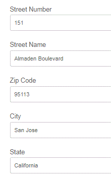

# Using Geolocation API's in Adaptive Forms{#using-geolocation-api-s-in-adaptive-forms}

In this article, we will take a look at using Google's Geolocation API to populate fields of an Adaptive Form. This use case is commonly used when you want to populate the current address fields on a form.

The following steps were followed to use the Geolocation API in Adaptive Forms.

 1. [Get API Key](https://developers.google.com/maps/documentation/javascript/get-api-key) from Google to use the Google Maps platform. You can get a trial key which is valid for 1 year.

1. Adaptive Form fragment was created with fields to hold the current address

1. The Geolocation API was invoked on the click event of the image object of Adaptive Form

1. The JSON data returned by the API call was parsed and the Adaptive Form fields values were set accordingly.

```javascript
navigator.geolocation.getCurrentPosition(showPosition);
function showPosition(position) 
{
console.log(" I am inside the showPosition in fragment");
console.log("Latitude: " + position.coords.latitude + "Longitude " + position.coords.longitude);
var url = "https://maps.googleapis.com/maps/api/geocode/json?latlng="+position.coords.latitude+","+position.coords.longitude+"&key=<your_api_key>";
  console.log(url);
  
  $.getJSON(url,function (data, textStatus){
    
    var location=data.results[0].formatted_address;
    console.log(location);
    
    for(i=0;i<data.results[0].address_components.length;i++)
        {
          if(data.results[0].address_components[i].types[0] == "street_number")
            {
              streetNumber.value = data.results[0].address_components[i].long_name;
            }
          if(data.results[0].address_components[i].types[0] == "route")
            {
              streetName.value = data.results[0].address_components[i].long_name;
            }
            if(data.results[0].address_components[i].types[0] == "postal_code")
            {
              
              zipCode.value = data.results[0].address_components[i].long_name;
            }
            if(data.results[0].address_components[i].types[0] == "locality")
            {
              
              city.value = data.results[0].address_components[i].long_name;
            }
          if(data.results[0].address_components[i].types[0] == "administrative_area_level_1")
            {
              
              state.value = data.results[0].address_components[i].long_name;
            }
        }
    
  });
}

```



In line 1 we use the HTML Geolocation API is used to get the current location. Once the current location is obtained we pass the current location to showPosition function.

In the showPosition function, we use the Google API to fetch the address details for the given latitude and longitude.

The JSON returned by the API is then parsed to set the Adaptive Form fields.

>[!NOTE]
>
>For testing purposes, you can use the HTTP protocol with localhost in the URL.
>
>For the production server, you will need to enable SSL for your AEM Server to get this capability.
>
>The sample associated with this article has been tested with US address. If you want to use this capability in other geographical locations you may have to tweak the JSON parsing.

To get this capability on to your server, please follow the following steps

* Install and start  AEM  Forms server. 
>![NOTE] This capability was tested on AEM Forms 6.3 and above
* [Get  Google  API Key](https://developers.google.com/maps/documentation/javascript/get-api-key).
* [Import the assets related to this article into AEM.](assets/geolocationapi.zip) 
* [Open the Adaptive Form fragment in edit mode.](http://localhost:4502/editor.html/content/forms/af/currentaddressfragment.html)
* Open the rule editor for Image Choice component.
* Replace the &lt;your_api_key&gt; with the Google API Key.
* Save your changes.
* [Preview the form](http://localhost:4502/content/dam/formsanddocuments/currentaddressfragment/jcr:content?wcmmode=disabled).
* Click on the "geolocation" icon.
* Your form should be populated with your current location.
