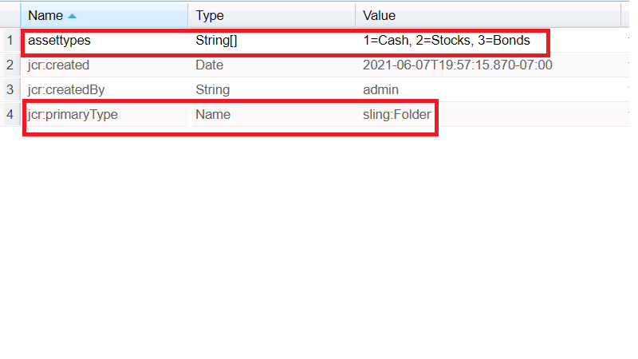

# Item Load Property in AEM Forms

Configure and populate drop down list using the item load path property.
The Item Load Path field allow an author to provide a url from which it loads the options available in a dropdown list.
To create such a node in crx please follow the steps mentioned below:
* Login to crx
* Create a node called assets(you can name this node as per your requirement) type sling:folder under content.
* Save
* Click on the newly created assets node and set its properties as shown below
* You will need to create a property of type String called assettypes(you can name it as per your requirement).Make sure the property is a multivalue. Provide the values that you want and save.

To load these values in your drop down list, provide the following path in the item load path property  **/content/assets/assettypes**

The sample package can be [downloaded from here](assets/item-load-path-package.zip)
