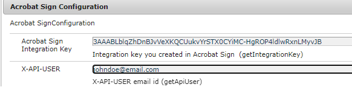

# Using Adobe Sign helper methods

In certain use cases, you may have the requriement to send a document for signatures without using an AEM workflow. In such cases, it will be very convenient to use the wrapper methods exposed by the sample bundle provided in this article.

## Deploy the sample OSGi bundle

[Deploy the OSGi bundle](assets/AdobeSignHelperMethods.core-1.0.0-SNAPSHOT.jar) via the AEM OSGi Web Console. Specify the API integration key and API user using the OSGi configuration as shown below, via the AEM OSGi Web Console's Configuration Manager.

![>NOTE] Please note that the `AdobeSignHelperMethods` OSGi bundle is not recognized as an Adobe Experience Manager (AEM) product code and, as such, it is not supported by Adobe Support.



## API documentation

The following are available via the `AcrobatSignHelperMethods` OSGi service provided in the OSGi bundle.

### getTransientDocumentID

`String getTransientDocumentID(Document documentForSigning) throws IOException`


 The document that is used to create an agreement or a web form. The document is first uploaded to Acrobat Sign by the sender. This is referred to as _transient_ since it is available for use only for 7 days after the upload. This methods accepts `com.adobe.aemfd.docmanager.Document` and returns transient document Id.

### getAgreementID

`String getAgreementId(String transientDocumentID, String email) throws ClientProtocolException, IOException`

Send the document for signing using the transient document Id for signing to the user identified by the email parameter.

### getWidgetID

`String getWidgetID(String transientDocumentID)`

 A widget is like a reusable template that can be presented to users multiple times and signed multiple times. Use this method to get widget Id using the transient document Id.

### getWidgetURL

`String getWidgetURL(String widgetId) throws ClientProtocolException, IOException`

Get a widget URL for a specific widget Id. This widget URL can then be presented to the users for signing the document.

## Use the API

The `AcrobatSignHelperMethods` is an OSGi service, so it must be annotated using the @Reference annotation in your java code.

```java
...
// Import the AcrobatSignHelperMethods from the provided bundle
import com.acrobatsign.core.AcrobatSignHelperMethods;
...

@Component(service = { Example.class })
public class ExampleImpl implements Example {

 // Gain a reference to the provided AcrobatSignHelperMethods OSGi service
 @Reference
 com.acrobatsign.core.AcrobatSignHelperMethods acrobatSignHelperMethods;

 function void example() { 
    ...
    // Use the AcrobatSignHelperMethods API methods in your code
    String transientDocumentId = acrobatSignHelperMethods.getTransientDocumentID(documentForSigning);

    String agreementId = acrobatSignHelperMethods.getAgreementId(transientDocumentID, "johndoe@example.com");
    ...
 }
}
```
 
