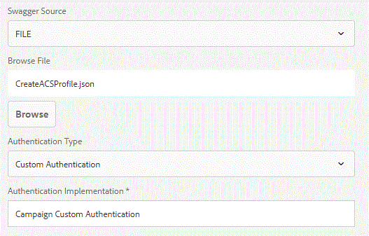

# Create Campaign Profile Using Form Data Model {#create-campaign-profile-using-form-data-model}

Steps involved in creating Adobe Campaign Standard profile using  AEM Forms Form Data Model

## Create Custom Authentication {#create-custom-authentication}

When creating Data Source with the swagger file, AEM Forms supports the following kinds of authentication types

* None
* OAuth 2.0
* Basic Authentication
* API Key
* Custom Authentication



We will have to use custom authentication to make REST calls to Adobe Campaign Standard.

To use custom authentication, we will have to develop an OSGi component that implements the  IAuthentication  interface

The method getAuthDetails needs to be implemented. This method will return  AuthenticationDetails  object. This AuthenticationDetails object will have the required HTTP headers set that is needed to make the REST API call to Adobe Campaign.

The following is the code that was used in creating custom authentication. The method getAuthDetails does all the work. We create AuthenticationDetails object. Then we add the appropriate HttpHeaders to this object and return this object.

```java {.line-numbers}
package aemfd.campaign.core;

import java.io.IOException;
import java.security.NoSuchAlgorithmException;
import java.security.spec.InvalidKeySpecException;

import org.osgi.service.component.annotations.Component;
import org.osgi.service.component.annotations.Reference;
import org.slf4j.Logger;
import org.slf4j.LoggerFactory;

import com.adobe.aemfd.dermis.authentication.api.IAuthentication;
import com.adobe.aemfd.dermis.authentication.exception.AuthenticationException;
import com.adobe.aemfd.dermis.authentication.model.AuthenticationDetails;
import com.adobe.aemfd.dermis.authentication.model.Configuration;

import aemforms.campaign.core.CampaignService;
import formsandcampaign.demo.CampaignConfigurationService;
@Component(service=IAuthentication.class,immediate=true)

public class CampaignAuthentication implements IAuthentication {
 @Reference
 CampaignService campaignService;
  @Reference
     CampaignConfigurationService config;
private Logger log = LoggerFactory.getLogger(CampaignAuthentication.class);
 @Override
 public AuthenticationDetails getAuthDetails(Configuration arg0) throws AuthenticationException {
 try {
   AuthenticationDetails auth = new AuthenticationDetails();
   auth.addHttpHeader("Cache-Control", "no-cache");
   auth.addHttpHeader("Content-Type", "application/json");
   auth.addHttpHeader("X-Api-Key",config.getApiKey() );
         auth.addHttpHeader("Authorization", "Bearer "+campaignService.getAccessToken());
         log.debug("Returning auth");
         return auth;
   
  } catch (NoSuchAlgorithmException e) {
   // TODO Auto-generated catch block
   e.printStackTrace();
  } catch (InvalidKeySpecException e) {
   // TODO Auto-generated catch block
   e.printStackTrace();
  } catch (IOException e) {
   // TODO Auto-generated catch block
   e.printStackTrace();
  }
  return null;
  
 }

 @Override
 public String getAuthenticationType() {
  // TODO Auto-generated method stub
  return "Campaign Custom Authentication";
 }

}

```

## Create Data Source {#create-data-source}

The first step is to create the swagger file. The swagger file defines the REST API which is going to be used to create a profile in Adobe Campaign Standard. The swagger file defines the input parameters and the output parameters of the REST API.

A data source is created using the swagger file. When creating Data Source you can specify the authentication type. In this case we are going to use custom authentication to authenticate against Adobe Campaign.The code listed above was used to authenticate against Adobe Campaign.

Sample swagger file is given to you as part of the asset's related to this article.**Make sure you change the host and basePath in the swagger file to match your ACS instance**

## Test the solution {#test-the-solution}

To test the solution please follow the following steps:

* [Download and unzip the assets related to this article.](assets/osgibundles.zip)
* Deploy the OSGi bundle using the Felix web console in AEM.
* [Download and unzip this file to get the swagger file](assets/createacsprofile.zip)
* Create Data Source using the swagger file
Create Form Data Model and base it on the Data Source created in the previous step
* Create an Adaptive Form based on the Form Data Model created in the earlier step.
* Drag and drop the following elements from the data sources tab on to the Adaptive Form

  * Email
  * First Name
  * Last Name
  * Mobile Phone

* Configure the submit action to "Submit using Form Data Model".
* Configure the Data Model to submit appropriately.
* Preview the form. Fill in the fields and submit.
* Verify profile is created in Adobe Campaign Standard.
