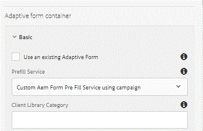

# Prefilling Adaptive Form using ACS Profile {#prefilling-adaptive-form-using-acs-profile}

In this part, we will pre-fill Adaptive Form with profile information fetched from ACS. AEM Forms has this powerful capability to pre-filling adaptive forms.

To learn more about pre-filling adaptive forms please read this [tutorial](https://helpx.adobe.com/experience-manager/kt/forms/using/prefill-service-adaptive-forms-article-use.html).

To prepopulate Adaptive Form by fetching data from ACS, we will assume that there is profile in ACS which has the same email as the logged in AEM user. For example, if the email id of the person logged into AEM is csimms@adobe.com, we expect to find a profile in ACS whose email is csimms@adobe.com.

The following steps are needed to fetch profile information from ACS using REST API

* Generate JWT
* Exchange JWT for Access Token
* Make a REST call to ACS and fetch profile by email
* Build XML document with the profile information
* Return InputStream of the XML document that will be consumed by AEM Forms



Associating prefill service with adaptive form

The following is the code for fetching and returning profile information from ACS.

In line 61 we fetch the ACS profile details based on the email id of the AEM user. The profile details are fetched by making a REST call to Adobe Campaign Standard. From the fetched profile details, XML document is constructed in a manner that is understood by AEM Forms. The input stream of this document is returned for consumption by AEM Forms.

```java {.line-numbers}
package aemforms.campaign.core;

import java.io.ByteArrayInputStream;
import java.io.ByteArrayOutputStream;
import java.io.IOException;
import java.io.InputStream;

import javax.jcr.Session;
import javax.xml.parsers.DocumentBuilder;
import javax.xml.parsers.DocumentBuilderFactory;
import javax.xml.parsers.ParserConfigurationException;
import javax.xml.transform.TransformerConfigurationException;
import javax.xml.transform.TransformerException;
import javax.xml.transform.TransformerFactory;
import javax.xml.transform.TransformerFactoryConfigurationError;
import javax.xml.transform.dom.DOMSource;
import javax.xml.transform.stream.StreamResult;

import org.apache.jackrabbit.api.security.user.UserManager;
import org.apache.sling.api.resource.Resource;
import org.apache.sling.api.resource.ResourceResolver;
import org.json.JSONObject;
import org.osgi.service.component.annotations.Component;
import org.osgi.service.component.annotations.Reference;
import org.slf4j.Logger;
import org.slf4j.LoggerFactory;
import org.apache.http.HttpHost;
import org.apache.http.HttpResponse;
import org.apache.http.client.ClientProtocolException;
import org.apache.http.client.HttpClient;
import org.apache.http.client.methods.HttpGet;
import org.apache.http.impl.client.HttpClientBuilder;
import org.apache.http.util.EntityUtils;
import org.apache.jackrabbit.api.JackrabbitSession;
import  org.apache.jackrabbit.api.security.user.Authorizable ;
import org.w3c.dom.Document;
import org.w3c.dom.Element;

import com.adobe.forms.common.service.DataXMLOptions;
import com.adobe.forms.common.service.DataXMLProvider;
import com.adobe.forms.common.service.FormsException;

import formsandcampaign.demo.*;
import aemforms.campaign.core.*;

@Component
public class PrefillAdaptiveFormWithCampaignProfile implements DataXMLProvider {
 private static final Logger log = LoggerFactory.getLogger(PrefillAdaptiveFormWithCampaignProfile.class);
    private static final String SERVER_FQDN = "mc.adobe.io";
    private static final String ENDPOINT = "/campaign/profileAndServices/profile/byEmail?email=";
@Reference
JWTService jwtService;
@Reference
CampaignConfigurationService campaignConfig;

    Session session = null;

public JSONObject getProfileDetails()
{
 String jwtToken = null;
 String email = null;
 log.debug("$$$$ in getProfile Details");
    try{
        jwtToken = jwtService.getAccessToken();
        UserManager um = ((JackrabbitSession) session).getUserManager();
  Authorizable loggedinUser = um.getAuthorizable(session.getUserID());
  email = loggedinUser.getProperty("profile/email")[0].getString();
  log.debug("####Got email..."+email);
    }catch (Exception e){
        log.error("Unable to generate JWT!\n",e);
    }
    String tenant = campaignConfig.getTenant();
    String apikey = campaignConfig.getApiKey();
    String path = "/" + tenant + ENDPOINT+email;
    HttpHost server = new HttpHost(SERVER_FQDN, 443, "https");
    HttpGet getReq = new HttpGet(path);
    getReq.addHeader("Cache-Control", "no-cache");
    getReq.addHeader("Content-Type", "application/json");
    getReq.addHeader("X-Api-Key", apikey);
    getReq.addHeader("Authorization", "Bearer " + jwtToken);
    HttpClient httpClient = HttpClientBuilder.create().build();
  try {
   HttpResponse result = httpClient.execute(server, getReq);
   String responseJson = EntityUtils.toString(result.getEntity());
   log.debug("The response Json"+responseJson);
   JSONObject responseJsonArray = new JSONObject(responseJson);
   log.debug("The json array is "+responseJsonArray.toString());
   return (JSONObject) responseJsonArray.getJSONArray("content").get(0);
  } catch (ClientProtocolException e) {
   // TODO Auto-generated catch block
   e.printStackTrace();
  } catch (IOException e) {
   // TODO Auto-generated catch block
   e.printStackTrace();
  }
 return null;
 
}
 public InputStream getDataXMLForDataRef(DataXMLOptions dataXmlOptions)
   throws FormsException {
  // TODO Auto-generated method stub
  log.debug("Geting xml");
  InputStream xmlDataStream = null;
  Resource aemFormContainer = dataXmlOptions.getFormResource();
  ResourceResolver resolver = aemFormContainer.getResourceResolver();
  session = resolver.adaptTo(Session.class);
  JSONObject profile = getProfileDetails();
  log.debug("####profile last name ####"+profile.getString("lastName"));
  try
  {
   DocumentBuilderFactory docFactory = DocumentBuilderFactory.newInstance();
   DocumentBuilder docBuilder = docFactory.newDocumentBuilder();
   Document doc = docBuilder.newDocument();
   Element rootElement = doc.createElement("data");
   doc.appendChild(rootElement);
   Element firstNameElement = doc.createElement("fname");
   firstNameElement.setTextContent(profile.getString("firstName"));
   log.debug("created firstNameElement  "+profile.getString("firstName"));
   Element lastNameElement = doc.createElement("lname");

   Element jobTitleElement = doc.createElement("jobTitle");
   jobTitleElement.setTextContent(profile.getString("salutation"));
   Element cityElement = doc.createElement("city");
   cityElement.setTextContent(profile.getJSONObject("location").getString("city"));
   log.debug("created cityElement  "+profile.getJSONObject("location").getString("city"));
   Element countryElement = doc.createElement("country");
   countryElement.setTextContent(profile.getJSONObject("location").getString("countryCode"));
   Element streetElement = doc.createElement("street");
   streetElement.setTextContent(profile.getJSONObject("location").getString("address1"));
   Element postalCodeElement = doc.createElement("postalCode");
   postalCodeElement.setTextContent(profile.getJSONObject("location").getString("zipCode"));
   Element genderElement = doc.createElement("gender");
   genderElement.setTextContent(profile.getString("gender"));
   lastNameElement.setTextContent(profile.getString("lastName"));
   Element emailElement = doc.createElement("email");
   emailElement.setTextContent(profile.getString("email"));
   rootElement.appendChild(firstNameElement);
   rootElement.appendChild(lastNameElement);
   rootElement.appendChild(emailElement);
   rootElement.appendChild(streetElement);
   rootElement.appendChild(countryElement);
   rootElement.appendChild(cityElement);
   rootElement.appendChild(jobTitleElement);
   rootElement.appendChild(postalCodeElement);
   rootElement.appendChild(genderElement);
   ByteArrayOutputStream outputStream = new ByteArrayOutputStream();
   DOMSource source = new DOMSource(doc);
   //StreamResult result = new StreamResult(new File("C:\\scrap\\datafile.xml"));
   StreamResult outputTarget = new StreamResult(outputStream);
   TransformerFactory.newInstance().newTransformer().transform(source, outputTarget);
   xmlDataStream = new ByteArrayInputStream(outputStream.toByteArray());
   return xmlDataStream;
  }
  
  catch (ParserConfigurationException e) {
   // TODO Auto-generated catch block
   e.printStackTrace();
  } catch (TransformerConfigurationException e) {
   // TODO Auto-generated catch block
   e.printStackTrace();
  } catch (TransformerException e) {
   // TODO Auto-generated catch block
   e.printStackTrace();
  } catch (TransformerFactoryConfigurationError e) {
   // TODO Auto-generated catch block
   e.printStackTrace();
  }
 
  return null;
 }

 @Override
 public String getServiceDescription() {
  // TODO Auto-generated method stub
  return "Custom Aem Form Pre Fill Service using campaign";
 }

 @Override
 public String getServiceName() {
  // TODO Auto-generated method stub
  return "Pre Fill Forms Using Campaign Profile";
 }

}

```

To get this working on your system please follow the following instructions:

* [Download and unzip the assets related to this tutorial](assets/osgibundles-3.zip).Deploy the bundle using Felix web console.
* [Import Sample Adaptive Form into AEM using the package manager](assets/prefillaffromcampaign.zip)
* Provide the appropriate settings for Adobe Campaign Standard in OSGi configuration.
* Deploy the bundles and import packages using Felix web console and package manager.
* [Create a service user as mentioned in this article](/help/forms/adaptive-forms/service-user-tutorial-develop.md). Make sure to deploy the OSGi bundle associated with the article.
* Store the ACS private key in etc/key/campaign/private.key. You will have to create a folder called campaign under etc/key.
* Provide read access to the campaign folder to the service user "data".
* Make sure you log in to AEM with a user whose email id is shared by a profile in Adobe Campaign. For example, if the email id of the AEM user is johndoe@adobe.com, you need to have a profile in ACS whose email is johndoe@adobe.com.
* [Preview the form](http://localhost:4502/content/dam/formsanddocuments/prefillfromcampaign/jcr:content?wcmmode=disabled).

