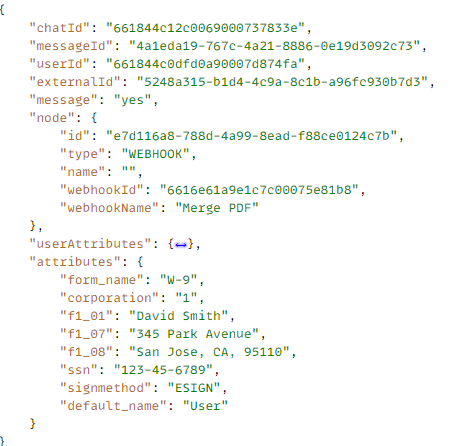
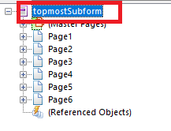

# Parse ChatBot data

A [ChatBot webhook](https://www.chatbot.com/help/webhooks/what-are-webhooks/) was used to send the ChatBot data to an AEM servlet.
The data captured in the ChatBot is in JSON format with the user entered data in the attributes object as shown below


To merge the data with the XDP template, we need to create the following XML. Notice the root element of the xml, this has to match with the root element of the XDP template for the data to merge successfully.


```xml
<topmostSubForm>
    <f1_01>David Smith</f1_01>
    <signmethod>ESIGN</signmethod>
    <corporation>1</corporation>
    <f1_08>San Jose, CA, 95110</f1_08>
    <f1_07>345 Park Avenue</f1_07>
    <ssn>123-45-6789</ssn>
    <form_name>W-9</form_name>
</topmostSubForm>

```



## Next Steps

[Merge data with XDP template](./merge-data-with-template.md)
