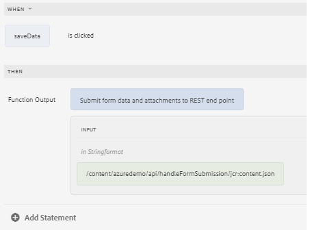

# Using GuideBridge API to POST form data

The "save and resume" for a form involves allowing users to save the progress of filling out the form and resume it at a later time. 
The following steps were followed to use the Geolocation API in Adaptive Forms. To accomplish this use case, we need to access and send the form data using the GuideBridge API to the REST endpoint for storage and retrieval.

The form data is saved on the click event of a button using the rule editor


The following JavaScript function was written to send the data to the specified endpoint

```javascript
/**
* Submits data and attachments 
* @name submitFormDataAndAttachments Submit form data and attachments to REST end point
* @param {string} endpoint in Stringformat
* @return {string} 
 */

function submitFormDataAndAttachments(endpoint) {

    guideBridge.getFormDataObject({
        success: function(resultObj) {
            afFormData = resultObj.data.data;
            var formData = new FormData();
            formData.append("dataXml", afFormData);
            for (i = 0; i < resultObj.data.attachments.length; i++) {
                var attachment = resultObj.data.attachments[i];
                console.log(attachment.name);
                formData.append(attachment.name, attachment.data);
            }
            var xhttp = new XMLHttpRequest();
            xhttp.onreadystatechange = function() {
                if (this.readyState == 4 && this.status == 200) {
                    console.log("successfully saved");
                    var fld = guideBridge.resolveNode("$form.confirmation");
                    return " Form data was saved successfully";

                }
            };
            xhttp.open('POST', endpoint)
            xhttp.send(formData);
        }
    });

}
```


## Server side code

The following server side Java code was written to handle the form data. The following is the Java servlet running in AEM that is called via the XHR call in the above JavaScript.

```java
package com.azuredemo.core.servlets;
import com.adobe.aemfd.docmanager.Document;
import org.apache.sling.api.SlingHttpServletRequest;
import org.apache.sling.api.SlingHttpServletResponse;
import org.apache.sling.api.request.RequestParameter;
import org.apache.sling.api.servlets.SlingAllMethodsServlet;
import org.apache.sling.servlets.annotations.SlingServletResourceTypes;
import org.osgi.service.component.annotations.Component;
import org.slf4j.Logger;
import org.slf4j.LoggerFactory;
import javax.servlet.Servlet;
import javax.servlet.http.HttpServletResponse;
import java.io.File;
import java.io.IOException;
import java.io.Serializable;
import java.util.List;
@Component(
   service = {
      Servlet.class
   }
)
@SlingServletResourceTypes(
   resourceTypes = "azure/handleFormSubmission",
   methods = "POST",
   extensions = "json"
)
public class StoreFormSubmission extends SlingAllMethodsServlet implements Serializable {
   private static final long serialVersionUID = 1 L;
   private final transient Logger log = LoggerFactory.getLogger(this.getClass());
   protected void doPost(SlingHttpServletRequest request, SlingHttpServletResponse response) throws IOException {
      List < RequestParameter > listOfRequestParameters = request.getRequestParameterList();
      log.debug("The size of list is " + listOfRequestParameters.size());
      for (int i = 0; i < listOfRequestParameters.size(); i++) {
         RequestParameter requestParameter = listOfRequestParameters.get(i);
         log.debug("is this request parameter a form field?" + requestParameter.isFormField());
         if (!requestParameter.isFormField()) {
            Document attachmentDOC = new Document(requestParameter.getInputStream());
            attachmentDOC.copyToFile(new File(requestParameter.getName()));
         } else {
            log.debug("Not a form field " + requestParameter.getName());
            log.debug(requestParameter.getString());
         }
      }
      response.setStatus(HttpServletResponse.SC_OK);
   }
}
```
