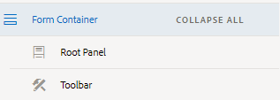
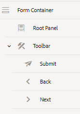
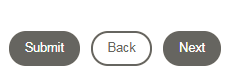

# Creating Adaptive Form{#creating-adaptive-form}  

In Part1 we will create Adaptive Form, add and configure toolbar with appropriate buttons.

## Creating Adaptive Form {#creating-adaptive-form} 

* [Login to your AEM instance](http://localhost:4502/aem/start.html)
* Click on Forms | Forms & Documents
* Click Create | Folder
* Name the folder "Application Forms"
* Open the newly created folder
* Click Create | Adaptive Forms
* Select "Summit Session" as your template for the Adaptive Form
* Click "Next"
* Name your adaptive form "Peak Application Form"
* Click on the select theme and select the "Reference Themes | Canvas 2.0"
* Click "Select" and then click "Create"
* You should get a message box informing the successful creation of Adaptive Form. Click the "Done" button to dismiss the dialog box.

The template defines the structure of your adaptive form.The template we have associated with this adaptive form is very basic.This template has header and footer and no other form components in it.

## Adding Toolbar to Adaptive Form {#adding-toolbar}

Gently select the newly created "Peak Application Form" and click the "Edit" icon on the toolbar. The adaptive form opens in edit mode. The form is opened with the content hierarchy on the left-hand-side.Every form will have Form Container and Root Panel under the Form Container. Typically you use the Form Container to do the following:

* Configure submission options
* Add toolbar
* Associate Pre-fill service
* Associate theme

Use the Root Panel to add additional sections, panels etc.

Select "Form Container" and click the "..." icon and select "Add Toolbar". The toolbar should get added to the Form Container. Your content hierarchy should look like this

## Configuring Toolbar {#configuring-toolbar}

After adding the toolbar to the Form Container, we need to configure the toolbar by adding navigation buttons.

Refresh your browser. Select the Toolbar, and then select "+" icon from the component toolbar that appears on the right-hand side.Add the "Next", "Previous" and "Submit" buttons to the toolbar.

Click the "Preview" button to preview the form. The preview button is on the top right-hand side of the screen.

Content Hierarchy after adding the toolbar

Toolbar with the buttons added

>[!VIDEO](https://video.tv.adobe.com/v/22173/quality=9)

*Adding and configuring toolbar*

