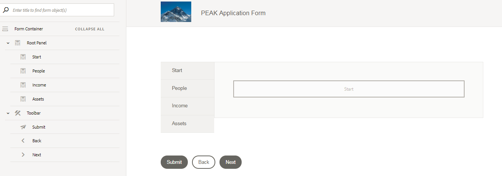

# Adding Child Panels to Root Panel {#adding-child-panels-to-root-panel}

Configuring root panel layout to "Tabs on Left" and add child panels to the root panel.

**Make sure you are in the edit mode. The edit button is located on the top right-hand side of the browser.**

Refresh your browser and select the "Root Panel" from the content hierarchy.

The component toolbar appears on the right-hand side. Select the "..." icon and then click on "Add Child Panel".

Specify "Start" as the child panel's name and title.

Similarly, add 3 more child panels to the root panel. Name the child panels as follows:

People, Income, and Assets.

## Configure Root Panel {#configure-root-panel}

Select the "Root Panel" to bring up the component toolbar.Select the "Wrench" icon to open the properties sheet of the Root Panel.

Select "**Tabs on Left**" option from the panel layout drop-down list.Save your changes by clicking the blue check mark icon on the top of the properties sheet.

This makes the child panels appear on the left-hand side of the form. Refresh your browser and your form should look like the screen shot below

Root Panel with child panels

## Start Panel {#start-panel}

We will now add Adaptive Form Fragments to the Start panel. AEM Forms provides a convenient mechanism to create a form segment, such as an address block, as use it in any adaptive form. These reusable, standalone segments are called adaptive form fragments. Two form fragments are provided as part of this tutorial. To learn more about creating Adaptive Form Fragments follow this [link.](https://helpx.adobe.com/experience-manager/6-3/forms/using/adaptive-form-fragments.html)

Refresh the browser.

Select the "Assets" icon from the sidebar. Filter the assets by Adaptive Form Fragments. Drag and drop the "Getting Started" form fragment on to the start panel on the right-hand side.

Once the "Getting Started" form fragment is added to the start panel, preview the form.

**Click the "Preview" button to preview the form. The preview button is on the top right-hand side of the screen.**

### Adding child panels to root panel

>[!VIDEO](https://video.tv.adobe.com/v/22192?quality=9)

