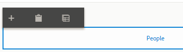
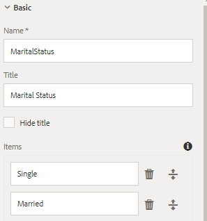
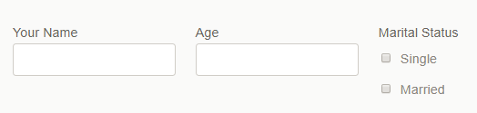

# Adding components to People panel {#adding-components-to-people-panel}

Configure People panel by adding the spouse details fragment. A rule is created to display the spouse details fragment if the applicants marital status is married.

**Make sure you are in the edit mode. The edit button is located on the top right-hand side of the browser.**

**Refresh your browser.**

Select the "People" panel in the content hierarchy.Select the "People" panel on the right-hand-side to bring up the following toolbar.

Click on the "+" icon and select drop-down list component. You have just added a drop-down list to the people panel.

Refresh the browser.

Select the newly added drop-down list under the People section in the content hierarchy. Select the "wrench" icon from the component toolbar to bring up the properties sheet for the drop-down list.

Set the following properties

Name: county

Title: What county do you live in?

Items: Alameda, Buxor, Contra Costa

Click the blue checkmark to save your changes.

## Adding Panel to People panel {#add-panel-to-people-panel}

Refresh browser

Select People panel from the content hierarchy. Select People panel on the right-hand side to bring up the toolbar as shown in the image below.

Click on the "+" icon and insert "panel" component. The newly added panel component shows up as a section in the under the people panel in the content hierarchy.

Repeat the above step to insert another "panel" component. You should see 2 sections under the People panel in the content hierarchy.

Refresh your browser.

Select the first "Section" under the people panel in the content hierarchy to bring up the component toolbar on the right-hand side.

Select the "Wrench" icon to bring up the properties sheet.

Set the following properties :

Title: **Your Details**

Number of Columns:** 3**(You will have to scroll down the properties sheet to see this property)

Refresh your browser.

Select "Section" under the people panel in the content hierarchy to bring up the component toolbar on the right-hand side.

Select the "Wrench" icon to bring up the properties sheet.

Set the following properties:

Title: **Spouse Details**

## Add components to Your Details  {#add-components-your-details}

Refresh your browser.

Select "Your Details" section in the content hierarchy on the left-hand-side. Select the "Your Details" section on the right-hand side and click the "+" icon to add the following components.

TextBox, Numeric Box, and CheckBox components to your details section.

Configure the newly added components as shown below:

Checkbox configured

Your Details panel with 3 fields

Notice the way 3 fields are arranged. This is because the **YourDetails** panel has 3 column layout that was set in the earlier step.

## Spouse Details {#spouse-details}

Refresh your browser.

Select the Spouse Details section in the content hierarchy.

Select the "assets" icon from the sidebar. Filter the assets by Adaptive Form Fragments. Drag and drop "SpouseDetails" fragment on to the spouse details section on the right-hand side.

## Video Walkthrough {#video-walkthrough}

>[!VIDEO](https://video.tv.adobe.com/v/22193?quality=9)

*Configuring people panel*

## Spouse Details Rules {#spouse-details-rules}

Spouse Details need to be displayed only if the applicant is "Married". Rule editor is used for authoring business rules such as these. The following video walks you through the steps for creating the rule.

After the Spouse Details rule is configured, please preview the form to test the functionality.

**Click the "Preview" button to preview the form. The preview button is on the top right-hand side of the screen.**

>[!VIDEO](https://video.tv.adobe.com/v/22195?quality=9)

*Spouse Details Rule*

