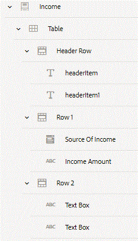

# Adding components to Income panel {#adding-components-to-income-panel}

We will add a table to the Income panel. Configure the table rows and use the rule editor to calculate the grand total.

**Make sure you are in the edit mode. The edit button is located on the top right-hand side of the browser.**

Refresh your browser.

Select the "Income" panel from the content hierarchy.

Click on the "Income" panel on the right-hand-side to bring up the toolbar. Click on the "+" icon and insert "Table" component.

By default when you insert a table component, it will have a Header row and two body rows. Each row will have 2 columns.

**Change column heading**

Select "Heading" and then select the pencil icon to edit the heading. Change the heading to "Source of Income".

Similarly, change the 2nd heading to Income Amount.

**Replace default text component in Row1Cell1**

By default, all the cell's in each table row are of type TextField. We will need to replace TextField with a drop-down list.

Select the cell under the Source of Income column to bring up the component toolbar. Select the "..." icon and then select Replace option. Select Dropdown list from the replace component.

**Replace default text component in Row1Cell2**

Select the cell under the Income Amount column to bring up the component toolbar. Select the "..." icon and then select Replace option. Select Numeric box from the replace component.

**Configure the newly added drop-down list:**

Select the drop-down list and then click on the wrench icon to bring up the properties sheet.

Set the Title to "Source Of Income"

Add the following items to the drop-down list

"Alimony"

"Salary"

"Rental Income"

Make sure you save your changes by clicking on the blue check mark icon

Select the newly added Numeric Box and bring up its properties sheet. Set the title to "Income Amount" and save your changes

Refresh your browser.

Your content hierarchy should like the screenshot below

## Configuring Row2 {#configuring-row}

**Configure the First TextBox under Row2**

Refresh your browser.

Select the first TextBox under Row2 in the content hierarchy to bring up the component toolbar.

Click the "Wrench" icon to bring up the properties sheet for the TextBox.Specify Default Value as "Grand Total".

**Replace the second TextBox with Numeric Box under Row2**

Refresh your browser.

Select the second TextBox under Row2 in the content hierarchy to bring up the component toolbar.

Click on the "..." ellipsis and select Replace. Select Numeric Box to replace the TextBox.

Select the newly added Numeric Box and click on the wrench to bring up the properties sheet of the component. Set its Title to "Grand Total"

## Make the Income Table Dynamic {#make-the-income-table-dynamic}

By default when you insert a table into Adaptive Form, the table is not dynamic meaning you cannot add new rows to the table at runtime.

Refresh your browser.

Select Row1 in the content hierarchy.

Click on the wrench icon to open up the properties sheet.

Set Minimum and Maximum count to 1 and 5 under the Repeat Settings and save your changes by clicking the blue check mark icon. This means the table can have a maximum of 5 rows. To have an indefinite number of rows set the maximum count to -1.

>[!VIDEO](https://video.tv.adobe.com/v/22198?quality=9)

*Adding income table*

## Create rule to calculate grand total {#create-rule-to-calculate-grand-total}

To calculate the Grand Total of income we need to use rule editor to create the rule.

Refresh your browser.

Select the Grand Total in the content hierarchy to bring up the component toolbar. Select the "hammer" icon to open the rule editor.

Click on "Create".

If the "Form Objects and Functions" is not visible on the left-hand side, click on "Form Objects and Functions" to see the form objects and functions on the left-hand side.

Select "Set Value Of" from the drop-down list.

Click on "Functions" tab on the left-hand side to bring up a listing of various functions available out of the box.

Drag and drop the "Sum" function on to the "***select option***" on the right-hand side.

The sum function accepts the following 2 parameters:

* Repeatable panel or table row
* The numeric field inside that repeatable panel or table row as its parameter

Click on the "Form Objects" on the left-hand side to bring up the form objects listing.

Drag and drop the Row1 of the Table under the Income node onto the first "***select option***" on the right-hand side.

Drag and drop the Income Amount under Row1 on to the second "***select option***" on the right-hand side.

Click "Done to save your changes".

**Click the "Preview" button to preview the form. The preview button is on the top right-hand side of the screen.**

>[!VIDEO](https://video.tv.adobe.com/v/22197?quality=9)

*Rule for calculating the grand total*

