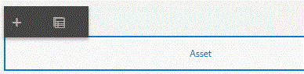

# Adding components to Assets section {#adding-components-to-assets-section}

Configure accordion layout for the Assets panel.The accordion layout provides a better end user experience for adding repeatable sections.

**Make sure you are in the edit mode. The edit button is located on the top right-hand side of the browser.**

* Refresh your browser.

* Collapse the "Start","Income" and "People" nodes in the content hierarchy.

* Select the "Assets" in the content hierarchy and click on the "wrench" icon to bring up the properties sheet.

* Select "Accordion" from the Layout drop-down layout.

* Save your changes.

Click on the content hierarchy and select the "Assets" node to bring up the component toolbar.Click on "..." to add child panel.

* Set the Name and Title of the child panel to "Asset".

* Select the newly added "Asset" in the content hierarchy to bring up the component toolbar. Click on the "Wrench" icon to open the properties sheet. Set the Minimum and Maximum settings to 1 and 3.

* Save your changes.

* Refresh your browser.

Select the newly added panel "Asset" under the Assets folder in the content hierarchy.

Click the "Asset" on the right-hand side and click on the + icon.

Add Drop-down list and Numeric box to the Asset panel.

Configure the drop-down list by setting the following properties:

* Title: Type Of Asset.

* Items: Cash, Stock, and Bonds.

Configure the Numeric Box by setting the following properties:

* Title: Value in Dollars.

**Click the "Preview" button to preview the form. The preview button is on the top right-hand side of the screen.**

Make sure the form is working as expected. Test the toolbar navigation buttons, make sure the income table is working as expected and finally test the assets section.

Congratulations!!!. on creating your first adaptive form.

>[!VIDEO](https://video.tv.adobe.com/v/22200?quality=9)

*Configure Assets Panel*

