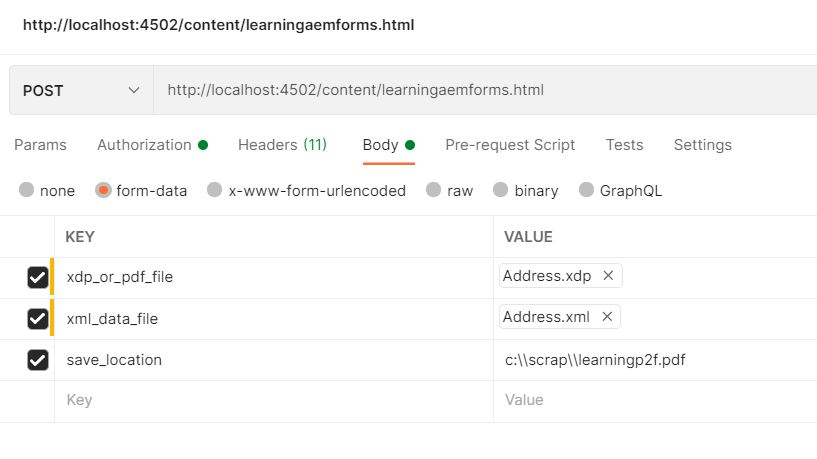

# OSGi Service

An OSGi service is a Java class or service interface, along with a number of service properties as name/value pairs. The service properties differentiate among different service providers that provide services with the same service interface.

An OSGi service is defined semantically by its service interface and implemented as a service object. A service's functionality is defined by the interfaces it implements. Thus, different applications can implement the same service. Service interfaces allow bundles to interact by binding interfaces, not implementations. A service interface should be specified with as few implementation details as possible.

## Define the interface

A simple interface with one method to merge data with the <span class="x x-first x-last">XDP</span> template.
 
```java
package com.mysite.samples;

import com.adobe.aemfd.docmanager.Document;

public interface MyfirstInterface
{
	public Document mergeDataWithXDPTemplate(Document xdpTemplate, Document xmlDocument);
}
 
```

## Implement the interface

Create a new package called `com.mysite.samples.impl` to hold the implementation of the interface.

```java
package com.mysite.samples.impl;
import org.osgi.service.component.annotations.Component;
import org.osgi.service.component.annotations.Reference;
import org.slf4j.Logger;
import org.slf4j.LoggerFactory;
import com.adobe.aemfd.docmanager.Document;
import com.adobe.fd.output.api.OutputService;
import com.adobe.fd.output.api.OutputServiceException;
import com.mysite.samples.MyfirstInterface;
@Component(service = MyfirstInterface.class)
public class MyfirstInterfaceImpl implements MyfirstInterface {
  @Reference
  OutputService outputService;

  private static final Logger log = LoggerFactory.getLogger(MyfirstInterfaceImpl.class);

  @Override
  public Document mergeDataWithXDPTemplate(Document xdpTemplate, Document xmlDocument) {
    com.adobe.fd.output.api.PDFOutputOptions pdfOptions = new com.adobe.fd.output.api.PDFOutputOptions();
    pdfOptions.setAcrobatVersion(com.adobe.fd.output.api.AcrobatVersion.Acrobat_11);
    try {
      return outputService.generatePDFOutput(xdpTemplate, xmlDocument, pdfOptions);

    } catch (OutputServiceException e) {

      log.error("Failed to merge data with XDP Template", e);

    }

    return null;
  }

}

```

The annotation `@Component(...)` on line 10 makes marks this Java class as an OSGi Component as well as registers it as an OSGi Service. 

The `@Reference` annotation is part of OSGi declarative services, and is used to inject a reference of the [Outputservice](https://helpx.adobe.com/experience-manager/6-5/forms/javadocs/index.html?com/adobe/fd/output/api/OutputService.html) into the variable `outputService`.


## Build and Deploy the bundle

* Open **command prompt window**
* Navigate to `c:\aemformsbundles\mysite\core`
* Execute the command `mvn clean install -PautoInstallBundle`
* The above command will automatically build and deploy the bundle to your AEM instance running on localhost:4502

The bundle will also be available in the following location `C:\AEMFormsBundles\mysite\core\target`. The bundle can also be deployed into AEM using the [Felix web console.](http://localhost:4502/system/console/bundles)

## Using the service

You can now use the service in your JSP page. The following code snippet shows how to get access to your service and use the methods implemented by the service

```java

MyFirstAEMFormsService myFirstAEMFormsService = sling.getService(com.mysite.samples.MyFirstAEMFormsService.class);
com.adobe.aemfd.docmanager.Document generatedDocument = myFirstAEMFormsService.mergeDataWithXDPTemplate(xdp_or_pdf_template,xmlDocument);

```

The sample package containing the JSP page can be [downloaded from here](assets/learning_aem_forms.zip)

[The complete bundle is available for downloading](assets/mysite.core-1.0.0-SNAPSHOT.jar)

## Test the package

Import and install the package into AEM using the [package manager](http://localhost:4502/crx/packmgr/index.jsp)

Use postman to make a POST call and provide the input parameters as shown in the screen shot below

