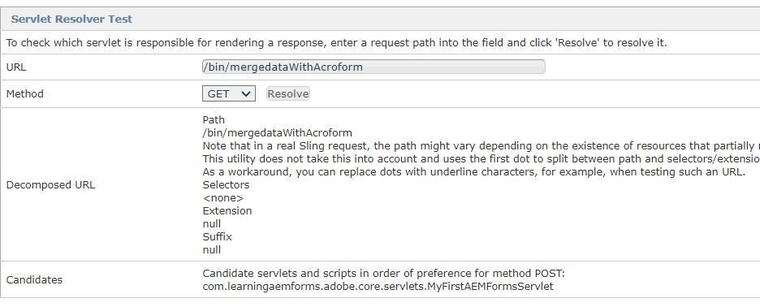
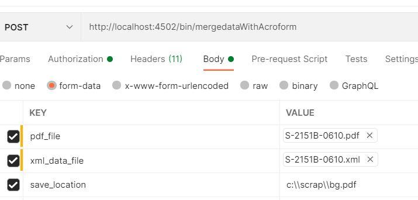

# Sling Servlet

A Servlet is a class used to extend the capabilities of servers that host applications accessed by means of a request-response programming model. For such applications, Servlet technology defines HTTP-specific servlet classes.
All servlets must implement the Servlet interface, which defines life-cycle methods.


A servlet in AEM can be registered as OSGi service: you can extend SlingSafeMethodsServlet for read-only implementation or SlingAllMethodsServlet in order to implement all RESTful operations.

## Servlet Code

``` java
import javax.servlet.Servlet;

import org.apache.sling.api.SlingHttpServletRequest;
import org.apache.sling.api.SlingHttpServletResponse;
import org.apache.sling.api.servlets.SlingAllMethodsServlet;
import org.osgi.service.component.annotations.Component;
import org.osgi.service.component.annotations.Reference;

import com.adobe.aemfd.docmanager.Document;
import com.adobe.fd.forms.api.FormsService;

@Component(service={Servlet.class}, property={"sling.servlet.methods=post", "sling.servlet.paths=/bin/mergedataWithAcroform"})
public class MyFirstAEMFormsServlet extends SlingAllMethodsServlet
{
	
	private static final long serialVersionUID = 1L;
	@Reference
	FormsService formsService;
	 protected void doPost(SlingHttpServletRequest request, SlingHttpServletResponse response)
	  { 
		 String file_path = request.getParameter("save_location");
		 
		 java.io.InputStream pdf_document_is = null;
		 java.io.InputStream xml_is = null;
		 javax.servlet.http.Part pdf_document_part = null;
		 javax.servlet.http.Part xml_data_part = null;
		 	 try
		 	 {
		 		pdf_document_part = request.getPart("pdf_file");
				 xml_data_part = request.getPart("xml_data_file");
				 pdf_document_is = pdf_document_part.getInputStream();
				 xml_is = xml_data_part.getInputStream();
				 Document data_merged_document = formsService.importData(new Document(pdf_document_is), new Document(xml_is));
				 data_merged_document.copyToFile(new File(file_path));
				 
		 	 }
		 	 catch(Exception e)
		 	 {
		 		 response.sendError(400,e.getMessage());
		 	 }
	  }
}
```

## Build and Deploy

To build your project, please follow the following steps:

* Open **command prompt window**
* Navigate to `c:\aemformsbundles\learningaemforms\core`
* Execute the command `mvn clean install -PautoInstallBundle`
* The above command will automatically build and deploy the bundle to your AEM instance running on localhost:4502

The bundle will also be available in the following location `C:\AEMFormsBundles\learningaemforms\core\target`. The bundle can also be deployed into AEM using the [Felix web console.](http://localhost:4502/system/console/bundles)


## Test the Servlet Resolver

Point your browser to the [servlet resolver URL](http://localhost:4502/system/console/servletresolver?url=%2Fbin%2FmergedataWithAcroform&method=POST). This will tell you the servlet that will be invoked for a given path as seen in the screen shot below


## Test the servlet using Postman


