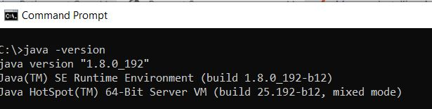

# Create your first OSGi bundle

An OSGi bundle is a Java™ archive file that contains Java code, resources, and a manifest that describes the bundle and its dependencies. The bundle is the unit of deployment for an application. This article is meant for developers wanting to create OSGi service or a servlet using AEM Forms 6.4 or 6.5. To build your first OSGi bundle please follow the following steps:


## Install JDK

Install the supported version of JDK. I have used JDK1.8. Make sure you have added **JAVA_HOME** in your environment variables and is pointing to the root folder of your JDK installation.
Add the %JAVA_HOME%/bin to the path


>[!NOTE]
> Do not use JDK 15. It is not supported by AEM.

### Test your JDK version

Open a new command prompt window and type: `java -version`. You should get back the version of JDK identified by the `JAVA_HOME` variable



## Install Maven

Maven is a build automation tool used primarily for Java projects. Please follow the following steps to install maven on your local system.

* Create a folder called `maven` in your C drive
* Download the [binary zip archive](http://maven.apache.org/download.cgi)
* Extract the contents of the zip archive into `c:\maven`
* Create an environment variable called `M2_HOME` with a value of `C:\maven\apache-maven-3.6.0`. In my case, the **mvn** version is 3.6.0. At the time of writing this article the latest maven version is 3.6.3
* Add the `%M2_HOME%\bin` to your path
* Save your changes
* Open a new command prompt and type in `mvn -version`. You should see the **mvn** version listed as shown in the screenshot below


## Settings.xml

A Maven `settings.xml` file defines values that configure Maven execution in various ways. Most commonly, it is used to define a local repository location, alternate remote repository servers, and authentication information for private repositories.

Navigate to `C:\Users\<username>\.m2 folder`
Extract the contents of [settings.zip](assets/settings.zip) file and place it in the `.m2` folder.

## Install Eclipse

Install the latest version of [eclipse](https://www.eclipse.org/downloads/) 

## Create your first project

 Archetype is a Maven project templating toolkit. An archetype is defined as an original pattern or model from which all other things of the same kind are made. The name fits as we are trying to provide a system that provides a consistent means of generating Maven projects. Archetype will help authors create Maven project templates for users, and provides users with the means to generate parameterized versions of those project templates.
 To create your first maven project, please follow the following steps:

* Create a new folder called `aemformsbundles` in your C drive
* Open a command prompt and navigate to `c:\aemformsbundles`
* Run the following command in your command prompt
* `mvn archetype:generate  -DarchetypeGroupId=com.adobe.granite.archetypes  -DarchetypeArtifactId=aem-project-archetype -DarchetypeVersion=19`

The Maven project will be generated interactively  and you will be asked to provide values to a number of properties such as:

Property Name| Significance| Value
------------------------|---------------------------------------|---------------------
groupId | groupId uniquely identifies your project across all projects | com.learningaemforms.adobe
appsFolderName | Name of the folder that will hold your project structure | learningaemforms
artifactId | artifactId is the name of the jar without version. If you created it, then you can choose whatever name you want with lowercase letters and no strange symbols. | learningaemforms
version| If you distribute it, then you can choose any typical version with numbers and dots (1.0, 1.1, 1.0.1, ...). | 1.0

Accept the default values for the other properties by hitting enter key.
If everything goes well you should see a build success message in your command window

## Create eclipse project from your maven project

Change your working directory to `learningaemforms`. 
Execute `mvn eclipse:eclipse` from the command line 
The above command reads your  pom file and creates Eclipse projects with correct metadata so that Eclipse will understand project types, relationships, classpath, etc.

## Import the project into eclipse

Launch **Eclipse**

Go to **File -> Import** and select **Existing Maven Projects** as shown here


Click Next

Select the `c:\aemformsbundles\learningaemform`s by clicking the **Browse** button


>[!NOTE]
>You may select to import the appropriate modules depending on your needs. Select and import the core module only, if you are only going to create Java code in your project.

Click **Finish** to start the import process

Project is imported into Eclipse and you will see a number of `learningaemforms.xxxx` folders

Expand the `src/main/java` under the `learningaemforms.core` folder. This is the folder in which you will be writing most of your code.


## Build your project


Once you have written your OSGi service, or servlet, you will need to build your project to generate the OSGi bundle that can be deployed using the Felix web console. Please refer [AEMFD Client SDK](https://repo.adobe.com/nexus/content/groups/public/com/adobe/aemfd/aemfd-client-sdk/) to include the appropriate client SDK in your Maven project. You will have to include the AEM FD Client SDK in the dependencies section of `pom.xml` of the core project as shown below.


```xml
<dependency>
    <groupId>com.adobe.aemfd</groupId>
    <artifactId>aemfd-client-sdk</artifactId>
    <version>6.0.122</version>
</dependency>

```

 To build your project, please follow the following steps:

* Open **command prompt window**
* Navigate to `c:\aemformsbundles\learningaemforms\core`
* Execute the command `mvn clean install -PautoInstallBundle`
The above command builds and installs the bundle in the AEM server running on `http://localhost:4502`. The bundle will also be available on the file system at
 `C:\AEMFormsBundles\learningaemforms\core\target` and can be deployed using [Felix web console](http://localhost:4502/system/console/bundles)
