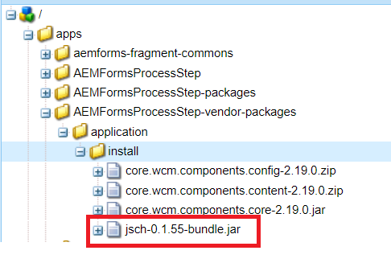

# Including third party bundles in your AEM project

In this article we will walk through the steps involved in including 3rd party OSGi bundle in your AEM project.For the purpose of this article we are going to include the [jsch-0.1.55.jar](https://repo1.maven.org/maven2/com/jcraft/jsch/0.1.55/jsch-0.1.55.jar) in our AEM project.  IF the OSGi is available in maven repository include bundle's dependency in the project's POM.xml file.

>[!NOTE]
> It is assumed the 3rd party jar is an OSGi bundle

```java
<!-- https://mvnrepository.com/artifact/com.jcraft/jsch -->
<dependency>
    <groupId>com.jcraft</groupId>
    <artifactId>jsch</artifactId>
    <version>0.1.55</version>
</dependency>

```

If your OSGi bundle is on your file system, create a folder called **localjar** under the base directory of your project(C:\aemformsbundles\AEMFormsProcessStep\localjar) the dependency will look something like this

```java
<dependency>
    <groupId>jsch</groupId>
    <artifactId>jsch</artifactId>
    <version>1.0</version>
    <scope>system</scope>
    <systemPath>${project.basedir}/localjar/jsch-0.1.55-bundle.jar</systemPath>
</dependency>
```

## Create the folder structure

We are adding this bundle to our AEM project **AEMFormsProcessStep** which is residing in  the **c:\aemformsbundles** folder

* Open the **filter.xml** from the C:\aemformsbundles\AEMFormsProcessStep\all\src\main\content\META-INF\vault folder of your project
Make a note of the root attribute  of the filter element.

* Create the following folder structure C:\aemformsbundles\AEMFormsProcessStep\all\src\main\content\jcr_root\apps\AEMFormsProcessStep-vendor-packages\application\install
* The **apps/AEMFormsProcessStep-vendor-packages** is the root attribute value in the filter.xml
* Update the dependencies section of the project's POM.xml
* Open command prompt. Navigate to your project's folder(c:\aemformsbundles\AEMFormsProcessStep) in my case. Execute the following command

```java
mvn clean install -PautoInstallSinglePackage
```

If everything goes well, the package is installed along with the third-party bundle into your AEM instance. You can check for the bundle using [felix web console](http://localhost:4502/system/console/bundles). The third-party bundle is available in the /apps folder of the `crx` repository as shown below

