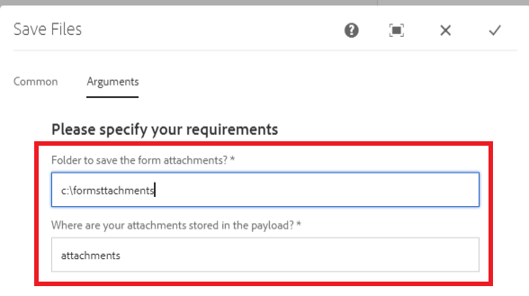

# Custom Process Step

This tutorial is intended for AEM Forms customers needing to implement custom workflow component.The first step in creating workflow component is to write your java code that will be associated with the workflow component. For the purpose of this tutorial we are going to write simple java class to store the adaptive form attachments to the file system.This java code will read the arguments specified in the workflow component.

The following steps are required to write the java class and deploy the class as an OSGi bundle

## Create Maven Project

The first step is to create an maven project using the appropriate Adobe Maven Archetype. The detailed steps are listed in this [article](https://experienceleague.adobe.com/docs/experience-manager-learn/forms/creating-your-first-osgi-bundle/create-your-first-osgi-bundle.html). Once you have your maven project imported into eclipse, you are ready to start writing your first OSGi component that can be used in your process step.


### Create class that implements WorkflowProcess

Open the maven project in your eclipse IDE. Expand **projectname** > **core** folder. Expand the src/main/java folder. You should see a package that ends with "core". Create Java class that implements WorkflowProcess in this package. You will need to override execute method. The signature of execute method is as follows
public void execute(WorkItem workItem, WorkflowSession workflowSession, MetaDataMap processArguments)throws WorkflowException 

In this tutorial, we are going to write the attachments added to Adaptive Form to the file system as part of the AEM Workflow.

To accomplish this use case, the following java class was written

Let's take a look at this code

``` java
package com.mysite.core;
import java.io.File;
import java.io.InputStream;
import java.util.HashMap;
import java.util.Map;
import javax.jcr.Node;
import javax.jcr.Session;
import org.osgi.framework.Constants;
import org.osgi.service.component.annotations.Component;
import org.osgi.service.component.annotations.Reference;
import org.slf4j.Logger;
import org.slf4j.LoggerFactory;
import com.adobe.aemfd.docmanager.Document;
import com.adobe.granite.workflow.WorkflowException;
import com.adobe.granite.workflow.WorkflowSession;
import com.adobe.granite.workflow.exec.WorkItem;
import com.adobe.granite.workflow.exec.WorkflowProcess;
import com.adobe.granite.workflow.metadata.MetaDataMap;
import com.day.cq.search.PredicateGroup;
import com.day.cq.search.Query;
import com.day.cq.search.QueryBuilder;
import com.day.cq.search.result.Hit;
import com.day.cq.search.result.SearchResult;
@Component(property = {
  Constants.SERVICE_DESCRIPTION + "=Custom component to wrtie form attachments to file system",
  Constants.SERVICE_VENDOR + "=Adobe Systems",
  "process.label" + "=Custom component to wrtie form attachments to file system"
})
public class WriteFormAttachmentsToFileSystem implements WorkflowProcess {

  private static final Logger log = LoggerFactory.getLogger(WriteFormAttachmentsToFileSystem.class);
  @Reference
  QueryBuilder queryBuilder;

  @Override
  public void execute(WorkItem workItem, WorkflowSession workflowSession, MetaDataMap metaDataMap)
  throws WorkflowException {

    String attachmentsPath = metaDataMap.get("attachmentsPath", String.class);

    log.debug("Got attachments path: " + attachmentsPath);
    String saveToLocation = metaDataMap.get("SaveToLocation", String.class);
    log.debug("Got save location: " + saveToLocation);

    log.debug("The seperator is" + File.separator);
    String payloadPath = workItem.getWorkflowData().getPayload().toString();
    Map < String, String > map = new HashMap < String, String > ();
    map.put("path", payloadPath + "/" + attachmentsPath);
    File saveLocationFolder = new File(saveToLocation);
    if (!saveLocationFolder.exists()) {
      saveLocationFolder.mkdirs();
    }

    map.put("type", "nt:file");
    Query query = queryBuilder.createQuery(PredicateGroup.create(map), workflowSession.adaptTo(Session.class));
    query.setStart(0);
    query.setHitsPerPage(20);

    SearchResult result = query.getResult();
    log.debug("Got  " + result.getHits().size() + " attachments ");
    Node attachmentNode = null;
    for (Hit hit: result.getHits()) {
      try {
        String path = hit.getPath();
        log.debug("The attachment title is  " + hit.getTitle() + " and the attachment path is  " + path);
        attachmentNode = workflowSession.adaptTo(Session.class).getNode(path + "/jcr:content");
        InputStream documentStream = attachmentNode.getProperty("jcr:data").getBinary().getStream();
        Document attachmentDoc = new Document(documentStream);
        attachmentDoc.copyToFile(new File(saveLocationFolder + File.separator + hit.getTitle()));
        attachmentDoc.close();
      } catch (Exception e) {
        log.error("Error saving file " + e.getMessage());
      }
    }
  }
}
```


* attachmentsPath - This is the same location that you have specified in the Adaptive Form when you configured the submit action of Adaptive Form to invoke AEM Workflow. This is a name of the folder that you want the attachments to be saved in AEM relative to the payload of the workflow.

* saveToLocation - This is the location that you want the attachments to be saved on your AEM server's file system.

These two values are passed as process arguments using the dialog of the workflow component



The QueryBuilder service is used to query nodes of type nt:file under the attachmentsPath folder. The rest of the code iterates through the search results to create Document object and save it to the file system


>[!NOTE]
>
>Since we are using Document object which is specific to AEM Forms, it is required that you include the aemfd-client-sdk dependency in your maven project.

```xml
<dependency>
    <groupId>com.adobe.aemfd</groupId>
    <artifactId>aemfd-client-sdk</artifactId>
    <version>6.0.772</version>
</dependency>
```

#### Build and Deploy

[Build the bundle as described here](https://experienceleague.adobe.com/docs/experience-manager-learn/forms/creating-your-first-osgi-bundle/create-your-first-osgi-bundle.html)
[Make sure the bundle is deployed and in active state](http://localhost:4502/system/console/bundles)

## Next Steps

Create your [custom workflow component](./custom-workflow-component.md)

