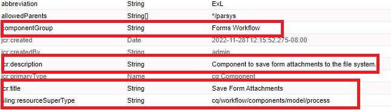
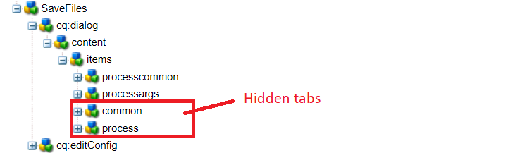
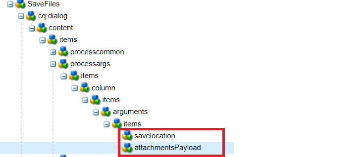
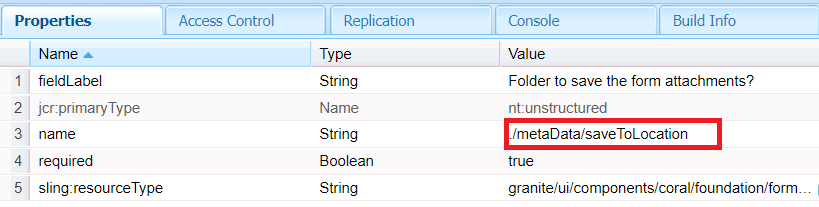
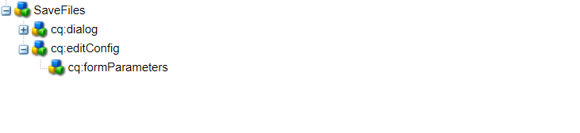
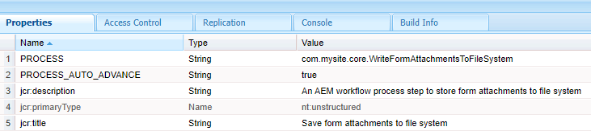

# Custom Workflow Component

This tutorial is intended for AEM Forms customers needing to create custom workflow component. The workflow component will be configured to execute the code written in the previous step. The workflow component has the ability to specify process arguments to the code. In this article we will explore workflow component asscoiated with the code.

[Download the custom workflow component](assets/saveFiles.zip)
Import the workflow component [using package manager](http://localhost:4502/crx/packmgr/index.jsp)

The custom workflow component is located in /apps/AEMFormsDemoListings/workflowcomponent/SaveFiles

Select the SaveFiles node and examine its properties

**componentGroup** - The value of this property determines the category of the workflow component.

**jcr:Title** - This is the title of the workflow component.

**sling:resourceSuperType** The value of this property will determine the inheritance of this component. In this case we are inherting from the process component

## cq:dialog

Dialogs are used to allow author to interact with the component. The cq:dialog is under the SaveFiles node

The nodes under the items node represent the tabs of the component thorugh which authors will interact with the component. The common and process tabs are hidden. The Common and Arguments tabs visible.

The process arguments for the process are under the processargs node

The author specifies the arguments as shown in the screen shot below

The values are stored as properties of the metadata node. For example the value **c:\formsattachments** will be stored in the property saveToLocation of the metadata node

## cq:editConfig

The cq:EditConfig is simply a node with the primary type cq:EditConfig and the name cq:editConfig under the component root
The edit behavior of a component is configured by adding a cq:editConfig node of type cq:EditConfig below the component node (of type cq:Component)

cq:formParameters (node type nt:unstructured): defines additional parameters that are added to the dialog form.

Notice the properties of the cq:formParameters node

The value of the property PROCESS indicates the java code that will be associated with the workflow component.

