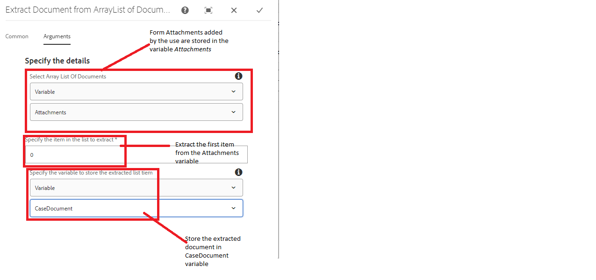
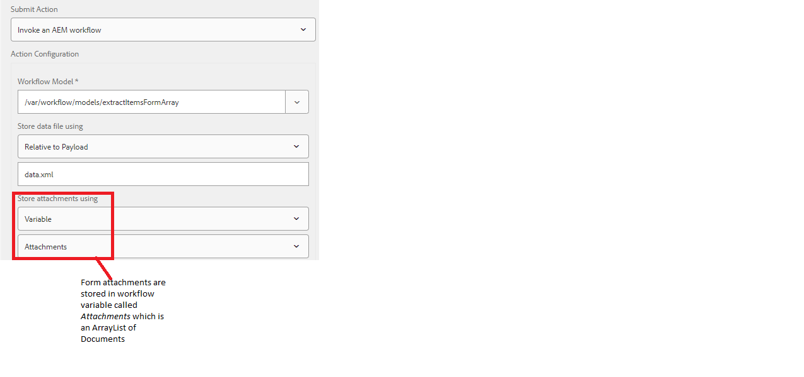

# Extract document from list of documents

A common use case is to submit the form data and the form attachment to an external system using the invoke form data model step in an AEM workflow. For example, when creating a case in ServiceNow you would want to submit case details with a supporting document. The attachments added to the adaptive form are stored in a variable of type arraylist of documents and to extract a specific document from this arraylist, you will have to write custom code. 

This article will walk you through the steps of using the custom workflow component to extract and store the document in a document variable.

## Create workflow

A workflow needs to be created to handle the form submission. The workflow needs to have the following variables defined

* A variable of type ArrayList of Document(This variable will hold the form attachments added by the user)
* A variable of type Document.(This variable will hold the document extracted from the ArrayList)

* Add the custom component to your workflow and configure its properties

## Configure Adaptive Form

* Configure the submit action of the adaptive form to trigger the AEM workflow

## Test the solution

[Deploy the custom bundle using the OSGi web console](assets/ExtractItemsFromArray.core-1.0.0-SNAPSHOT.jar)

[Import the workflow component using package manager](assets/Extract-item-from-documents-list.zip)

[Import the sample workflow](assets/extract-item-sample-workflow.zip)

[Import the adaptive form](assets/test-attachment-extractions-adaptive-form.zip)

[Preview the form](http://localhost:4502/content/dam/formsanddocuments/testattachmentsextractions/jcr:content?wcmmode=disabled)

Add an attachment to the form and submit it.

>[!NOTE]
>
>The extracted document can then be used in any other workflow step such as Send E-mail or Invoke FDM Step
