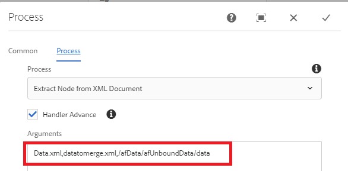
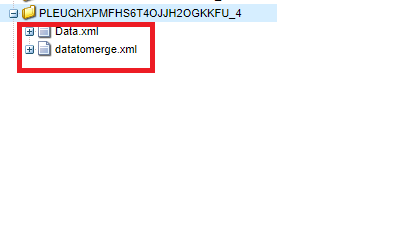

# Extract node from submitted data xml

This custom process step is to create new xml document by extracting node from another xml document. You would need to use this when you want to merge the submitted data with xdp template to generate pdf. For example when you submit an adaptive form the data that you need to merge with the xdp template is inside the data element. In this case you would need to create another xml document by extracting the appropriate data element.

The following screen shot shows you the arguments that you need to pass to the custom process step

The following are the parameters
* Data.xml - The xml file from which you want to extract node
* datatomerge.xml - The new xml created with the extracted node
* /afData/afUnboundData/data - The node to extract

The following screen shot shows you the datamerge.xml being created under the payload folder

[Custom bundle can be downloaded from here](/help/forms/assets/common-osgi-bundles/SetValueApp.core-1.0-SNAPSHOT.jar)
