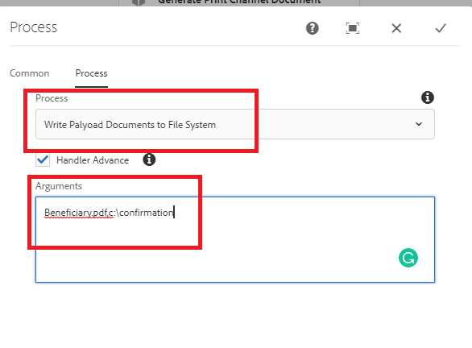

# Write the document to the file system

Common use case is to write the generated documents in the workflow to the file system.
This custom workflow process step makes it easy to write the workflow documents to file system.
The custom process takes the following comma separated arguments

``` java
ChangeBeneficiary.pdf,c:\confirmation
```

The first argument is the name of the document that you want to save to the file system. The second argument is the folder location you want to save the document. For example in the above use case the document is written to `c:\confirmation\ChangeBeneficiary.pdf`

The following screen shot shows you the arguments that you need to pass to the custom process step


[Custom bundle can be downloaded from here](/help/forms/assets/common-osgi-bundles/SetValueApp.core-1.0-SNAPSHOT.jar)
