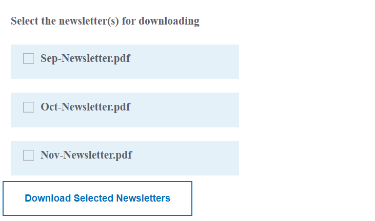

# Introduction

A common use case is to list DAM folder contents(pdf files, word documents, etc) using the checkbox component and allow the user to select files(s) to download. The selected files will be assembled into one file that the user can download.

## Prerequisites

You will need the following:

* A working instance of AEM with Form Add-on package installed

* [Development environment set up according to this document](https://experienceleague.adobe.com/docs/experience-manager-learn/forms/creating-your-first-osgi-bundle/create-your-first-osgi-bundle.html)

## Next Steps

[Populate choice group](./populating-choice-group-with-dam-folder-content.md)
