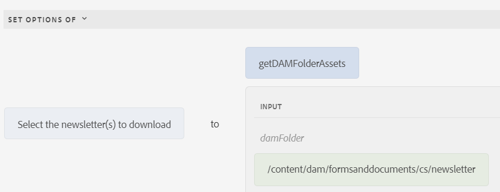

# Adding items dynamically to choice group component

 AEM Forms 6.5 introduced the ability to add items dynamically to an Adaptive Forms choice group component such as CheckBox, Radio Button and Image List. In this article we will look at the use case of populating a choice group component with the DAM folder content. In the screen shot the 3 files are in folder called newsletter.Every time a new newsletter is added to the folder the choice group component will be updated to list its contents automatically. The user can select one or more newsletters to download.

 

## Create servlet to return the DAM folder content

The following code was written to return the DAM folder contents in JSON format.

```java
package com.newsletters.core.servlets;
import static com.day.cq.commons.jcr.JcrConstants.JCR_CONTENT;
import java.io.IOException;
import java.io.PrintWriter;
import java.util.ArrayList;
import java.util.List;
import javax.servlet.Servlet;
import org.apache.sling.api.SlingHttpServletRequest;
import org.apache.sling.api.SlingHttpServletResponse;
import org.apache.sling.api.resource.Resource;
import org.apache.sling.api.servlets.SlingSafeMethodsServlet;
import org.osgi.service.component.annotations.Component;
import org.slf4j.Logger;
import org.slf4j.LoggerFactory;
import com.google.gson.Gson;
import com.google.gson.JsonObject;

@Component(service = {
  Servlet.class
}, property = {
  "sling.servlet.methods=get",
  "sling.servlet.paths=/bin/listfoldercontents"
})
public class ListFolderContent extends SlingSafeMethodsServlet {
  private static final long serialVersionUID = 1 L;
  private static final Logger log = LoggerFactory.getLogger(ListFolderContent.class);
  protected void doGet(SlingHttpServletRequest request, SlingHttpServletResponse response) {
    Resource resource = request.getResourceResolver().getResource(request.getParameter("damFolder"));
    List < JsonObject > results = new ArrayList < > ();
    resource.getChildren().forEach(child -> {
      if (!JCR_CONTENT.equals(child.getName())) {
        JsonObject asset = new JsonObject();
        log.debug("##The child name is " + child.getName());
        asset.addProperty("assetname", child.getName());
        asset.addProperty("assetpath", child.getPath());
        results.add(asset);

      }
    });
    PrintWriter out = null;
    try {
      out = response.getWriter();
    } catch (IOException e) {

      log.debug(e.getMessage());
    }
    response.setContentType("application/json");
    response.setCharacterEncoding("UTF-8");
    Gson gson = new Gson();
    out.print(gson.toJson(results));
    out.flush();
  }

}
```

## Create client library with JavaScript function

The servlet is invoked from a JavaScript function. The function returns an array object which will be used to populate the choice group component

``` javascript
/**
 * Populate drop down/choice group  with assets from specified folder
 * @return {string[]} 
 */
function getDAMFolderAssets(damFolder) {
   // strUrl is whatever URL you need to call
   var strUrl = '/bin/listfoldercontents?damFolder=' + damFolder;
   var documents = [];
   $.ajax({
      url: strUrl,
      success: function(jsonData) {
         for (i = 0; i < jsonData.length; i++) {
            documents.push(jsonData[i].assetpath + "=" + jsonData[i].assetname);
         }
      },
      async: false
   });
   return documents;
}
```

## Create Adaptive Form

Create an adaptive form and associate the form with client library **listfolderassets**. Add a checkbox component to your form. Use the rule editor to populate the options of the checkbox as shown in the screen-shot
 

We are invoking javascript function called **getDAMFolderAssets** and passing the path of the DAM folder's assets to list in the form.
