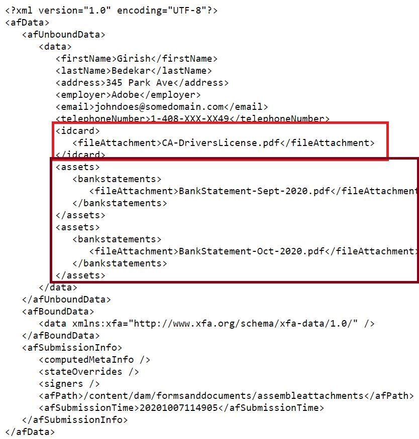
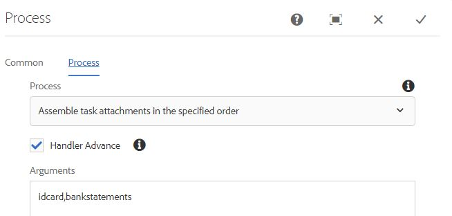
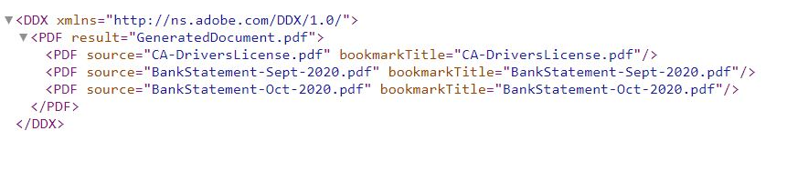
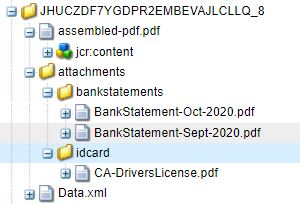

# Assemble form attachments

This article provides assets to assemble adaptive form attachments in a specified order. The form attachments need to be in pdf format for this sample code to work. The following is the use case.
User filling out an adaptive form attaches one or more pdf documents to the form.
On form submission assemble the form attachments to generate one pdf. You can specify the order in which the attachments are assembled to generate the final pdf. 

## Create OSGi component that implements WorkflowProcess interface

Create a OSGi component that implements the [com.adobe.granite.workflow.exec.WorkflowProcess interface](https://helpx.adobe.com/experience-manager/6-5/sites/developing/using/reference-materials/javadoc/com/adobe/granite/workflow/exec/WorkflowProcess.html). The code in this component can be associated with the process step component in the AEM workflow. The execute method of the interface com.adobe.granite.workflow.exec.WorkflowProcess is implemented in this component.

When an adaptive form is submitted to trigger an AEM workflow the submitted data is stored in the specified file under the payload folder. For example this is the submitted data file. We need to assemble the attachments specified under the idcard and bankstatements tag.
.

### Get the tag names

The order of the attachments is specified as process step arguments in the workflow as shown in the screen shot below. Here we are assembling the attachments added to the field idcard followed by bankstatements



The following code snippet extracts the attachment names from the process arguments

```java

String  []attachmentNames  = arg2.get("PROCESS_ARGS","string").toString().split(",");

```

### Create DDX from the attachment names

We then need to create [Document Description XML (DDX)](https://helpx.adobe.com/pdf/aem-forms/6-2/ddxRef.pdf) document which is used by the Assembler service to assemble documents. The following is the DDX that was created from the process arguments. Notice the PDF source elements are in the right order as specified in the process arguments.



### Create map of documents

We then create a map of documents with the attachment name as the key and the attachment as the value. Query builder service was used to query the attachments under the payload path and build the map of documents. This map of document along with the DDX is needed for the assembler service to assemble the final pdf.

```java

public Map<String, Object> createMapOfDocuments(String payloadPath,WorkflowSession workflowSession )
{
  Map<String, String> queryMap = new HashMap<String, String>();
  Map<String,Object>mapOfDocuments = new HashMap<String,Object>();
  queryMap.put("type", "nt:file");
  queryMap.put("path",payloadPath);
  Query query = queryBuilder.createQuery(PredicateGroup.create(queryMap),workflowSession.adaptTo(Session.class));
  query.setStart(0);
  query.setHitsPerPage(30);
  SearchResult result = query.getResult();
  log.debug("Get result hits "+result.getHits().size());
  for (Hit hit : result.getHits()) {
    try {
          String path = hit.getPath();
          log.debug("The title "+hit.getTitle()+" path "+path);
          if(hit.getTitle().endsWith("pdf"))
           {
             com.adobe.aemfd.docmanager.Document attachmentDocument = new com.adobe.aemfd.docmanager.Document(path);
             mapOfDocuments.put(hit.getTitle(),attachmentDocument);
             log.debug("@@@@Added to map@@@@@ "+hit.getTitle());
           }
        }
    catch (Exception e)
       {
          log.debug(e.getMessage());
       }

}
return mapOfDocuments;
}


```

### Use AssemblerService to assemble the documents

After the DDX and the document map is created, the next step is the use the AssemblerService to assemble the documents.
The following code assembles and returns the assembled pdf.

```java
private com.adobe.aemfd.docmanager.Document assembleDocuments(Map<String, Object> mapOfDocuments, com.adobe.aemfd.docmanager.Document ddxDocument)
{
    AssemblerOptionSpec aoSpec = new AssemblerOptionSpec();
    aoSpec.setFailOnError(true);
    AssemblerResult ar = null;
    try
    {
        ar = assemblerService.invoke(ddxDocument, mapOfDocuments, aoSpec);
        return (com.adobe.aemfd.docmanager.Document) ar.getDocuments().get("GeneratedDocument.pdf");
    }
    catch (OperationException e)
    {
        log.debug(e.getMessage());
    }
    return null;
    
}

```

### Save the assembled pdf under the payload folder

The final step is to save the assembled pdf under the payload folder. This pdf can then be accessed in the subsequent steps of the workflow for further processing.
The following code snippet was used to save the file under the payload folder

```java
Session session = workflowSession.adaptTo(Session.class);
javax.jcr.Node payloadNode =  workflowSession.adaptTo(Session.class).getNode(workItem.getWorkflowData().getPayload().toString());
log.debug("The payload Path is "+payloadNode.getPath());
javax.jcr.Node assembledPDFNode = payloadNode.addNode("assembled-pdf.pdf", "nt:file"); 
javax.jcr.Node jcrContentNode =  assembledPDFNode.addNode("jcr:content", "nt:resource");
Binary binary =  session.getValueFactory().createBinary(assembledDocument.getInputStream());
jcrContentNode.setProperty("jcr:data", binary);
log.debug("Saved !!!!!!"); 
session.save();

```

The following is the payload folder structure after the form attachments are assembled and stored.



### To get this capability working on your AEM Server

* Download the [Assemble Form Attachments Form](assets/assemble-form-attachments-af.zip) to your local system.
* Import the form from the[Forms And Documents](http://localhost:4502/aem/forms.html/content/dam/formsanddocuments) page.
* Download [workflow](assets/assemble-form-attachments.zip) and import into AEM using package manager.
* Download the custom bundle(assets/assembletaskattachments.assembletaskattachments.core-1.0-SNAPSHOT.jar)
* Deploy and start the bundle using the [web console](http://localhost:4502/system/console/bundles)
* Point your browser to [AssembleAttachments Form](http://localhost:4502/content/dam/formsanddocuments/assembleattachments/jcr:content?wcmmode=disabled)
* Add a attachment in the ID Document and a couple of pdf documents to the bank statements section
* Submit the form to trigger the workflow
* Check the workflow's [payload folder in the crx](http://localhost:4502/crx/de/index.jsp#/var/fd/dashboard/payload) for the assembled pdf

>[!NOTE]
> If you have enabled logger for the custom bundle the DDX and the assembled file is written to the folder of your AEM installation.

