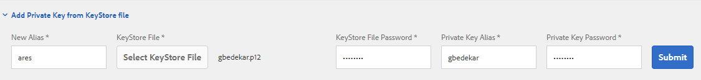
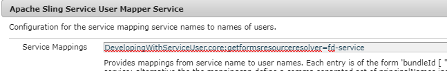

# Certifying Document in AEM Forms

A Certified Document provides PDF document and forms recipients with added assurances of its authenticity and integrity.

To certify a document, you can use Acrobat DC on the desktop or AEM Forms Document Services as part of an automated process on a server.

This article provides you sample OSGI bundle to certify pdf documents using AEM Forms Document Services.The code used in the sample is [available here](https://helpx.adobe.com/experience-manager/6-4/forms/using/aem-document-services-programmatically.html)

To certify documents using AEM Forms, the following steps need to be followed

## Adding certificate to trust store {#adding-certificate-to-trust-store}

Please follow the steps mentioned below to add the certificate to keystore in AEM

* [Initialize global trust store](http://localhost:4502/libs/granite/security/content/truststore.html)
* [Search for fd-service](http://localhost:4502/security/users.html) user
* **You will have to scroll the results page to load all the users to find the fd-service user**
* Double click the fd-service user to open the user settings window
* Click on "Add Private Key from the keystore file".Specify the alias and password specific to your certificate

* Save your changes

## Creating OSGI Service

You can write your own OSGi bundle and use the AEM Forms Client SDK to implement a service to certify PDF documents. The following links would be useful to write your own OSGi bundle

* [Creating your first OSGi bundle](https://helpx.adobe.com/experience-manager/using/maven_arch13.html)
* [Use Document Service API](https://helpx.adobe.com/experience-manager/6-4/forms/using/aem-document-services-programmatically.html)

Or you can use the sample bundle included as part of this tutorial assets.

>[!NOTE]
>
>The sample bundle uses alias called "ares" to certify the documents. So please make sure your alias is called "ares" when using this bundle

## Testing the sample on your local system

* Download and install [Custom Document Services Bundle](/help/forms/assets/common-osgi-bundles/AEMFormsDocumentServices.core-1.0-SNAPSHOT.jar)
* Download and install [Developing with Service User Bundle](/help/forms/assets/common-osgi-bundles/DevelopingWithServiceUser.jar)
* [Make sure you have added the following entry in the Apache Sling Service User Mapper Service](http://localhost:4502/system/console/configMgr) 
**DevelopingWithServiceUser.core:getformsresourceresolver=fd-service** as shown in the screenshot below

* [Import Sample Adaptive Form](assets/certify-pdf-af.zip)
* [Import and install the Custom Submit](assets/custom-submit-certify.zip)
* [Open the Adaptive Form](http://localhost:4502/content/dam/formsanddocuments/certifypdf/jcr:content?wcmmode=disabled)
* Upload PDF document that needs to be certified
**optional** - Specify the signature field that you want to use in certifying the document
* Click submit.
* Certified PDF should be returned to you.
