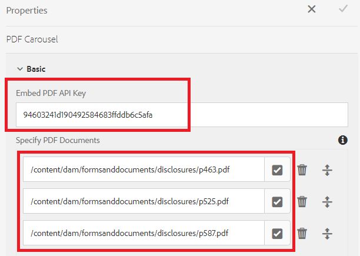

# Display multiple pdf documents in a carousel

A common use case is to display multiple PDF documents to the form filler to review before submitting the form.

To accomplish this use case we have utilized the [Adobe PDF Embed API](https://www.adobe.io/apis/documentcloud/dcsdk/pdf-embed.html).

[A live demo of this sample can be experienced here.](https://forms.enablementadobe.com/content/dam/formsanddocuments/wefinancecreditcard/jcr:content?wcmmode=disabled)

The following steps were performed to complete the integration

## Create a custom component to display multiple PDF documents

A custom component (pdf-carousel) was created to cycle through pdf documents

## Client library

A client library was created to display the PDFs using the Adobe PDF Embed API. The PDFs to display are specified in the pdf-carousel components.

## Create Adaptive Form

Create an adaptive form based with some tabs (This sample has 3 tabs)
Add some adaptive form components in the first two tabs
Add the pdf carousel component in the third tab
Configure the pdf-carousel component as shown in the screenshot below

**Embed PDF API Key** - This is the key that you can use to embed the pdf. This key will only work with localhost. You can create [your own key](https://www.adobe.io/apis/documentcloud/dcsdk/pdf-embed.html) and associate it with other domain.

**Specify PDF Documents** - Here you can specify the pdf documents that you want to be displayed in the carousel.

## Deploy the sample on your server

To test this on your local server, follow the steps:

1. [Import the client library](assets/pdf-carousel-client-lib.zip) into your local AEM instance [using the package manager](http://localhost:4502/crx/packmgr/index.jsp)
1. [Import the pdf carousel component](assets/pdf-carousel-component.zip) into your local AEM instance [using the package manager](http://localhost:4502/crx/packmgr/index.jsp)
1. [Import the Adaptive Form ](assets/adaptive-form-pdf-carousel.zip) into your local AEM instance [using the package manager](http://localhost:4502/crx/packmgr/index.jsp)
1. [Import the sample pdf's to display](assets/pdf-carousel-sample-documents.zip) into your local AEM instance [using the assets file upload link](http://localhost:4502/assets.html/content/dam)
1. [Preview Adaptive Form](http://localhost:4502/content/dam/formsanddocuments/wefinancecreditcard/jcr:content?wcmmode=disabled)
1. Tab to the Documents to Review tab. You should see three PDF documents in the carousel component.
