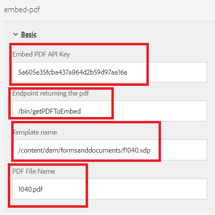

# Display DoR inline

A common use case is to display a pdf document with the data entered by the form filler.

To accomplish this use case we have utilized the [Adobe PDF Embed API](https://www.adobe.io/apis/documentcloud/dcsdk/pdf-embed.html).

The following steps were performed to complete the integration

## Create custom component to display the PDF inline

A custom component (embed-pdf) was created to embed the pdf returned by the POST call.

## Client library

The following code gets executed when the `viewPDF` checkbox button is clicked. We pass the adaptive form data, template name to the endpoint to generate the pdf. The generated pdf is then displayed to the form filler using embed pdf JavaScript library.

``` javascript
$(document).ready(function() {

    $(".viewPDF").click(function() {
        console.log("view pdfclicked");
        window.guideBridge.getDataXML({
            success: function(result) {
                var obj = new FormData();
                obj.append("data", result.data);
                obj.append("template", document.querySelector("[data-template]").getAttribute("data-template"));
                const fetchPromise = fetch(document.querySelector("[data-endpoint]").getAttribute("data-endpoint"), {
                        method: "POST",
                        body: obj,
                        contentType: false,
                        processData: false,

                    })
                    .then(response => {

                        var adobeDCView = new AdobeDC.View({
                            clientId: document.querySelector("[data-apikey]").getAttribute("data-apikey"),
                            divId: "adobe-dc-view"
                        });
                        console.log("In preview file");
                        adobeDCView.previewFile(

                            {
                                content: {
                                    promise: response.arrayBuffer()
                                },
                                metaData: {
                                    fileName: document.querySelector("[data-filename]").getAttribute("data-filename")
                                }
                            }
                        );


                        console.log("done")
                    })


            }
        });
    });


});
```

## Generate sample data for the XDP

* Open the XDP in AEM Forms designer. 
* Click File | Form Properties | Preview
* Click Generate Preview Data
* Click Generate
* Provide meaningful file name such as "form-data.xml"

## Generate XSD from the xml data

You can use any of the free online tools to [generate XSD](https://www.freeformatter.com/xsd-generator.html) from the xml data generated in the previous step.

## Upload the template

Make sure you upload the xdp template into [AEM Forms](http://localhost:4502/aem/forms.html/content/dam/formsanddocuments) using the create button


## Create Adaptive Form

Create adaptive form based on the XSD from the previous step.
Add a new tab to the adaptive. Add a checkbox component and embed-pdf component to this tab
Make sure you name the checkbox viewPDF.
Configure the embed-pdf component as shown in the screenshot below


**Embed PDF API Key** - This is the key that you can use to embed the pdf. This key will only work with localhost. You can create [your own key](https://www.adobe.io/apis/documentcloud/dcsdk/pdf-embed.html) and associate it with other domain.

**Endpoint returning the pdf** - This is the custom servlet that will merge the data with the xdp template and return the pdf.

**Template name** - This is the path to the xdp. Typically, it is stored under the formsanddocuments folder.

**PDF File Name** - This is the string that will appear in embed pdf component.

## Create custom servlet

 A custom servlet was created to merge the data with XDP template and return the pdf. The code to accomplish this is listed below. The custom servlet is part of the [embedpdf bundle](assets/embedpdf.core-1.0-SNAPSHOT.jar)

``` java
import java.io.ByteArrayInputStream;
import java.io.IOException;
import java.io.InputStream;
import java.io.OutputStream;
import java.io.StringReader;
import java.io.StringWriter;
import javax.servlet.Servlet;
import javax.xml.parsers.DocumentBuilder;
import javax.xml.parsers.DocumentBuilderFactory;
import javax.xml.transform.Transformer;
import javax.xml.transform.TransformerFactory;
import javax.xml.transform.dom.DOMSource;
import javax.xml.transform.stream.StreamResult;
import javax.xml.xpath.XPath;
import javax.xml.xpath.XPathConstants;
import javax.xml.xpath.XPathFactory;

import org.apache.sling.api.SlingHttpServletRequest;
import org.apache.sling.api.SlingHttpServletResponse;
import org.apache.sling.api.servlets.SlingAllMethodsServlet;
import org.osgi.service.component.annotations.Component;
import org.osgi.service.component.annotations.Reference;
import org.slf4j.Logger;
import org.slf4j.LoggerFactory;
import org.w3c.dom.Node;
import org.w3c.dom.NodeList;
import org.xml.sax.InputSource;
import com.adobe.aemfd.docmanager.Document;
import com.adobe.fd.output.api.OutputService;

package com.embedpdf.core.servlets;
@Component(service = {
   Servlet.class
}, property = {
   "sling.servlet.methods=post",
   "sling.servlet.paths=/bin/getPDFToEmbed"
})
public class StreamPDFToEmbed extends SlingAllMethodsServlet {
   @Reference
   OutputService outputService;
   private static final long serialVersionUID = 1 L;
   private static final Logger log = LoggerFactory.getLogger(StreamPDFToEmbed.class);

   protected void doPost(SlingHttpServletRequest request, SlingHttpServletResponse response) throws IOException {
      String xdpName = request.getParameter("template");
      String formData = request.getParameter("data");
      log.debug("in doPOST of Stream PDF Form Data is >>> " + formData + " template is >>> " + xdpName);

      try {

         XPathFactory xfact = XPathFactory.newInstance();
         XPath xpath = xfact.newXPath();
         DocumentBuilderFactory factory = DocumentBuilderFactory.newInstance();
         DocumentBuilder builder = factory.newDocumentBuilder();

         org.w3c.dom.Document xmlDataDoc = builder.parse(new InputSource(new StringReader(formData)));

         // get the data to merge with template

         Node afBoundData = (Node) xpath.evaluate("afData/afBoundData", xmlDataDoc, XPathConstants.NODE);
         NodeList afBoundDataChildren = afBoundData.getChildNodes();
         String afDataNodeName = afBoundDataChildren.item(0).getNodeName();
         Node nodeWithDataToMerge = (Node) xpath.evaluate("afData/afBoundData/" + afDataNodeName, xmlDataDoc, XPathConstants.NODE);
         StringWriter writer = new StringWriter();
         Transformer transformer = TransformerFactory.newInstance().newTransformer();
         transformer.transform(new DOMSource(nodeWithDataToMerge), new StreamResult(writer));
         String xml = writer.toString();
         InputStream targetStream = new ByteArrayInputStream(xml.getBytes());
         Document xmlDataDocument = new Document(targetStream);
         // get the template
         Document xdpTemplate = new Document(xdpName);
         log.debug("got the  xdp Template " + xdpTemplate.length());

         // use output service the merge data with template
         com.adobe.fd.output.api.PDFOutputOptions pdfOptions = new com.adobe.fd.output.api.PDFOutputOptions();
         pdfOptions.setAcrobatVersion(com.adobe.fd.output.api.AcrobatVersion.Acrobat_11);
         com.adobe.aemfd.docmanager.Document documentToReturn = outputService.generatePDFOutput(xdpTemplate, xmlDataDocument, pdfOptions);

         // stream pdf to the client

         InputStream fileInputStream = documentToReturn.getInputStream();
         response.setContentType("application/pdf");
         response.addHeader("Content-Disposition", "attachment; filename=AemFormsRocks.pdf");
         response.setContentLength((int) fileInputStream.available());
         OutputStream responseOutputStream = response.getOutputStream();
         int bytes;
         while ((bytes = fileInputStream.read()) != -1) {
            responseOutputStream.write(bytes);
         }
         responseOutputStream.flush();
         responseOutputStream.close();

      } catch (Exception e) {

         System.out.println("Error " + e.getMessage());
      }

   }

}

```


## Deploy the sample on your server

To test this on your local server, please follow the following steps:

1. [Download and Install the embedpdf bundle](assets/embedpdf.core-1.0-SNAPSHOT.jar). 
This has the servlet to merge the data with the XDP template and stream the pdf back.
1. Add the path /bin/getPDFToEmbed in the excluded paths section of Adobe Granite CSRF Filter using the [AEM ConfigMgr](http://localhost:4502/system/console/configMgr). In your production environment it is recommended to use the [CSRF protection framework](https://experienceleague.adobe.com/docs/experience-manager-65/developing/introduction/csrf-protection.html?lang=en)
1. [Import the client library and custom component](assets/embed-pdf.zip)
1. [Import the Adaptive Form and Template](assets/embed-pdf-form-and-xdp.zip)
1. [Preview Adaptive Form](http://localhost:4502/content/dam/formsanddocuments/from1040/jcr:content?wcmmode=disabled)
1. Fill in few of the form fields
1. Tab to the View PDF tab. Select the view pdf checkbox. You should see a pdf displayed in the form populated with the adaptive form data
