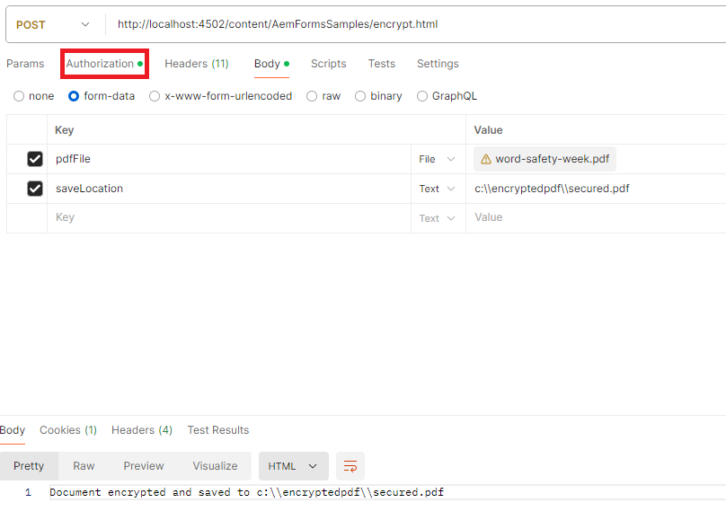

# Encrypt PDF with a permission password

A permissions password, also known as an owner or master password, is required to copy, edit, or print a PDF document. Learn to use the [DocAssuranceService](https://developer.adobe.com/experience-manager/reference-materials/6-5/forms/javadocs/index.html?com/adobe/fd/docassurance/client/api/DocAssuranceService.html) API to apply a permission password to a PDF programmatically

The following JSP code encrypts a PDF with a permissions password:

```java
<%--
     Encrypt PDF with permissions password
--%>
    <%@include file="/libs/foundation/global.jsp"%>
<%@ page import="com.adobe.fd.docassurance.client.api.EncryptionOptions,java.util.*,java.io.*,com.adobe.fd.encryption.client.*" %>
    <%@page session="false" %>
<%
    String filePath = request.getParameter("saveLocation");
    InputStream pdfIS = null;
    com.adobe.aemfd.docmanager.Document generatedDocument = null;
    // get the pdf file
    javax.servlet.http.Part pdfPart = request.getPart("pdfFile");
    pdfIS = pdfPart.getInputStream();
    com.adobe.aemfd.docmanager.Document pdfDocument = new com.adobe.aemfd.docmanager.Document(pdfIS);


// encrypt the document with permssions password. You can only print this document
    PasswordEncryptionOptionSpec poSpec = new PasswordEncryptionOptionSpec();    
    poSpec.setCompatability(PasswordEncryptionCompatability.ACRO_X);
    poSpec.setEncryptOption(PasswordEncryptionOption.ALL);
    List<PasswordEncryptionPermission> permissionList = new ArrayList<PasswordEncryptionPermission>();
    permissionList.add(PasswordEncryptionPermission.PASSWORD_PRINT_LOW);
    //hardcoding passwords into code is for demonstration purposes only.In real life scenarios the password is sourced from a secure location
    poSpec.setPermissionPassword("adobe");
    poSpec.setPermissionsRequested(permissionList);
    EncryptionOptions encryptionOptions = EncryptionOptions.getInstance();
    encryptionOptions.setEncryptionType(com.adobe.fd.docassurance.client.api.DocAssuranceServiceOperationTypes.ENCRYPT_WITH_PASSWORD);
    encryptionOptions.setPasswordEncryptionOptionSpec(poSpec);
    com.adobe.fd.docassurance.client.api.DocAssuranceService docAssuranceService = sling.getService(com.adobe.fd.docassurance.client.api.DocAssuranceService.class);
    com.adobe.aemfd.docmanager.Document securedDocument = docAssuranceService.secureDocument(pdfDocument,encryptionOptions,null,null,null);
    securedDocument.copyToFile(new java.io.File(filePath));
    out.println("Document encrypted and saved to " +filePath);
%>
```


**To test the sample package on your system**

[Download and install the package using the AEM package manager](assets/encryptpdf.zip)

**After you install the package, add the following URLs the Adobe Granite CSRF Filter's OSGi configuration allowlist:**

1. [Login to configMgr](http://localhost:4502/system/console/configMgr)
1. Search for Adobe Granite CSRF Filter
1. Add the following path in the excluded sections and save
1. /content/AemFormsSamples/encrypt 
 
## Testing the sample

There are a number of ways to test the sample code. The quickest and easiest is to use Postman app. Postman allows you to make POST requests to your server.The following screenshot show you the request parameters needed for the post request to work. Please make sure you specify the appropriate Authorization type before you submit the request.


