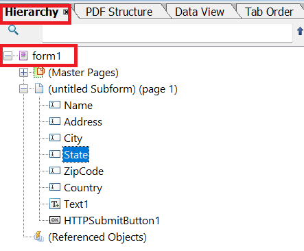

# Download Interactive DoR

A common use case is to be able to download an interactive DoR with the Adaptive Form data. The downloaded DoR will then be completed using Adobe Acrobat or Adobe Reader.

## Adaptive Form is not based on XSD Schema

If your XDP and Adaptive Form is not based on any schema, then please follow the following steps to generate an interactive Document of Record.

### Create Adaptive Form

Create an adaptive form and make sure the adaptive form field names are named identical to field names in your xdp template.
Make a note of the root element name of your xdp template.


### Client Lib

The following code gets triggered when the Download PDF button gets triggered

```javascript
$(document).ready(function() {
    $(".downloadPDF").click(function() {
        window.guideBridge.getDataXML({
            success: function(guideResultObject) {
                var req = new XMLHttpRequest();
                req.open("POST", "/bin/generateinteractivedor", true);
                req.responseType = "blob";
                var postParameters = new FormData();
                postParameters.append("dataXml", guideResultObject.data);
                postParameters.append("xdpName","two.xdp")
                postParameters.append("formBasedOnSchema", "false");
                postParameters.append("xfaRootElement","form1");
                console.log(guideResultObject.data);
                req.send(postParameters);
                req.onreadystatechange = function() {
                    if (req.readyState == 4 && req.status == 200) {
                        download(this.response, "report.pdf", "application/pdf");
                    }


                }
            }
        });

    });
});
```

## Adaptive Form based on XSD Schema

If your xdp is not based on XSD, then please follow the following steps to create XSD(schema)on which you will base your adaptive form

### Generate sample data for the XDP

* Open the XDP in AEM Forms designer. 
* Click File | Form Properties | Preview
* Click Generate Preview Data
* Click Generate
* Provide meaningful file name such as "form-data.xml"

### Generate XSD from the xml data

You can use any of the free online tools to [generate XSD](https://www.freeformatter.com/xsd-generator.html) from the xml data generated in the previous step.

### Create Adaptive Form

Create an adaptive form based on the XSD from the previous step. Associate the form to use the client lib "irs". This client library has the code to make a POST call to the servlet which return the PDF to the calling application.
The following code gets triggered when the _Download PDF_ is clicked 

``` javascript
$(document).ready(function() {
    $(".downloadPDF").click(function() {
        window.guideBridge.getDataXML({
            success: function(guideResultObject) {
                var req = new XMLHttpRequest();
                req.open("POST", "/bin/generateinteractivedor", true);
                req.responseType = "blob";
                var postParameters = new FormData();
                postParameters.append("dataXml", guideResultObject.data);
                postParameters.append("xdpName","f8918-r14e_redo-barcode_3 2.xdp")
                postParameters.append("formBasedOnSchema", "true");
                postParameters.append("dataNodeToExtract","afData/afBoundData/topmostSubform");
                console.log(guideResultObject.data);
                req.send(postParameters);
                req.onreadystatechange = function() {
                    if (req.readyState == 4 && req.status == 200) {
                        download(this.response, "report.pdf", "application/pdf");
                    }


                }
            }
        });

    });
});
```


## Create custom servlet

 Create a custom servlet that will merge the data with XDP template and return the pdf. The code to accomplish this is listed below. The custom servlet is part of the [AEMFormsDocumentServices.core-1.0-SNAPSHOT bundle](/help/forms/assets/common-osgi-bundles/AEMFormsDocumentServices.core-1.0-SNAPSHOT.jar)).

``` java
public class GenerateIInteractiveDor extends SlingAllMethodsServlet {
    private static final long serialVersionUID = 1 L;
    @Reference
    DocumentServices documentServices;
    @Reference
    FormsService formsService;
    private static final Logger log = LoggerFactory.getLogger(GenerateIInteractiveDor.class);

    protected void doGet(SlingHttpServletRequest request, SlingHttpServletResponse response) {
        doPost(request, response);
    }
    protected void doPost(SlingHttpServletRequest request, SlingHttpServletResponse response) {
        String xdpName = request.getParameter("xdpName");

        boolean formBasedOnXSD = Boolean.parseBoolean(request.getParameter("formBasedOnSchema"));

        XPathFactory xfact = XPathFactory.newInstance();
        XPath xpath = xfact.newXPath();
        String dataXml = request.getParameter("dataXml");
        log.debug("The data xml is " + dataXml);
        org.w3c.dom.Document xmlDataDoc = documentServices.w3cDocumentFromStrng(dataXml);
        Document renderedPDF = null;
        try {
            if (!formBasedOnXSD) {
                String xfaRootElement = request.getParameter("xfaRootElement");
                DocumentBuilderFactory dbFactory = DocumentBuilderFactory.newInstance();
                DocumentBuilder dBuilder = dbFactory.newDocumentBuilder();
                org.w3c.dom.Document newXMLDocument = dBuilder.newDocument();
                Element rootElement = newXMLDocument.createElement(xfaRootElement);
                String unboundData = "afData/afUnboundData/data";
                Node dataNode = (Node) xpath.evaluate(unboundData, xmlDataDoc, XPathConstants.NODE);
                NodeList dataChildNodes = dataNode.getChildNodes();
                for (int i = 0; i<dataChildNodes.getLength(); i++) {
                    Node childNode = dataChildNodes.item(i);
                    if (childNode.getNodeType() == 1) {
                        Element newElement = newXMLDocument.createElement(childNode.getNodeName());
                        newElement.setTextContent(childNode.getTextContent());
                        rootElement.appendChild(newElement);
                        log.debug("the node name is  " + childNode.getNodeName() + " and its value is " + childNode.getTextContent());
                    }
                }
                newXMLDocument.appendChild(rootElement);
                Document xmlDataDocument = documentServices.orgw3cDocumentToAEMFDDocument(newXMLDocument);
                String xdpTemplatePath = "crx:///content/dam/formsanddocuments";
                com.adobe.fd.forms.api.PDFFormRenderOptions renderOptions = new com.adobe.fd.forms.api.PDFFormRenderOptions();
                renderOptions.setAcrobatVersion(com.adobe.fd.forms.api.AcrobatVersion.Acrobat_11);
                renderOptions.setContentRoot(xdpTemplatePath);
                renderOptions.setRenderAtClient(com.adobe.fd.forms.api.RenderAtClient.NO);
                renderedPDF = formsService.renderPDFForm(xdpName, xmlDataDocument, renderOptions);

            } else {
                // form is based on xsd
                // get the actual xml data that needs to be merged with the template. This can be made more generic
                String nodeToExtract = request.getParameter("dataNodeToExtract");
                Node dataNode = (Node) xpath.evaluate(nodeToExtract, xmlDataDoc, XPathConstants.NODE);
                StringWriter writer = new StringWriter();
                Transformer transformer = TransformerFactory.newInstance().newTransformer();
                transformer.transform(new DOMSource(dataNode), new StreamResult(writer));
                String xml = writer.toString();
                System.out.println(xml);
                xmlDataDoc = documentServices.w3cDocumentFromStrng(xml);
                Document xmlDataDocument = documentServices.orgw3cDocumentToAEMFDDocument(xmlDataDoc);
                String xdpTemplatePath = "crx:///content/dam/formsanddocuments";
                com.adobe.fd.forms.api.PDFFormRenderOptions renderOptions = new com.adobe.fd.forms.api.PDFFormRenderOptions();
                renderOptions.setAcrobatVersion(com.adobe.fd.forms.api.AcrobatVersion.Acrobat_11);
                renderOptions.setContentRoot(xdpTemplatePath);
                renderOptions.setRenderAtClient(com.adobe.fd.forms.api.RenderAtClient.NO);
                renderedPDF = formsService.renderPDFForm(xdpName, xmlDataDocument, renderOptions);
            }
            InputStream fileInputStream = renderedPDF.getInputStream();
            response.setContentType("application/pdf");
            response.addHeader("Content-Disposition", "attachment; filename=" + xdpName.replace("xdp", "pdf"));
            response.setContentLength((int) fileInputStream.available());
            OutputStream responseOutputStream = response.getOutputStream();
            int bytes;
            while ((bytes = fileInputStream.read()) != -1) {
                responseOutputStream.write(bytes);
            }
            responseOutputStream.flush();
            responseOutputStream.close();

        } catch (XPathExpressionException | TransformerException | FormsServiceException | IOException | ParserConfigurationException e) {
            log.debug(e.getMessage());
        }

    }

}
```

In this sample code, the xdp name and other parameters are extracted from the request object. If the form is not based on an XSD, a new XML document is created to merge with the xdp. However, if the form is XSD-based, the relevant node is extracted directly from the adaptive form's submitted data, and an XML document is generated to merge with the xdp template accordingly.

## Deploy the sample on your server

To test this on your local server, please follow the following steps:

1. [Download and Install the DevelopingWithServiceUser Bundle](/help/forms/assets/common-osgi-bundles/DevelopingWithServiceUser.jar)
1. Add the following entry in the Apache Sling Service User Mapper Service
        DevelopingWithServiceUser.core:getformsresourceresolver=fd-service
1. [Download and install the custom DocumentServices bundle](/help/forms/assets/common-osgi-bundles/AEMFormsDocumentServices.core-1.0-SNAPSHOT.jar). This has the servlet to merge the data with the XDP template and stream the pdf back
1. [Import the client library](assets/generate-interactive-dor-client-lib.zip)
1. [Import the Article Assets(Adaptive Form,XDP Templates and XSD)](assets/generate-interactive-dor-sample-assets.zip)
1. [Preview Adaptive Form](http://localhost:4502/content/dam/formsanddocuments/f8918complete/jcr:content?wcmmode=disabled)
1. Fill in few of the form fields.
1. Click Download PDF to get the PDF. You may have to wait a few seconds for the PDF to download.

>[!NOTE]
>
>When you open the downloaded PDF using the browser's pdf viewer, you will not see the data in the pdf. Open the downloaded PDF using Adobe Acrobat or Adobe Reader. 


>[!NOTE]
>
>You can try the same use case with [non xsd based adaptive form](http://localhost:4502/content/dam/formsanddocuments/two/jcr:content?wcmmode=disabled). Make sure you pass the appropriate parameters to the post endpoint in streampdf.js located in the irs clientlib.
