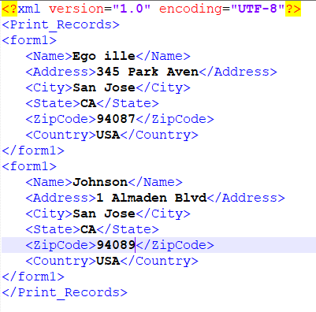

# Generate a set of PDF Documents from one xml data file

OutputService provides a number of methods to create documents using a form design and data to merge with the form design. The following article explains the use case to generate multiple pdf's from one large xml containing multiple individual records.
The following is the screen-shot of xml file containing multiple records.



Data xml has 2 records. Each record is represented by the form1 element. This xml is passed to the OutputService [generatePDFOutputBatch method](https://helpx.adobe.com/aem-forms/6/javadocs/com/adobe/fd/output/api/OutputService.html) we get list of pdf documents(one per record)
The signature of the generatePDFOutputBatch method takes the following parameters

* templates - Map containing the template, identified by a key
* data - Map containing xml data documents, identified by key
* pdfOutputOptions - options to configure pdf generation
* batchOptions - options to configure batch

>[!NOTE]
>
>This use case is available as live example on this [website](https://forms.enablementadobe.com/content/samples/samples.html?query=0).

## Use case Details{#use-case-details}

In this use case we are going to provide a simple web interface to upload the template and data(xml) file. Once the upload of the files is complete and POST request is sent to AEM servlet. This servlet extracts the documents and calls the  generatePDFOutputBatch method of the OutputService. The generated pdf's are zipped into a zip file and made available to the end user to download from the web browser.

## Servlet Code{#servlet-code}

The following is the code snippet from the servlet. Code extracts the template(xdp) and the data file(xml) from the request. Template file is saved to the file system. Two maps are created- templateMap and dataFileMap which contain the template and the xml(data) files respectively. A call is then made to generateMultipleRecords method of the DocumentServices service.

```java
for (final java.util.Map.Entry < String, org.apache.sling.api.request.RequestParameter[] > pairs: params
.entrySet()) {
final String key = pairs.getKey();
final org.apache.sling.api.request.RequestParameter[] pArr = pairs.getValue();
final org.apache.sling.api.request.RequestParameter param = pArr[0];
try {
if (!param.isFormField()) {

if (param.getFileName().endsWith("xdp")) {
    final InputStream xdpStream = param.getInputStream();
    com.adobe.aemfd.docmanager.Document xdpDocument = new com.adobe.aemfd.docmanager.Document(xdpStream);

    xdpDocument.copyToFile(new File(saveLocation + File.separator + "fromui.xdp"));
    templateMap.put("key1", "file://///" + saveLocation + File.separator + "fromui.xdp");
    System.out.println("####  " + param.getFileName());

}
if (param.getFileName().endsWith("xml")) {
    final InputStream xmlStream = param.getInputStream();
    com.adobe.aemfd.docmanager.Document xmlDocument = new com.adobe.aemfd.docmanager.Document(xmlStream);
    dataFileMap.put("key1", xmlDocument);
}
}

Document zippedDocument = documentServices.generateMultiplePdfs(templateMap, dataFileMap,saveLocation);
.....
.....
....
```

### Interface Implementation Code{#Interface-Implementation-Code}

The following code generates multiple pdf's using the OutputService's generatePDFOutputBatch and returns a zip file containing the pdf files to the calling servlet

```java
public Document generateMultiplePdfs(HashMap < String, String > templateMap, HashMap < String, Document > dataFileMap, String saveLocation) {
    log.debug("will save generated documents to " + saveLocation);
    com.adobe.fd.output.api.PDFOutputOptions pdfOptions = new com.adobe.fd.output.api.PDFOutputOptions();
    pdfOptions.setAcrobatVersion(com.adobe.fd.output.api.AcrobatVersion.Acrobat_11);
    com.adobe.fd.output.api.BatchOptions batchOptions = new com.adobe.fd.output.api.BatchOptions();
    batchOptions.setGenerateManyFiles(true);
    com.adobe.fd.output.api.BatchResult batchResult = null;
    try {
        batchResult = outputService.generatePDFOutputBatch(templateMap, dataFileMap, pdfOptions, batchOptions);
        FileOutputStream fos = new FileOutputStream(saveLocation + File.separator + "zippedfile.zip");
        ZipOutputStream zipOut = new ZipOutputStream(fos);
        FileInputStream fis = null;

        for (int i = 0; i < batchResult.getGeneratedDocs().size(); i++) {
              com.adobe.aemfd.docmanager.Document dataMergedDoc = batchResult.getGeneratedDocs().get(i);
            log.debug("Got document " + i);
            dataMergedDoc.copyToFile(new File(saveLocation + File.separator + i + ".pdf"));
            log.debug("saved file " + i);
            File fileToZip = new File(saveLocation + File.separator + i + ".pdf");
            fis = new FileInputStream(fileToZip);
            ZipEntry zipEntry = new ZipEntry(fileToZip.getName());
            zipOut.putNextEntry(zipEntry);
            byte[] bytes = new byte[1024];
            int length;
            while ((length = fis.read(bytes)) >= 0) {
                zipOut.write(bytes, 0, length);
            }
            fis.close();
        }
        zipOut.close();
        fos.close();
        Document zippedDocument = new Document(new File(saveLocation + File.separator + "zippedfile.zip"));
        log.debug("Got zipped file from file system");
        return zippedDocument;


    } catch (OutputServiceException | IOException e) {

        e.printStackTrace();
    }
    return null;


}
```

### Deploy on your server{#Deploy-on-your-server}

To test this capability on your server, please follow the below instructions:

* [Download and extract zip file contents to your file system](assets/mult-records-template-and-xml-file.zip).This zip file contains the template and xml data file.
* [Point your browser to Felix web console](http://localhost:4502/system/console/bundles)
* [Deploy DevelopingWithServiceUser Bundle](/help/forms/assets/common-osgi-bundles/DevelopingWithServiceUser.jar). 
* [Deploy Custom AEMFormsDocumentServices Bundle](/help/forms/assets/common-osgi-bundles/AEMFormsDocumentServices.core-1.0-SNAPSHOT.jar).Custom bundle which generates the pdf's using the OutputService API
* [Point your browser to package manager](http://localhost:4502/crx/packmgr/index.jsp)
* [Import and install the package](assets/generate-multiple-pdf-from-xml.zip). This package contains html page which allows you to drop the template and data files.
* [Point your browser to MultiRecords.html](http://localhost:4502/content/DocumentServices/Multirecord.html?)
* Drag and drop the template and xml data file together
* Download the zip file created. This zip file contains the pdf files generated by the output service.

>[!NOTE]
>There are multiple ways to trigger this capability. In this example we have used a web interface to drop the template and data file to demonstrate the capability.

