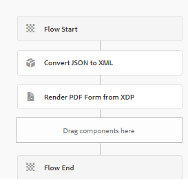

# Generate PDF with data from core component based form submission

Here's the revised text with "Core Components" capitalized:

A typical scenario involves generating a PDF from data submitted via a Core Components-based adaptive form. This data is always in JSON format. To generate a PDF using the Render PDF API, it's necessary to convert the JSON data into XML format. The `toString` method of `org.json.XML` is used for this conversion. For more details, refer to the [documentation of `org.json.XML.toString` method](https://www.javadoc.io/doc/org.json/json/20171018/org/json/XML.html#toString-java.lang.Object-).

## Adaptive Form-based on JSON schema

Please follow these steps to create a JSON schema for your adaptive form:

### Generate sample data for the XDP

To streamline the process, follow these refined steps:

1. Open the XDP file in AEM Forms Designer.
1. Navigate to "File" > "Form Properties" > "Preview."
1. Select "Generate Preview Data."
1. Click on "Generate."
1. Assign a meaningful filename, such as `form-data.xml`.

### Generate JSON schema from the XML data

You can utilize any free online tool to [convert XML to JSON](https://jsonformatter.org/xml-to-jsonschema) using the XML data generated in the previous step.

### Custom workflow process to convert JSON to XML

The provided code converts JSON to XML, storing the resulting XML in a workflow process variable named `dataXml`.

```java
import org.slf4j.LoggerFactory;
import com.adobe.granite.workflow.WorkflowException;
import java.io.InputStream;
import java.io.BufferedReader;
import java.io.InputStreamReader;
import javax.jcr.Node;
import javax.jcr.Session;
import org.json.JSONObject;
import org.json.XML;
import org.slf4j.Logger;
import org.osgi.service.component.annotations.Component;
import com.adobe.granite.workflow.WorkflowSession;
import com.adobe.granite.workflow.exec.WorkItem;
import com.adobe.granite.workflow.exec.WorkflowProcess;
import com.adobe.granite.workflow.metadata.MetaDataMap;

@Component(property = {
    "service.description=Convert JSON to XML",
    "process.label=Convert JSON to XML"
})
public class ConvertJSONToXML implements WorkflowProcess {

    private static final Logger log = LoggerFactory.getLogger(ConvertJSONToXML.class);

    @Override
    public void execute(final WorkItem workItem, final WorkflowSession workflowSession, final MetaDataMap arg2) throws WorkflowException {
        String processArgs = arg2.get("PROCESS_ARGS", "string");
        log.debug("The process argument I got was " + processArgs);
        
        String submittedDataFile = processArgs;
        String payloadPath = workItem.getWorkflowData().getPayload().toString();
        log.debug("The payload in convert json to xml " + payloadPath);
        
        String dataFilePath = payloadPath + "/" + submittedDataFile + "/jcr:content";
        try {
            Session session = workflowSession.adaptTo(Session.class);
            Node submittedJsonDataNode = session.getNode(dataFilePath);
            InputStream jsonDataStream = submittedJsonDataNode.getProperty("jcr:data").getBinary().getStream();
            BufferedReader streamReader = new BufferedReader(new InputStreamReader(jsonDataStream, "UTF-8"));
            StringBuilder stringBuilder = new StringBuilder();
            String inputStr;
            while ((inputStr = streamReader.readLine()) != null) {
                stringBuilder.append(inputStr);
            }
            JSONObject submittedJson = new JSONObject(stringBuilder.toString());
            log.debug(submittedJson.toString());
            
            String xmlString = XML.toString(submittedJson);
            log.debug("The json converted to XML " + xmlString);
            
            MetaDataMap metaDataMap = workItem.getWorkflow().getWorkflowData().getMetaDataMap();
            metaDataMap.put("xmlData", xmlString);
        } catch (Exception e) {
            log.error("Error converting JSON to XML: " + e.getMessage(), e);
        }
    }
}

```

### Create workflow

To handle form submissions, create a workflow that includes two steps:

1. The initial step employs a custom process to transform the submitted JSON data into XML.
1. The subsequent step generates a PDF by combining the XML data with the XDP template.




## Deploy the example code

To test this on your local server, follow these streamlined steps:

1. [Download and install the custom bundle via the AEM OSGi web console](assets/convertJsonToXML.core-1.0.0-SNAPSHOT.jar).
1. [Import the workflow package](assets/workflow_to_render_pdf.zip).
1. [Import the sample Adaptive Form and XDP template](assets/adaptive_form_and_xdp_template.zip).
1. [Preview the Adaptive Form](http://localhost:4502/content/dam/formsanddocuments/f23/jcr:content?wcmmode=disabled).
1. Complete a few form fields.
1. Submit the form to initiate the AEM workflow.
1. Find the rendered PDF in the workflow's payload folder.
