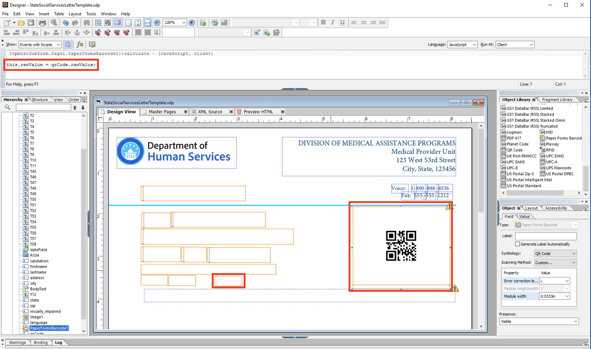
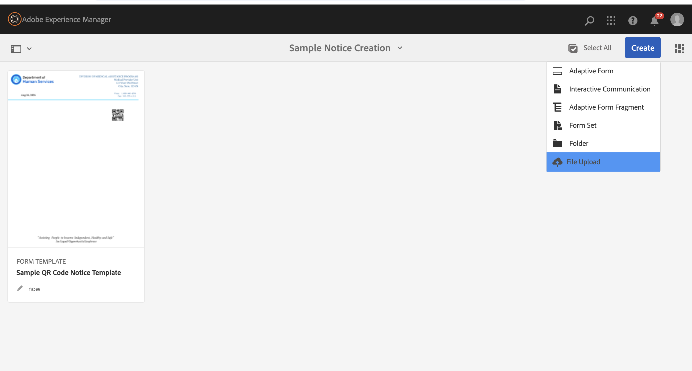
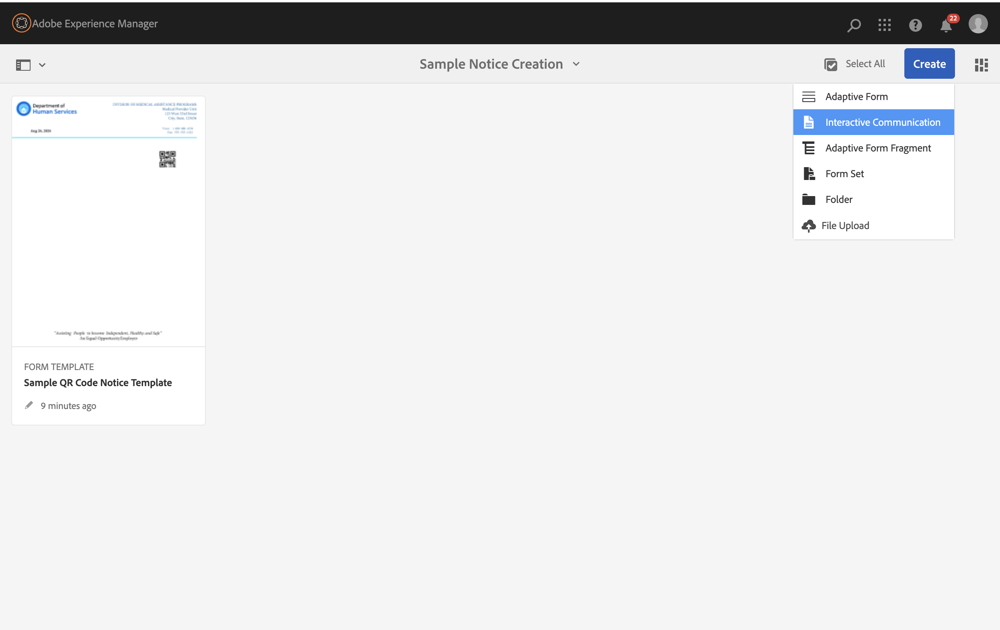

# Dynamic QR Code within PDF Notice Generation{#notice-gen-w-qrcode}

This article will demonstrate the ability to provide a dynamic QR code within a personalized PDF notice. The use case is as follows:

1. The author creates an XDP file with designated location of QR code among additional personalized data fields
2. XDP file is uploaded to AEM and is used as a template for Interactive Communication
3. Case Worker or batch processing provides dynamic data to merge with XDP template
4. Generated PDF is created with personalized data including unique QR code URL value provided
5. Notice recipient receives personalized notice on paper which includes unique QR code where recipient may be directed to provide additional information for specific need

### Create XDP Template
First step is to create the XDP template using Forms Designer. See below the highlighted objects: the placed QRCode object as well as a hidden text field which will be used as the source value to trigger the QR code generation. Also note the Javascript code that indicates the population of the QRCode object to be that of the hidden field. In this image the "this" noted in Javascript is the selected QRCode object and qrCode is the hidden text field which will be populated at the time the notice is generated.

With the QRcode instance selected add an action of a "calculate" type and enter the code as in the Javascript window shown.

Add any additional fields that you wish to dynamically populate and save the XDP file. 

### Upload XDP into AEM Forms
Next upload your new XDP template into AEM Forms, where it will be recognized as a Form Template as seen below.

>[!NOTE]
>
>The default rendered QR code seen is simply a placeholder and is not a reflection of the final generated code.

### Create Interactive Communications Notice
With the template uploaded we will now create a notice that leverages that template. From the Create menu select Interactive Communications.

Line 23 - Call the DocumentServices extractBarCode method to get the JSON object populated with decoded data

To get this running on your system, please follow the following steps:

1. [Download BarcodeService.zip](assets/barcodeservice.zip) and import into AEM using the package manager
1. [Download and install the Custom DocumentServices Bundle](/help/forms/assets/common-osgi-bundles/AEMFormsDocumentServices.core-1.0-SNAPSHOT.jar)
1. [Download and install the DevelopingWithServiceUser Bundle](/help/forms/assets/common-osgi-bundles/DevelopingWithServiceUser.jar)
 1. [Download the sample PDF Form](assets/barcode.pdf)
1. Point your browser to the [sample adaptive form](http://localhost:4502/content/dam/formsanddocuments/barcodedemo/jcr:content?wcmmode=disabled)
1. Upload the sample PDF provided
1. You should see the forms populated with the data
