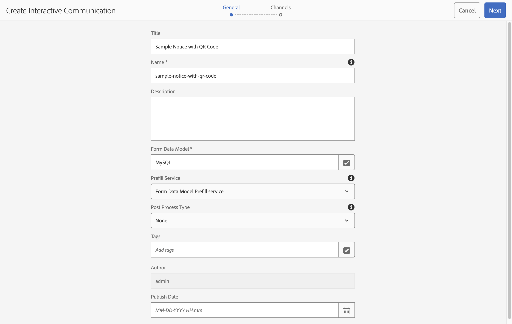
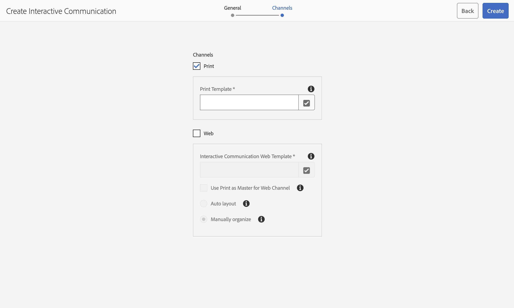
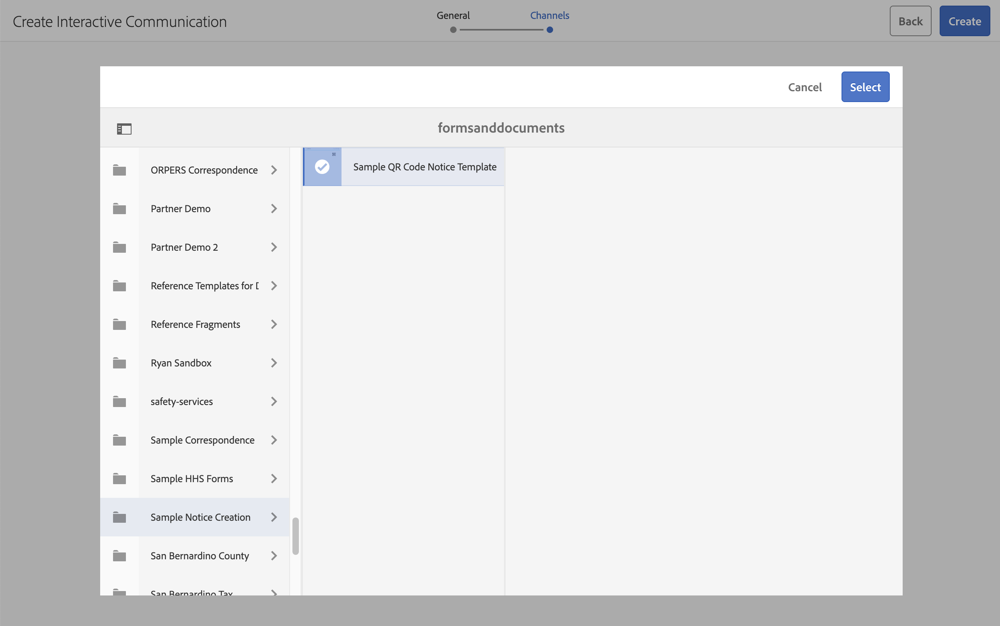
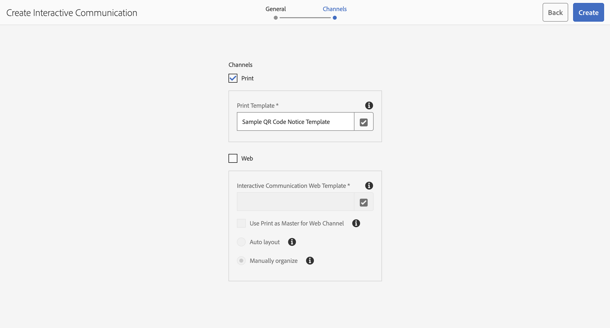
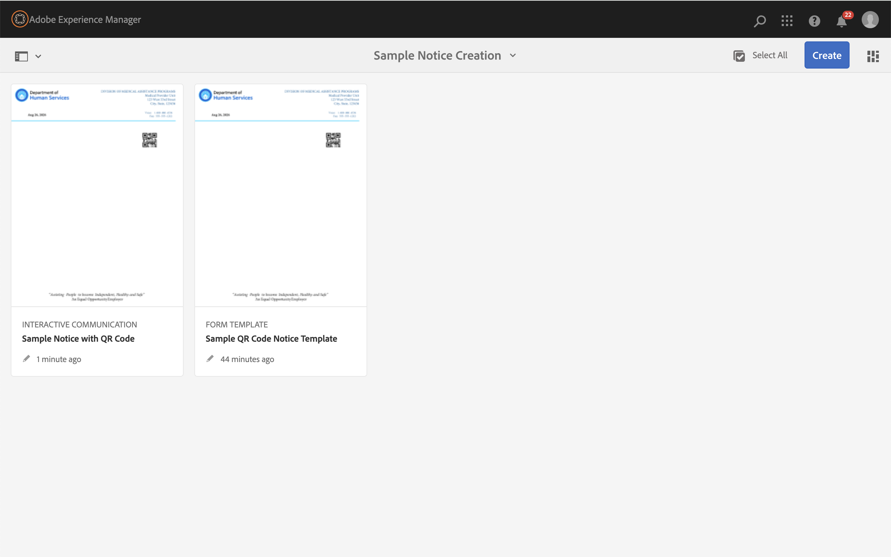
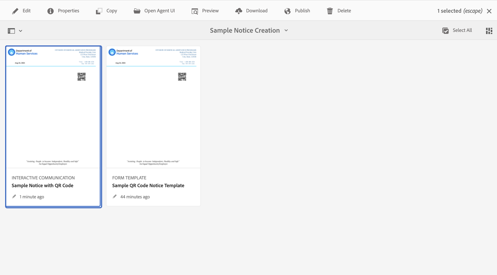
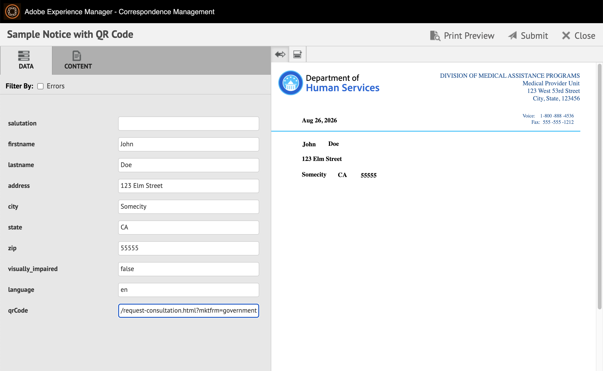
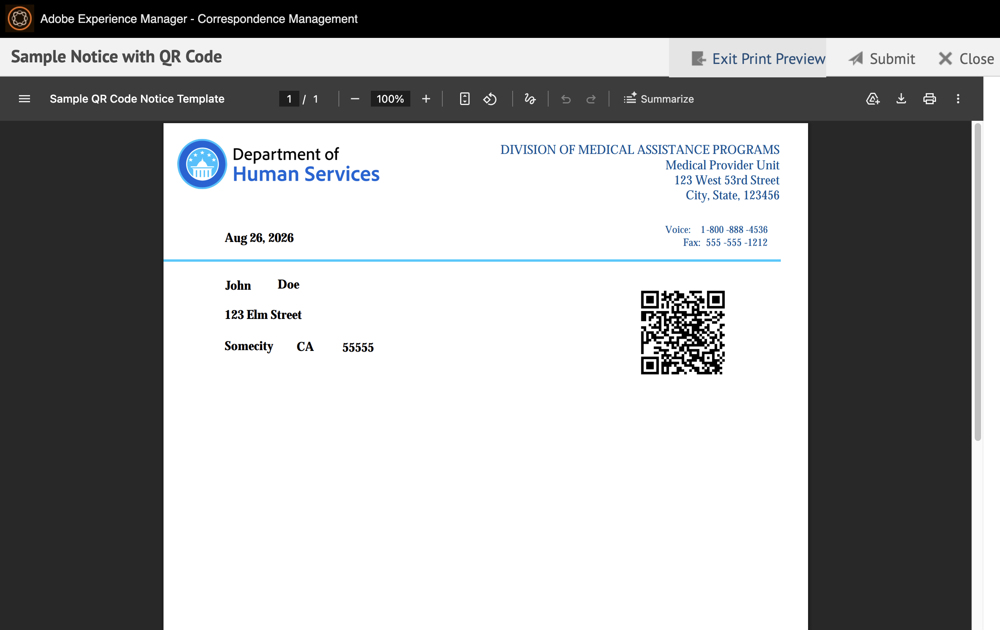

# Dynamic QR Code within PDF Notice Generation{#notice-gen-w-qrcode}

This article will demonstrate the ability to provide a dynamic QR code within a personalized PDF notice. The use case is as follows:

1. The author creates an XDP file with designated location of QR code among additional personalized data fields
2. XDP file is uploaded to AEM and is used as a template for Interactive Communication
3. Case Worker or batch processing provides dynamic data to merge with XDP template
4. Generated PDF is created with personalized data including unique QR code URL value provided
5. Notice recipient receives personalized notice on paper which includes unique QR code where recipient may be directed to provide additional information for specific need

### Pre-requisites
The following pre-requisites are to be considered as part of this tutorial:
1. [AEM Forms 6.5 (Non Cloud Services) or greater](https://experienceleague.adobe.com/en/docs/experience-manager-65/content/forms/getting-started/introduction-aem-forms)
2. [Download and install the DocumentServices Bundle](/help/forms/assets/common-osgi-bundles/AEMFormsDocumentServices.core-1.0-SNAPSHOT.jar)
3. [AEM Forms Designer](https://experienceleague.adobe.com/en/docs/experience-manager-65/content/forms/install-aem-forms/jee-installation/installing-configuring-designer)

### Create XDP Template
First step is to create the XDP template using Forms Designer. See below the highlighted objects: the placed QRCode object as well as a hidden text field which will be used as the source value to trigger the QR code generation. Also note the Javascript code that indicates the population of the QRCode object to be that of the hidden field. In this image the "this" noted in Javascript is the selected QRCode object and qrCode is the hidden text field which will be populated at the time the notice is generated.

With the QRcode instance selected add an action of a "calculate" type and enter the code as in the Javascript window shown.

Add any additional fields that you wish to dynamically populate and save the XDP file. 

### Upload XDP into AEM Forms
Next upload your new XDP template into AEM Forms, where it will be recognized as a Form Template as seen below.

>[!NOTE]
>
>The default rendered QR code seen is simply a placeholder and is not a reflection of the final generated code.

### Create Interactive Communications Notice
With the template uploaded we will now create a notice that leverages that template. From the Create menu select Interactive Communications.

Enter a desired name for your notice, select a specific Form Data Model source and select the Form data Model Prefill Service. All other options on the General section can be left blank for this sample. Click next to proceed to Channels tab.

For this sample we are going to focus on creating a file that is destined for Print, so we will deselect the Web channel.

To set the value of our Print Channel, click the corresponding checkbox and browse to the URL where to find the XDP file you previously uploaded. Locate your template and click Select.

>[!NOTE]
>
>Look at the current URL in your browser for a hint of your current location to help in the navigation for your uploaded XDP file.

With the desired Print template selected, click Create to complete the creation of your Interactive Communication notice.

On creation confirmation, click Done to return to your current directory where you will find both your template and the newly created Interactive Correspondence notice.

Next, select your new Interactive Communication to reveal the contextual menu on the top of the window. Click on Open Agent UI.

The Agent UI presents a limited interface for use by agents or caseworkers who may need to send a single notice. 

>[!NOTE]
>This same notice template can be leveraged for high volume batch processing, sending notices to thousands or millions of unique users. In a batch or high volume scenario all data would be dynamically pulled from a data source and there would be no agent UI interaction required. Also see [Generate multiple interactive communications using Batch API](https://experienceleague.adobe.com/en/docs/experience-manager-65/content/forms/interactive-communications/generate-multiple-interactive-communication-using-batch-api) for additional information on batch notice generation.

Enter values into the fields on the left side to reflect first name, last name, etc. Enter a URL in the qrCode field that points to a form that you would like to request that the recipient of the notice to complete. With your values entered click the Print Preview to generate a PDF of your notice.

You will see a fully rendered PDF of your notice with the values you included in each field. This rendered PDF will also include your unique QR code in the final document. 

Using a mobile phone you can scan the shown code to confirm you are navigated to the URL you provided.

The inclusion of a unique QR code can be considered as part of a broader personalized notice use case. As each notice may contain unique recipient specific information, the QR code too can be unique to each recipient.

For additional information and use cases on personalizing body content of a notice see [Text within Interactive Correspondence](https://experienceleague.adobe.com/en/docs/experience-manager-65/content/forms/interactive-communications/texts-interactive-communications). 
