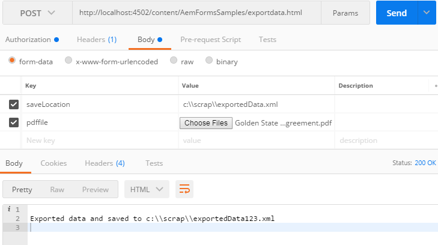

# Developing with Output and Forms Services in AEM Forms{#developing-with-output-and-forms-services-in-aem-forms}

Using Output and Forms Service API in AEM Forms

In this article we will take a look at the following

* Output Service - Typically this service is used to merge xml data with xdp template or pdf to generate flattened pdf. For more details, please refer to this [javadoc](https://helpx.adobe.com/experience-manager/6-5/forms/javadocs/index.html?com/adobe/fd/output/api/OutputService.html) for the Output service.
* FormsService - This is a very versatile service which allows you to export/import data from and into PDF file. For more details, please refer to this [javadoc](https://developer.adobe.com/experience-manager/reference-materials/6-5/forms/javadocs/index.html?com/adobe/fd/output/api/OutputService.html
) for the the Forms service.


The following code snippet exports data from PDF file

```java
javax.servlet.http.Part pdfPart = request.getPart("pdffile");
String filePath = request.getParameter("saveLocation");
java.io.InputStream pdfIS = pdfPart.getInputStream();
com.adobe.aemfd.docmanager.Document pdfDocument = new com.adobe.aemfd.docmanager.Document(pdfIS);
com.adobe.fd.forms.api.FormsService formsservice = sling.getService(com.adobe.fd.forms.api.FormsService.class);
com.adobe.aemfd.docmanager.Document xmlDocument = formsservice.exportData(pdfDocument,com.adobe.fd.forms.api.DataFormat.Auto);
```

Line 1 extracts  pdffile  from the request

Line2 extracts the saveLocation from the request

Line 5 gets hold of FormsService

Line 6 exports the xmlData from the PDF File

**To test the sample package on your system**

[Download and install the package using the AEM package manager](assets/outputandformsservice.zip)


**After you install the package you will have to allowlist the following URLs in Adobe Granite CSRF Filter.**

1. Please follow the steps mentioned below to allowlist the paths mentioned above.
1. [Login to configMgr](http://localhost:4502/system/console/configMgr)
1. Search for Adobe Granite CSRF Filter
1. Add the following 3 paths in the excluded sections and save
1. /content/AemFormsSamples/mergedata 
1. /content/AemFormsSamples/exportdata 
1. /content/AemFormsSamples/outputservice 
1. Search for "Sling Referrer filter"
1. Check the "Allow Empty" check box. (This setting should be for testing purposes only)
There are a number of ways to test the sample code. The quickest and easiest is to use Postman app. Postman allows you to make POST requests to your server. Install Postman app on your system. 
Launch the app and enter the following URL to test the export data API

Make sure you have selected "POST" from the drop down list
http://localhost:4502/content/AemFormsSamples/exportdata.html
Make sure you specify "Authorization" as "Basic Auth". Specify the AEM Server username and password
Navigate to the "Body" tab and specify the request parameters as shown in the image below

Then click the Send button

The package contains 3 samples. The following paragraphs explain when to use the output service or Forms Service, the  url  of the service ,input parameters that each service expects

## Merge Data and Flatten Output

* Use Output Service to merge data with  xdp  or pdf document to generate flattened pdf
* **POST URL**: http://localhost:4502/content/AemFormsSamples/outputservice.html
* **Request Parameters -**

    * **xdp_or_pdf_file** : The xdp or pdf file that you want to merge data with
    * **xmlfile**: The xml data file that is merged with xdp_or_pdf_file
    * **saveLocation**: The location to save the rendered document on your file system. For example c:\\documents\\sample.pdf

### Import Data into PDF File

* Use FormsService to import data into PDF file  
* **POST URL** - http://localhost:4502/content/AemFormsSamples/mergedata.html
* **Request Parameters:**

    * **pdffile** : The pdf file that you want to merge data with
    * **xmlfile**: The xml data file that is merged with pdf file
    * **saveLocation**: The location to save the rendered document on your file system. For example `c:\\outputsample.pdf`.

**Export Data from PDF File**
* Use FormsService to export data from PDF File
* **POST UR**L - http://localhost:4502/content/AemFormsSamples/exportdata.html
* **Request Parameters:**

    * **pdffile** : The pdf file that you want to export data from
    * **saveLocation**: The location to save the exported data on your file system. For example c:\\documents\\exported_data.xml

[You could import this postman collection to test the API](assets/document-services-postman-collection.json)
