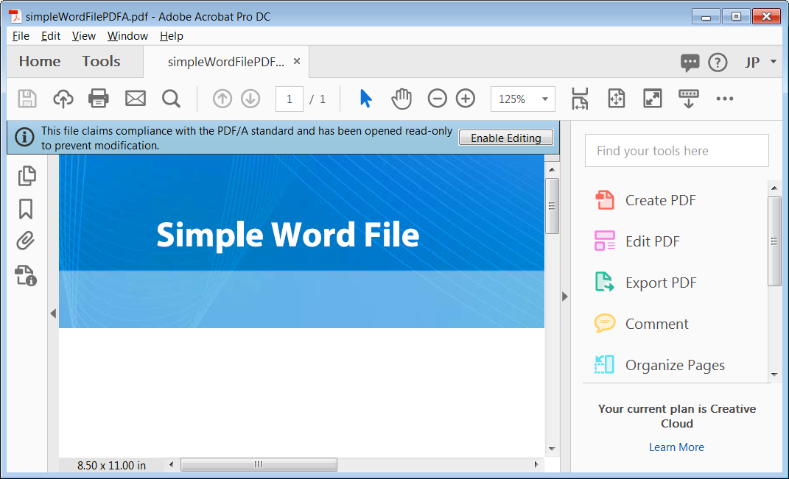
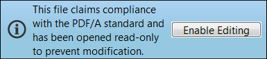

# PDF

Portable Document Format (PDF) is actually a family of file formats, and this article details the ones that are most relevant for form developers. Many of the technical details and standards of different PDF types are evolving and changing. Some of these formats and specifications are International Organization for Standardization (ISO) standards, and some are specific intellectual property owned by Adobe. 

This article shows you how to create various types of PDFs. It helps you understand how and why to use each one. All these types work best in the premier client tool for viewing and working with PDFs—Adobe Acrobat DC.

Following is an example of a PDF/A file in Acrobat DC.

Sample files can be [downloaded from here](assets/pdf-file-types.zip)

## Xml Forms Architecture PDF

Adobe uses the term PDF form to refer to the interactive and dynamic Forms you create with AEM Forms Designer. The Forms and files you create with Designer are based on Adobe’s XML Forms Architecture (XFA). In many ways, the XFA PDF file format is closer to an HTML file than it is to a traditional PDF file. For example, the following code shows you what a simple text object Looks like in an XFA PDF file.

XFA Forms are XML based. This well-structured and flexible format enables an AEM Forms Server to transform your Designer files into different formats, including traditional PDF, PDF/A, and HTML. You can see the Complete XML structure of your Forms in Designer by selecting the XML Source tab of the Layout Editor. You can create both static and dynamic XFA Forms in AEM Forms Designer.

## Static PDF

Static XFA PDF forms layout never changes at runtime, but they can be interactive for the user. The following are a few advantages of static XFA PDF forms:

* Static XFA PDF forms layout never changes at runtime, but they can be interactive for the user. 
* Static Forms support Acrobat’s Comment and Markup tools.
* Static Forms enable you to import and export Acrobat comments.
* Static Forms support font sub setting which is a technique that can be done on an AEM Forms Server.
* Static Forms can be rendered using the built-in PDF viewer that comes with modern browsers.

>[!NOTE]
>
> You can create static PDFs using AEM Forms Designer by saving the XDP as Adobe Static PDF Form

## PDF formats

Portable Document Format (PDF) is actually a family of file formats, and this article details the ones that are most relevant for form developers. Many of the technical details and standards of different PDF types are evolving and changing. Some of these formats and specifications are International Organization for Standardization (ISO) standards, and some are specific intellectual property owned by Adobe. 

This article shows you how to create various types of PDFs. It will help you understand how and why to use each one. All these types work best in the premier client tool for viewing and working with PDFs—Adobe Acrobat DC.

This is an example of a PDF/A file in Acrobat DC.

Sample files can be [downloaded from here](assets/pdf-file-types.zip)

### XFA PDF

Adobe uses the term PDF form to refer to the interactive and dynamic forms you create with AEM Forms Designer. It’s important to note that there’s another type of PDF form, called an Acroform, that’s different from the PDF forms you create in AEM Forms Designer. The forms and files you create with Designer are based on Adobe’s XML Forms Architecture (XFA). In many ways, the XFA PDF file format is closer to an HTML file than it is to a traditional PDF file. For instance, the following code shows you what a simple text object looks like in an XFA PDF file.

As you can see, XFA forms are XML based. This well-structured and flexible format enables an AEM Forms Server to transform your Designer files into different formats, including traditional PDF, PDF/A and HTML. You can see the complete XML structure of your forms in Designer by selecting the XML Source tab of the Layout Editor. You can create both static and dynamic XFA forms in AEM Forms Designer.

### Static PDF

Static XFA PDF forms won’t change their layout at runtime, but they can be interactive for the user. The following are a few advantages of static XFA PDF forms:

* Static XFA PDF forms won’t change their layout at runtime, but they can be interactive for the user. 
* Static forms support Acrobat’s Comment and Markup tools.
* Static forms enable you to import and export Acrobat comments.
* Static forms support font sub setting which is a technique that can be done on an AEM Forms server.
* Static forms can be rendered using the in built pdf viewer that comes with modern browsers.

>[!NOTE]
> You can create static pdfs using AEM Forms Designer by saving the XDP as Adobe Static PDF Form

### Dynamic Forms

Dynamic XFA PDFs can change their layout at runtime, so the commenting and markup features aren’t supported. However, dynamic XFA PDFs do offer the following advantages:

* Dynamic forms support client-side scripts that change the layout and pagination of the form. For instance, the Purchase Order.xdp will expand and paginate to accommodate an endless amount of data if you save it as a dynamic form
* Dynamic forms support all the properties of your form at runtime, whereas static forms support only a subset

>[!NOTE]
>
> You can create dynamic pdfs using AEM Forms Designer by saving the XDP as Adobe Dynamic XML Form

>[!NOTE]
>
> Dynamic forms cannot be rendered using the in built pdf viewers of the modern browsers.

### PDF File (Traditional PDF)

A Certified Document provides PDF document and Forms recipients with added assurances of its authenticity and integrity.

The most popular and pervasive PDF format is the traditional PDF file. There are many ways of creating a traditional PDF file, including using Acrobat and many third-party tools. Acrobat provides all the following ways to create traditional PDF files. If you don’t have Acrobat installed, you may not see these options on your computer.

* By capturing the print stream of a desktop application: Choose the Print command of an authoring application and select the Adobe PDF printer icon. Instead of a printed copy of your document, you’ll have created a PDF file of your document
* By using the Acrobat PDFMaker plug-in with Microsoft Office applications: When you install Acrobat, it adds an Adobe PDF menu to Microsoft Office applications and an icon to the Office ribbon. You can use these added features to create PDF files directly in Microsoft Office
* By using Acrobat Distiller to convert Postscript and Encapsulated Postscript (EPS) files into PDFs: Distiller is typically used in print publishing and other workflows that require a conversion from the Postscript format to the PDF format
* Under the hood, a traditional PDF is very different than an XFA PDF. It doesn’t have the same XML structure, and since it’s created by capturing the print stream of a file, a traditional PDF is a static and read-only file.

A Certified Document provides PDF document and forms recipients with added assurances of its authenticity and integrity.

### Acroforms

Acroforms are Adobe’s older interactive form technology; they date back to Acrobat version 3. Adobe provides the [Acrobat Forms API Reference](assets/FormsAPIReference.pdf), dated May 2003, to provide the technical details for this technology. Acroforms are a combination of the
following items:

* A traditional PDF that defines the static layout and graphics of the form.
* Interactive form fields that are bolted on top with the form tools of the Adobe Acrobat program. These form tools are a small subset of what’s available in AEM Forms Designer.

### PDF/A (PDFs for Archive)

PDF/A (PDF for Archives) builds on the document storage benefits of traditional PDFs with many specific details that enhance long-term archiving. The traditional PDF file format offers many benefits for long-term document storage. The compact nature of PDF facilitates easy transfer and conserves space, and its well-structured nature enables powerful indexing and search capabilities. Traditional PDF has extensive support for metadata, and PDF has a long history of supporting different computer environments.

Like PDF, PDF/A is an ISO standard specification. It was developed by a task force that included AIIM (Association for Information and Image Management), NPES (National Printing Equipment Association), and the Administrative Office of the U.S. Courts. Since the goal of the PDF/A specification is to provide a long-term archive format, many PDF features are omitted so the files can be self-contained. The following are some key points about the specification that enhance the long-term reproducibility of the PDF/A file:  

* All content must be contained in the file, and there can be no dependencies on external sources like hyperlinks, fonts, or software programs.
* All fonts must be embedded, and they need to be fonts that have an unlimited-use license for electronic documents.
* JavaScript isn’t allowed
* Transparency isn’t allowed
* Encryption isn’t allowed
* Audio and video content aren’t allowed
* Color spaces must be defined in a device-independent way
* All metadata must follow certain standards

### Viewing a PDF/A file

Two files in the sample files were created from the same Microsoft Word file. One was created as a traditional PDF and the other as a PDF/A file. Open these two files in Acrobat Professional:

* simpleWordFile.pdf
* simpleWordFilePDFA.pdf

Although the documents Look the same, the PDF/A file opens with a blue bar across the top, indicating that you’re viewing this document in PDF/A mode. This blue bar is Acrobat’s document message bar, which you see when you open certain types of PDF files.

The document message bar includes instructions, and possibly buttons, to help you complete a task. It’s color-coded, and you’ll see the blue color when you open special types of PDFs (like this PDF/A file) as well as certified and digitally signed PDFs. The bar changes to purple for PDF forms and to yellow when you’re participating in a PDF review.

>[!NOTE]
>
> If you click Enable Editing, you take this document out of PDF/A compliance.

