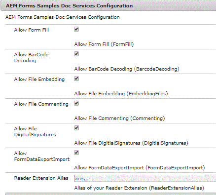

# Rendering XDP into PDF with Usage Rights{#rendering-xdp-into-pdf-with-usage-rights}

A common use case is to render xdp into PDF and apply Reader Extensions to the rendered PDF.

For example in forms portal of AEM Forms, When a user clicks on XDP, we can render XDP as PDF and reader extend the PDF.

To test this capability, you can try this [link](https://forms.enablementadobe.com/content/samples/samples.html?query=0#collapse2). The sample name is "Render and Reader Extend XDP"

To accomplish this use case we need to do the following.

* Add the Reader Extensions certificate to "fd-service" user. The steps to add Reader Extensions credential are listed [here](https://experienceleague.adobe.com/docs/experience-manager-65/forms/install-aem-forms/osgi-installation/install-configure-document-services.html?lang=en)

* Create a custom OSGi service that will render and apply usage rights. The code to accomplish this is listed below

## Render XDP and Apply usage rights {#render-xdp-and-apply-usage-rights}

* Line 7: Using the  FormsService's  renderPDFForm we generate PDF from the XDP.

* Lines 8-14: The appropriate usage rights are set. These usage rights are fetched from the OSGi configuration settings.

* Line 20 : Use the resourceresolver associated with service user fd-service

* Line 24: DocumentAssuranceService's  secureDocument  method is used to apply the usage rights

```java
 public Document renderAndExtendXdp(String xdpPath) {
  // TODO Auto-generated method stub
  log.debug("In renderAndExtend xdp the alias is " + docConfig.ReaderExtensionAlias());
  PDFFormRenderOptions renderOptions = new PDFFormRenderOptions();
  renderOptions.setAcrobatVersion(AcrobatVersion.Acrobat_11);
  try {
   Document xdpRenderedAsPDF = formsService.renderPDFForm("crx://" + xdpPath, null, renderOptions);
   UsageRights usageRights = new UsageRights();
   usageRights.setEnabledBarcodeDecoding(docConfig.BarcodeDecoding());
   usageRights.setEnabledFormFillIn(docConfig.FormFill());
   usageRights.setEnabledComments(docConfig.Commenting());
   usageRights.setEnabledEmbeddedFiles(docConfig.EmbeddingFiles());
   usageRights.setEnabledDigitalSignatures(docConfig.DigitialSignatures());
   usageRights.setEnabledFormDataImportExport(docConfig.FormDataExportImport());
   ReaderExtensionsOptionSpec reOptionsSpec = new ReaderExtensionsOptionSpec(usageRights, "Sample ARES");
   UnlockOptions unlockOptions = null;
   ReaderExtensionOptions reOptions = ReaderExtensionOptions.getInstance();
   reOptions.setCredentialAlias(docConfig.ReaderExtensionAlias());
   log.debug("set the credential");
   reOptions.setResourceResolver(getResolver.getFormsServiceResolver());
   
   reOptions.setReOptions(reOptionsSpec);
   log.debug("set the resourceResolver and re spec");
   xdpRenderedAsPDF = docAssuranceService.secureDocument(xdpRenderedAsPDF, null, null, reOptions,
     unlockOptions);

   return xdpRenderedAsPDF;
  } catch (FormsServiceException e) {
   // TODO Auto-generated catch block
   e.printStackTrace();
  } catch (Exception e) {
   // TODO Auto-generated catch block
   e.printStackTrace();
  }
  return null;

 }

```

The following screenshot shows you the configuration properties exposed. Most of the common usage rights are exposed through this configuration.



The following code shows you the code that is used to build the OSGi configuration settings

```java
package com.aemformssamples.configuration;

import org.osgi.service.metatype.annotations.AttributeDefinition;
import org.osgi.service.metatype.annotations.AttributeType;
import org.osgi.service.metatype.annotations.ObjectClassDefinition;

@ObjectClassDefinition(name = "AEM Forms Samples Doc Services Configuration", description = "AEM Forms Samples Doc Services Configuration")
public @interface DocSvcConfiguration {
 @AttributeDefinition(name = "Allow Form Fill", description = "Allow Form Fill", type = AttributeType.BOOLEAN)
 boolean FormFill() default false;

 @AttributeDefinition(name = "Allow BarCode Decoding", description = "Allow BarCode Decoding", type = AttributeType.BOOLEAN)
 boolean BarcodeDecoding() default false;

 @AttributeDefinition(name = "Allow File Embedding", description = "Allow File Embedding", type = AttributeType.BOOLEAN)
 boolean EmbeddingFiles() default false;

 @AttributeDefinition(name = "Allow Commenting", description = "Allow Commenting", type = AttributeType.BOOLEAN)
 boolean Commenting() default false;

 @AttributeDefinition(name = "Allow DigitialSignatures", description = "Allow File DigitialSignatures", type = AttributeType.BOOLEAN)
 boolean DigitialSignatures() default false;

 @AttributeDefinition(name = "Allow FormDataExportImport", description = "Allow FormDataExportImport", type = AttributeType.BOOLEAN)
 boolean FormDataExportImport() default false;

 @AttributeDefinition(name = "Reader Extension Alias", description = "Alias of your Reader Extension")
 String ReaderExtensionAlias() default "";

}

```

## Create Servlet to Stream the PDF {#create-servlet-to-stream-the-pdf}

The next step is to create a servlet with a GET method to return the reader extended PDF to the user. In this case, the user will be asked to save the PDF to their file system. This is because the PDF is rendered as dynamic PDF and the pdf viewers that come with the browsers do not handle dynamic pdf's.

The following is the code for the servlet. We pass the path of the XDP in the CRX repository to this servlet.

We then call the renderAndExtendXdp method of com.aemformssamples.documentservices.core.DocumentServices.

The reader extended PDF is then streamed to the calling application

```java
package com.aemformssamples.documentservices.core.servlets;

import java.io.IOException;
import java.io.InputStream;
import java.io.OutputStream;

import javax.servlet.Servlet;

import org.apache.sling.api.SlingHttpServletRequest;
import org.apache.sling.api.SlingHttpServletResponse;
import org.apache.sling.api.servlets.SlingSafeMethodsServlet;
import org.osgi.service.component.annotations.Component;
import org.osgi.service.component.annotations.Reference;
import org.slf4j.Logger;
import org.slf4j.LoggerFactory;

import com.adobe.aemfd.docmanager.Document;
import com.adobe.fd.forms.api.FormsService;
import com.aemformssamples.documentservices.core.DocumentServices;

@Component(service = Servlet.class, property = {

  "sling.servlet.methods=get",

  "sling.servlet.paths=/bin/renderandextend"

})
public class RenderAndReaderExtend extends SlingSafeMethodsServlet {
 @Reference
 FormsService formsService;
 @Reference
 DocumentServices documentServices;
 private static final Logger log = LoggerFactory.getLogger(RenderAndReaderExtend.class);
 private static final long serialVersionUID = 1L;

 protected void doGet(SlingHttpServletRequest request, SlingHttpServletResponse response) {
  log.debug("The path of the XDP I got was " + request.getParameter("xdpPath"));
  Document renderedPDF = documentServices.renderAndExtendXdp(request.getParameter("xdpPath"));
  response.setContentType("application/pdf");
  response.addHeader("Content-Disposition", "attachment; filename=AemFormsRocks.pdf");
  try {
   response.setContentLength((int) renderedPDF.length());
   InputStream fileInputStream = null;
   fileInputStream = renderedPDF.getInputStream();
   OutputStream responseOutputStream = null;
   responseOutputStream = response.getOutputStream();
   int bytes;
   while ((bytes = fileInputStream.read()) != -1) {
    {
     responseOutputStream.write(bytes);
    }

   }
  } catch (IOException e2) {
   // TODO Auto-generated catch block
   e2.printStackTrace();
  }

 }

}

```

To test this on your local server, please follow the following steps
1. [Download and Install the DevelopingWithServiceUser Bundle](/help/forms/assets/common-osgi-bundles/DevelopingWithServiceUser.jar)
1. [Download and Install the AEMFormsDocumentServices Bundle](/help/forms/assets/common-osgi-bundles/AEMFormsDocumentServices.core-1.0-SNAPSHOT.jar)

1. [Downlaod the custom portal template html](assets/render-and-extend-template.zip)
1. [Download and import the assets related to this article into AEM using package manager](assets/renderandextendxdp.zip)
    * This package has sample portal and xdp file
1. Add Reader Extensions certificate to "fd-service" user
1. Point your browser to [portal web page](http://localhost:4502/content/AemForms/ReaderExtensionsXdp.html)
1. Click the pdf icon to render the xdp and get pdf which is Reader Extended


