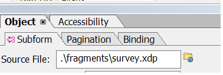
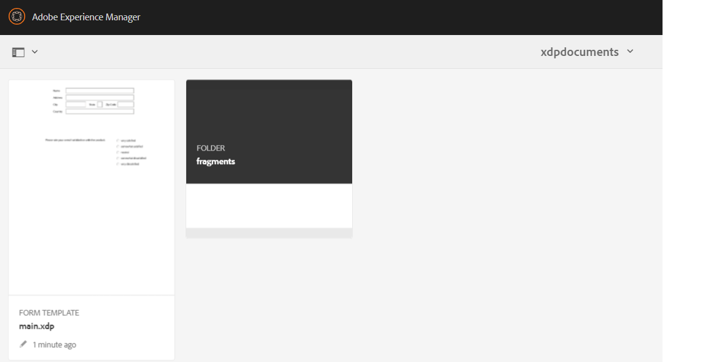
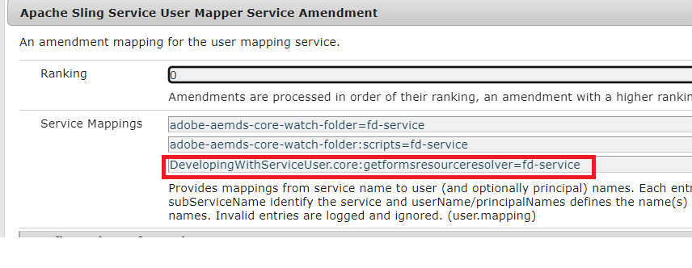

# Generating pdf document with fragments using ECMA script{#developing-with-output-and-forms-services-in-aem-forms}


In this article we will use output service to generate pdf files using xdp fragments. The main xdp and the fragments reside in the crx repository. It is important to mimic the file system folder structure in AEM. For example if you are using a fragment in fragments folder in your xdp you must create a folder called **fragments** under your base folder in AEM. The base folder will contain your base xdp template. For example if you have the following structure on your file system
*  c:\xdptemplates - This will contain your base xdp template
* c:\xdptemplates\fragments - This folder will contain fragments and the main template will reference the fragment as shown below
.
* The folder xdpdocuments will contain your base template and the fragments in **fragments** folder

You can create the required structure using the [forms and document ui](http://localhost:4502/aem/forms.html/content/dam/formsanddocuments)

The following is the folder structure for the sample xdp which uses 2 fragments



* Output Service - Typically this service is used to merge xml data with xdp template or pdf to generate flattened pdf. For more details, please refer to the [javadoc](https://helpx.adobe.com/experience-manager/6-5/forms/javadocs/index.html?com/adobe/fd/output/api/OutputService.html) for the Output service. In this sample we are using fragments residing in the crx repository. 


The following ECMA script was used generate PDF. Notice the use of ResourceResolver and  ResourceResolverHelper in the code. The ResourceReolver is needed as this code is running outside of any user context.

```java
var inputMap = processorContext.getInputMap();
var itr = inputMap.entrySet().iterator();
var entry = inputMap.entrySet().iterator().next();
var xmlData = inputMap.get(entry.getKey());
log.info("Got XML Data File");

var resourceResolverHelper = sling.getService(Packages.com.adobe.granite.resourceresolverhelper.ResourceResolverHelper);
var aemDemoListings = sling.getService(Packages.com.mergeandfuse.getserviceuserresolver.GetResolver);
log.info("Got service resolver");
var resourceResolver = aemDemoListings.getFormsServiceResolver();
//The ResourceResolverHelper execute's the following code within the context of the resourceResolver 
resourceResolverHelper.callWith(resourceResolver, {call: function()
       {
             //var statement = new Packages.com.adobe.aemfd.docmanager.Document("/content/dam/formsanddocuments/xdpdocuments/main.xdp",resourceResolver);
               var outputService = sling.getService(Packages.com.adobe.fd.output.api.OutputService);
            var pdfOutputOptions = new Packages.com.adobe.fd.output.api.PDFOutputOptions();
            pdfOutputOptions.setContentRoot("crx:///content/dam/formsanddocuments/xdpdocuments");
            pdfOutputOptions.setAcrobatVersion(Packages.com.adobe.fd.output.api.AcrobatVersion.Acrobat_11);
            var dataMergedDocument = outputService.generatePDFOutput("main.xdp",xmlData,pdfOutputOptions);
               //var dataMergedDocument = outputService.generatePDFOutput(statement,xmlData,pdfOutputOptions);
            processorContext.setResult("mergeddocument.pdf",dataMergedDocument);
            log.info("Generated the pdf document with fragments");
      }

 });
```

**To test the sample package on your system**
* [Deploy the DevelopingWithServiceUSer bundle](assets/DevelopingWithServiceUser.jar)
* Add the entry **DevelopingWithServiceUser.core:getformsresourceresolver=fd-service** in the user mapper service amendment as shown in the screenshot below

* [Download and import the sample xdp files and ECMA scripts](assets/watched-folder-fragments-ecma.zip).
This will create a watched folder structure in your c:/fragmentsandoutputservice folder

* [Extract the sample data file](assets/usingFragmentsSampleData.zip) and place it in the install folder of your watched folder(c:\fragmentsandoutputservice\install)

* Check the results folder of your watched folder configuration for the generated pdf file
