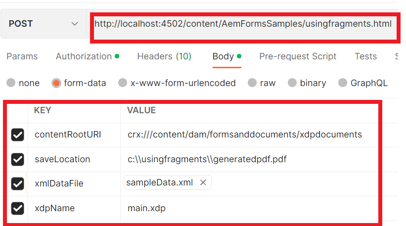

# Generating pdf documents using fragments{#developing-with-output-and-forms-services-in-aem-forms}


In this article we will use output service to generate pdf files using xdp fragments. The main xdp and the fragments reside in the crx repository. It is important to mimic the file system folder structure in AEM. For example if you are using a fragment in fragments folder in your xdp you must create a folder called **fragments** under your base folder in AEM. The base folder will contain your base xdp template. For example if you have the following structure on your file system
*  c:\xdptemplates - This will contain your base xdp template
* c:\xdptemplates\fragments - This folder will contain fragments and the main template will reference the fragment as shown below
.
* The folder xdpdocuments will contain your base template and the fragments in **fragments** folder

You can create the required structure using the [forms and document ui](http://localhost:4502/aem/forms.html/content/dam/formsanddocuments)

The following is the folder structure for the sample xdp which uses 2 fragments


* Output Service - Typically this service is used to merge xml data with xdp template or pdf to generate flattened pdf. For more details, please refer to the [javadoc](https://helpx.adobe.com/experience-manager/6-5/forms/javadocs/index.html?com/adobe/fd/output/api/OutputService.html) for the Output service. In this sample we are using fragments residing in the crx repository. 


The following code was used to include fragments in the PDF file

```java
System.out.println("I am in using fragments POST.jsp");
// contentRootURI is the base folder. All fragments are relative to this folder
String contentRootURI = request.getParameter("contentRootURI");
String xdpName = request.getParameter("xdpName");
javax.servlet.http.Part xmlDataPart = request.getPart("xmlDataFile");
System.out.println("Got xml file");
String filePath = request.getParameter("saveLocation");
java.io.InputStream xmlIS = xmlDataPart.getInputStream();
com.adobe.aemfd.docmanager.Document xmlDocument = new com.adobe.aemfd.docmanager.Document(xmlIS);
com.adobe.fd.output.api.OutputService outputService = sling.getService(com.adobe.fd.output.api.OutputService.class);

if (outputService == null) {
  System.out.println("The output service is  null.....");
} else {
  System.out.println("The output service is  not null.....");

}
com.adobe.fd.output.api.PDFOutputOptions pdfOptions = new com.adobe.fd.output.api.PDFOutputOptions();
pdfOptions.setAcrobatVersion(com.adobe.fd.output.api.AcrobatVersion.Acrobat_11);

pdfOptions.setContentRoot(contentRootURI);

com.adobe.aemfd.docmanager.Document generatedDocument = outputService.generatePDFOutput(xdpName, xmlDocument, pdfOptions);
generatedDocument.copyToFile(new java.io.File(filePath));
out.println("Document genreated and saved to " + filePath);
```

**To test the sample package on your system**

* [Download and import the sample xdp files into AEM](assets/xdp-templates-fragments.zip)
* [Download and install the package using the AEM package manager](assets/using-fragments-assets.zip)
* [The sample xdp and fragments can be downloaded from here](assets/xdptemplates.zip)

**After you install the package you will have to allowlist the following URLs in Adobe Granite CSRF Filter.**

1. Please follow the steps mentioned below to allowlist the paths mentioned above.
1. [Login to configMgr](http://localhost:4502/system/console/configMgr)
1. Search for Adobe Granite CSRF Filter
1. Add the following path in the excluded sections and save
1. /content/AemFormsSamples/usingfragments

There are a number of ways to test the sample code. The quickest and easiest is to use Postman app. Postman allows you to make POST requests to your server. Install Postman app on your system. 
Launch the app and enter the following URL to test the export data API

Make sure you have selected "POST" from the drop down list
http://localhost:4502/content/AemFormsSamples/usingfragments.html
Make sure you specify "Authorization" as "Basic Auth". Specify the AEM Server username and password
Navigate to the "Body" tab and specify the request parameters as shown in the image below

Then click the Send button

[You could import this postman collection to test the API](assets/usingfragments.postman_collection.json)
