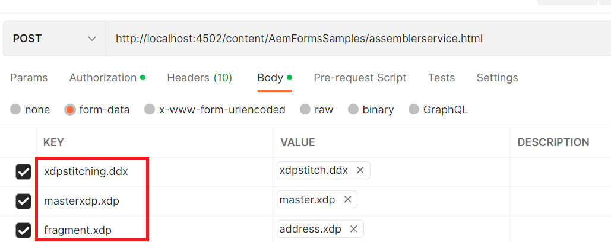

# XDP Stitching using assembler sevice

This article provides you the assets for demonstrating the ability to stitch xdp documents using assembler service.
The following jsp code was written to insert a subform called **address** from xdp document called address.xdp into an insertion point called **address** in master.xdp document. The resulting xdp was saved in the root folder of your AEM installation.

Assembler service relies on a valid DDX documents to describe the manipulation of PDF documents. You can refer to the [DDX reference document here](assets/ddxRef.pdf).Page 40 has information on xdp stitching.

```java

    javax.servlet.http.Part ddxFile = request.getPart("xdpstitching.ddx");
    System.out.println("Got DDX");
    java.io.InputStream ddxIS = ddxFile.getInputStream();
    com.adobe.aemfd.docmanager.Document ddxDocument = new com.adobe.aemfd.docmanager.Document(ddxIS);
    javax.servlet.http.Part masterXdpPart = request.getPart("masterxdp.xdp");
    System.out.println("Got master xdp");
    java.io.InputStream masterXdpPartIS = masterXdpPart.getInputStream();
    com.adobe.aemfd.docmanager.Document masterXdpDocument = new com.adobe.aemfd.docmanager.Document(masterXdpPartIS);

    javax.servlet.http.Part fragmentXDPPart = request.getPart("fragment.xdp");
    System.out.println("Got fragment.xdp");
    java.io.InputStream fragmentXDPPartIS = fragmentXDPPart.getInputStream();
    com.adobe.aemfd.docmanager.Document fragmentXdpDocument = new com.adobe.aemfd.docmanager.Document(fragmentXDPPartIS);

    java.util.Map < String, Object > mapOfDocuments = new java.util.HashMap < String, Object > ();
    mapOfDocuments.put("master.xdp", masterXdpDocument);
    mapOfDocuments.put("address.xdp", fragmentXdpDocument);
    com.adobe.fd.assembler.service.AssemblerService assemblerService = sling.getService(com.adobe.fd.assembler.service.AssemblerService.class);
    if (assemblerService != null)
      System.out.println("Got assembler service");

    com.adobe.fd.assembler.client.AssemblerOptionSpec aoSpec = new com.adobe.fd.assembler.client.AssemblerOptionSpec();
    aoSpec.setFailOnError(true);

    com.adobe.fd.assembler.client.AssemblerResult assemblerResult = assemblerService.invoke(ddxDocument, mapOfDocuments, aoSpec);
    com.adobe.aemfd.docmanager.Document finalXDP = assemblerResult.getDocuments().get("stitched.xdp");
    finalXDP.copyToFile(new java.io.File("stitched.xdp"));

```

The DDX file to insert fragments into another xdp is listed below. The DDX inserts the subform  **address** from address.xdp into the insertion point called **address** in the master.xdp. The resulting document named **stitched.xdp** is saved to the file system.

``` xml
<?xml version="1.0" encoding="UTF-8"?> 
<DDX xmlns="http://ns.adobe.com/DDX/1.0/"> 
        <XDP result="stitched.xdp"> 
           <XDP source="master.xdp"> 
            <XDPContent insertionPoint="address" source="address.xdp" fragment="address"/> 
         </XDP> 
        </XDP>         
</DDX>

```

To get this capability working on your AEM Server

* Download [XDP Stitching package](assets/xdp-stitching.zip) to your local system.
* Upload and install the package using the [package manager](http://localhost:4502/crx/packmgr/index.jsp)
* [Extract the content of this zip file](assets/xdp-and-ddx.zip) to get the sample xdp's and DDX file

**After you install the package you will have to allowlist the following URLs in Adobe Granite CSRF Filter.**

1. Please follow the steps mentioned below to allowlist the paths mentioned above.
1. [Login to configMgr](http://localhost:4502/system/console/configMgr)
1. Search for Adobe Granite CSRF Filter
1. Add the following path in the excluded sections and save `/content/AemFormsSamples/assemblerservice`
1. Search for "Sling Referrer filter"
1. Check the "Allow Empty" check box. (This setting should be for testing purposes only)
There are a number of ways to test the sample code. The quickest and easiest is to use Postman app. Postman allows you to make POST requests to your server. Install Postman app on your system. 
Launch the app and enter the following URL to test the export data API
http://localhost:4502/content/AemFormsSamples/assemblerservice.html

Provide the following input paramters as specified in the screen shot. You can use the sample documents you downloaded earlier,


>[!NOTE]
>
>Make sure your AEM Forms install is complete. All your bundles need to be in active state.
>
