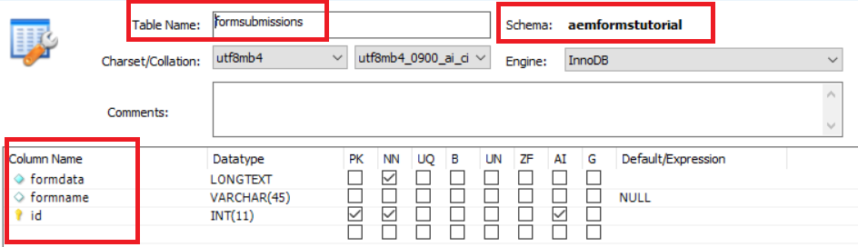

# Introduction

Customers typically want to export the submitted form data in CSV format. This article will highlight the steps needed to export the form data in CSV format. This article assumes the form submissions are stored in RDBMS table. The following screenshot details the minimum table structure required to store the form submissions.

>[!NOTE]
>
>This sample works only with Adaptive Forms not based on Schema or Form Data Model


As you can see the name of the schema is aemformstutorial.Inside this schema is the table formsubmissions with the following columns defined

* formdata: This column holds the submitted formdata
* formname: This column holds the name of the form submitted
* id: This is the primary key and is set to auto-increment

The table name and the two-column names are exposed as OSGi configuration properties as shown in the screenshot below:

The code reads these values and construct the appropriate SQL query to execute. For example the following query is executed based on the above values

`SELECT formdata FROM aemformstutorial.formsubmissions where formname=timeoffrequestform`

In the above query the name of the form(timeoffrequestform) is passed as request parameter to the servlet.

## **Create OSGi Service**

The following OSGI service was created to export the submitted data in CSV format.

* Line 37: We are accessing Apache Sling Connection Pooled DataSource. 

* Line 89: This is the entry point to the service.The method `getCSVFile(..)` takes in formName as input parameter and fetches the submitted data pertaining to the given form name.

>[!NOTE]
>
>The code assumes you have defined connection pooled DataSource called "aemformstutorial" in Felix Web Console.The code also assumes that you have a schema in the database called aemformstutorial

```java
package com.aemforms.storeandexport.core;

import java.io.IOException;
import java.io.StringReader;
import java.sql.Connection;
import java.sql.PreparedStatement;
import java.sql.ResultSet;
import java.sql.SQLException;
import java.sql.Statement;
import java.util.ArrayList;
import java.util.List;

import javax.sql.DataSource;
import javax.xml.parsers.DocumentBuilder;
import javax.xml.parsers.DocumentBuilderFactory;
import javax.xml.parsers.ParserConfigurationException;
import javax.xml.xpath.XPath;
import javax.xml.xpath.XPathConstants;
import javax.xml.xpath.XPathExpressionException;
import javax.xml.xpath.XPathFactory;

import org.osgi.service.component.annotations.Component;
import org.osgi.service.component.annotations.Reference;
import org.slf4j.Logger;
import org.slf4j.LoggerFactory;
import org.w3c.dom.Document;
import org.w3c.dom.Node;
import org.w3c.dom.NodeList;
import org.xml.sax.InputSource;
import org.xml.sax.SAXException;

@Component(service = StoreAndExport.class)
public class StoreAndExportImpl implements StoreAndExport {

    private final Logger log = LoggerFactory.getLogger(getClass());
    @Reference
    StoreAndExportConfigurationService config;
    @Reference(target = "(&(objectclass=javax.sql.DataSource)(datasource.name=aemformstutorial))")
    private DataSource dataSource;

    private List<String> getRowValues(String row) {
        List<String> rowValues = new ArrayList<String>();
        //API to obtain DOM Document instance
        DocumentBuilderFactory factory = DocumentBuilderFactory.newInstance();
        DocumentBuilder builder = null;
        try {
            builder = factory.newDocumentBuilder();
            Document doc = builder.parse(new InputSource(new StringReader(row)));
            XPathFactory xpf = XPathFactory.newInstance();
            XPath xpath = xpf.newXPath();
            Node dataNode = (Node) xpath.evaluate("//afData/afUnboundData/data", doc, XPathConstants.NODE);
            NodeList dataElements = dataNode.getChildNodes();
            for (int i = 0; i < dataElements.getLength(); i++) {
                log.debug("The name of the node is" + dataElements.item(i).getNodeName() + " the node value is " + dataElements.item(i).getTextContent());
                rowValues.add(i, dataElements.item(i).getTextContent());
            }
            return rowValues;
        } catch (Exception e) {
            log.debug(e.getMessage());
        }
        return null;
    }

    private List<String> getHeaderValues(String row) {
        DocumentBuilderFactory factory = DocumentBuilderFactory.newInstance();
        List<String> rowValues = new ArrayList<String>();
        DocumentBuilder builder = null;
        try {
            //Create DocumentBuilder with default configuration
            builder = factory.newDocumentBuilder();
            Document doc = builder.parse(new InputSource(new StringReader(row)));
            XPathFactory xpf = XPathFactory.newInstance();
            XPath xpath = xpf.newXPath();
            Node dataNode = (Node) xpath.evaluate("//afData/afUnboundData/data", doc, XPathConstants.NODE);
            NodeList dataElements = dataNode.getChildNodes();
            for (int i = 0; i < dataElements.getLength(); i++) {
                rowValues.add(i, dataElements.item(i).getNodeName());
            }
            return rowValues;
        } catch (Exception e) {
            log.debug(e.getMessage());
        }
        return null;

    }

    @Override
    public StringBuilder getCSVFile(String formName) {
        log.debug("In get CSV File");
        String selectStatement = "SELECT " + config.getFORM_DATA_COLUMN() + " FROM aemformstutorial." + config.getTABLE_NAME() + " where " + config.getFORM_NAME_COLUMN() + "='" + formName + "'" + "";
        log.debug("The select statment is " + selectStatement);
        Connection con = getConnection();
        Statement st = null;
        ResultSet rs = null;
        CSVUtils csvUtils = new CSVUtils();
        try {
            st = con.createStatement();
            rs = st.executeQuery(selectStatement);
            log.debug("Got Result Set in getCSVFile");
            StringBuilder sb = new StringBuilder();
            while (rs.next()) {
                if (rs.isFirst()) {
                    sb = csvUtils.writeLine(getHeaderValues(rs.getString(1)), sb);
                }
                sb = csvUtils.writeLine(getRowValues(rs.getString(1)), sb);
                log.debug("$$$$The current strng buffer is " + sb.toString());
            }

            return sb;
        } catch (Exception e) {
            log.debug(e.getMessage());
        } finally {
            try {
                rs.close();
            } catch (Exception e) { /* ignored */ }
            try {
                st.close();
            } catch (Exception e) { /* ignored */ }
            try {
                con.close();
            } catch (Exception e) { /* ignored */ }
        }

        return null;

    }

    private Connection getConnection() {
        log.debug("Getting Connection ");
        Connection con = null;
        try {
            con = dataSource.getConnection();
            log.debug("got connection");
            return con;
        } catch (Exception e) {
            log.debug("not able to get connection ");
            log.debug(e.getMessage());
        }
        return null;
    }
    
    @Override
    public void inserFormData(String formData) {
        String formDataColumn = config.getFORM_DATA_COLUMN();
        String formNameColumn = config.getFORM_NAME_COLUMN();
        String tableName = config.getTABLE_NAME();
        String insertStatement = "Insert into aemformstutorial." + tableName + "(" + formDataColumn + "," + formNameColumn + ") VALUES(?,?)";
        log.debug("The insert statment is" + insertStatement);
        Connection con = getConnection();
        PreparedStatement pstmt = null;
        try {
            DocumentBuilderFactory factory = DocumentBuilderFactory.newInstance();
            DocumentBuilder builder = null;
            builder = factory.newDocumentBuilder();
            Document xmlDoc = builder.parse(new InputSource(new StringReader(formData)));
            XPath xPath = javax.xml.xpath.XPathFactory.newInstance().newXPath();
            org.w3c.dom.Node submittedFormNameNode = (org.w3c.dom.Node) xPath.compile("/afData/afSubmissionInfo/afPath").evaluate(xmlDoc, javax.xml.xpath.XPathConstants.NODE);
            String paths[] = submittedFormNameNode.getTextContent().split("/");
            String formName = paths[paths.length - 1];
            log.debug("The form name submiited is" + formName);
            pstmt = null;
            pstmt = con.prepareStatement(insertStatement);
            pstmt.setString(1, formData);
            pstmt.setString(2, formName);
            log.debug("Executing the insert statment  " + pstmt.execute());
            con.commit();
        } catch (SQLException e) {
            log.debug(e.getMessage());
        } catch (ParserConfigurationException e) {
            log.debug(e.getMessage());
        } catch (SAXException e) {
            log.debug(e.getMessage());
        } catch (IOException e) {
            log.debug(e.getMessage());
        } catch (XPathExpressionException e) {
            log.debug(e.getMessage());
        } finally {
            try {
                pstmt.close();
            } catch (Exception e) { /* ignored */ }
            try {
                con.close();
            } catch (Exception e) { /* ignored */ }
        }
    }
}
```

## Configuration Service

We have exposed the following three properties as OSGI configuration properties. The SQL query is constructed by reading these values at run time.

```java
package com.aemforms.storeandexport.core;

import org.osgi.service.metatype.annotations.AttributeDefinition;
import org.osgi.service.metatype.annotations.ObjectClassDefinition;

@ObjectClassDefinition(name="Store and Export Configuration", description = "Details on the Database ")
public @interface StoreAndExportConfiguration {
    @AttributeDefinition(name = "Table Name", description = "Name of the table to store the submitted data")
    String tableName() default "formsubmissions";

    @AttributeDefinition(name = "Form Data Column Name", description = "Column name to hold submitted form data")
    String formDataColumn() default "formdata";

    @AttributeDefinition(name = "Form Name Column Name", description = "Column name to hold submitted form name")
    String formNameColumn() default "formname";
}
```

## Servlet

The following is the servlet code which invokes the `getCSVFile(..)` method of the service. The service returns StringBuffer object which is then streamed back to the calling application

```java
package com.aemforms.storeandexport.core.servlets;

import java.io.IOException;
import javax.servlet.Servlet;
import javax.servlet.ServletOutputStream;

import org.apache.sling.api.SlingHttpServletRequest;
import org.apache.sling.api.SlingHttpServletResponse;
import org.apache.sling.api.servlets.SlingAllMethodsServlet;
import org.osgi.service.component.annotations.Component;
import org.osgi.service.component.annotations.Reference;
import com.aemforms.storeandexport.core.StoreAndExport;

@Component(
        service = {Servlet.class}, 
        property = {"sling.servlet.methods=get", "sling.servlet.paths=/bin/streamformdata"}
)
public class StreamCSVFile extends SlingAllMethodsServlet {
    private static final long serialVersionUID = -3703364266795135086L;

    @Reference
    StoreAndExport createCSVFile;

    protected void doGet(SlingHttpServletRequest request, SlingHttpServletResponse response) {
        StringBuilder stringToStream = createCSVFile.getCSVFile(request.getParameter("formName"));
        response.setHeader("Content-Type", "text/csv");
        response.setHeader("Content-Disposition", "attachment;filename=\"formdata.csv\"");
        try {
            final ServletOutputStream sout = response.getOutputStream();
            sout.print(stringToStream.toString());
        } catch (IOException e) {
            log.debug(e.getMessage());
        }
    }
}
```

### Deploy on your server

* Import the [SQL file](assets/formsubmissions.sql) into MySQL server using MySQL Workbench. This creates schema called **aemformstutorial** and table called **formsubmissions** with some sample data.
* Deploy [OSGi Bundle](assets/store-export.jar) using the Felix web console
* [To get TimeOffRequest Submissions](http://localhost:4502/bin/streamformdata?formName=timeoffrequestform). You should get CSV file streamed back to you.
