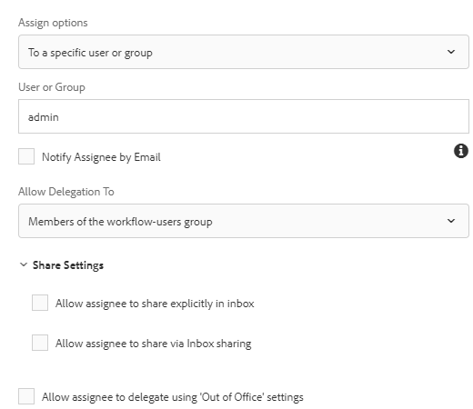

# Creating workflow to review submitted data

Workflows are typically used to route submitted data for review and approval. Workflows are created using the workflow editor in AEM. The Workflows can be triggered on Adaptive Form submission. The following steps will walk you through the process of creating your first workflow.

## Create Workflow Model

* [Open workflow models](http://localhost:4502/libs/cq/workflow/admin/console/content/models.html)
* Click on Create -> Create Model
* Provide a meaningful Title and Name such as _Review Submitted Data_.
* Gently tap the newly created workflow and click on the _Edit_ icon.
* Workflow is opened in edit mode. The workflow by default has one component called _Step1_. Select this component and click delete icon to delete the component.
* Listed on the left are the various workflow components that can be used to build your workflow. You can filter the components by _Forms Workflow_ type.

## Create Variable

* Click on the variable's icon to create new variables. Variables are used to store values. AEM Forms provides a number of variable types that can be created. Today we will create a variable of type XML to hold the Adaptive Form's submitted data. Create a new variable called _submittedData_ of type XML as shown in the image below.

  >[!NOTE]
If the form is based on Form Data Model the submitted data is in JSON format and in that case you will create a variable of type JSON to hold the submitted data.

* Click on the _steps_ icon on the left to list the various workflow components. Drag and drop _Set Variable_ component onto your workflow on the right. Make sure you place the _Set Variable_ component below the Flow Start.
  * Click on the _Set Variable_ component and then click on the _Wrench_ icon to open the property sheet of the component.
  * Click on the Mapping Tab->Add Mapping->Map Variable. Set the values as shown in the screen shot below.

## Add workflow components 

* Drag and drop _Assign Task_ component on to the right - hand side below the _Set Variable_ component.
  * Click on the _Assign Task_ component and then click on the _Wrench_ icon to open the property sheet.
  * Provide meaningful Title to the Assign Task component.
  * Click on Forms and Documents tab and set the following properties as shown in the screen shot

  * _1 By selecting this option the workflow is not coupled with specific Adaptive Form._
  * _2 The workflow engine looks for file called Data.xml relative to the payload in the repository_ 

  * Click on Assignee tab. Here you can assign the task to a user in your organization. For this use case we are going to assign the task to admin user as shown in the screen shot below.

  * Save your changes by clicking on the _Done_ icon of the component
* Click on _Sync_ to generate the runtime model of the workflow.
Your workflow model is now ready and can be associated with Adaptive Form's submit action.

## Configuring Adaptive Form to trigger AEM Workflow

* Open Adaptive Form in edit mode.
* Open the content explorer

* Select Form Container node and open its configuration properties

* Expand the Submission panel
* Set the form's submit action as specified in the above screen shot.
_Please make sure you make a note of the value specified in the Data File Path field. This value must match the value you specify in the pre-populate section of the Assign Task component of your workflow._

Now when you fill and submit your Adaptive Form, the workflow associated with submit action of the form will be triggered.

