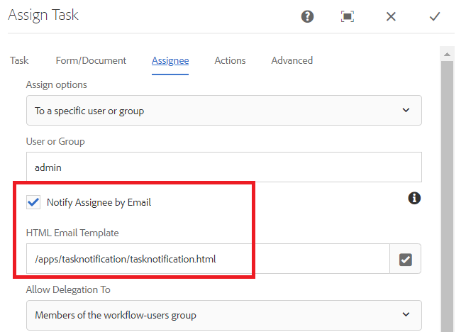
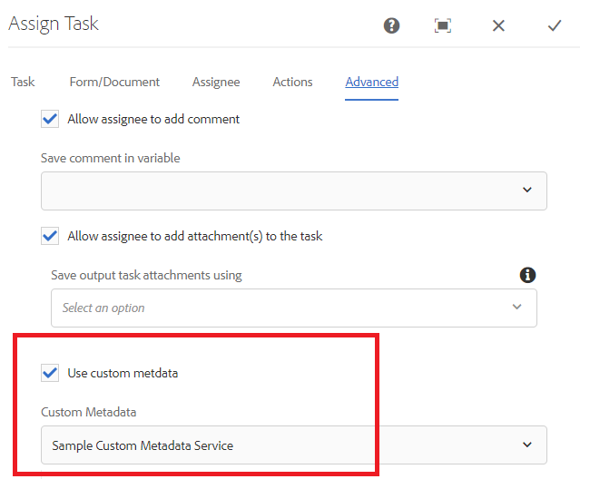
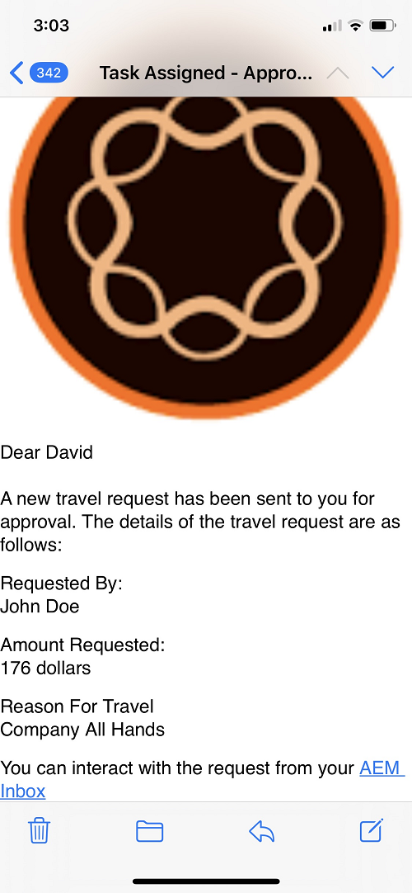

# Customize Assign Task Notification

Assign Task component is used to assign tasks to workflow participants. When a task is assigned to a user or a group a email notification is sent to the defined user or group members.
This e-mail notification will typically contain dynamic data related to the task. This dynamic data is fetched using the system generated [metadata properties](https://experienceleague.adobe.com/docs/experience-manager-65/forms/publish-process-aem-forms/use-metadata-in-email-notifications.html#using-system-generated-metadata-in-an-email-notification).
To include values from the submitted form data in the e-mail notification, we need to create custom metadata property and then use these custom metadata properties in the e-mail template


## Creating custom metadata property

The recommended approach is to create a OSGI component that implements the getUserMetadata method of the [WorkitemUserMetadataService](https://helpx.adobe.com/experience-manager/6-5/forms/javadocs/com/adobe/fd/workspace/service/external/WorkitemUserMetadataService.html#getUserMetadataMap--)

The following code creates 4 metadata properties(_firstName_,_lastName_,_reason_ and _amountRequested_) and sets its value from the submitted data. For example the metadata property _firstName_'s value is set to the value of the element called firstName from the submitted data. The following code assumes the adaptive form's submitted data is in xml format. Adaptive Forms based on JSON schema or Form Data Model generate data in JSON format.


``` java
package com.aemforms.workitemuserservice.core;

import java.io.InputStream;
import java.util.HashMap;
import java.util.Map;

import javax.jcr.Session;
import javax.xml.parsers.DocumentBuilder;
import javax.xml.parsers.DocumentBuilderFactory;
import javax.xml.xpath.XPath;

import org.osgi.framework.Constants;
import org.osgi.service.component.annotations.Component;
import org.slf4j.Logger;
import org.slf4j.LoggerFactory;
import org.w3c.dom.*;


import com.adobe.fd.workspace.service.external.WorkitemUserMetadataService;
import com.adobe.granite.workflow.WorkflowSession;
import com.adobe.granite.workflow.exec.WorkItem;
import com.adobe.granite.workflow.metadata.MetaDataMap;
@Component(property={Constants.SERVICE_DESCRIPTION+"=A sample implementation of a user metadata service.",
Constants.SERVICE_VENDOR+"=Adobe Systems",
"process.label"+"=Sample Custom Metadata Service"})


public class WorkItemUserServiceImpl implements WorkitemUserMetadataService {
private static final Logger log = LoggerFactory.getLogger(WorkItemUserServiceImpl.class);

@Override
public Map<String, String> getUserMetadata(WorkItem workItem, WorkflowSession workflowSession,MetaDataMap metadataMap)
{
HashMap<String, String> customMetadataMap = new HashMap<String, String>();
String payloadPath = workItem.getWorkflowData().getPayload().toString();
String dataFilePath = payloadPath + "/Data.xml/jcr:content";
Session session = workflowSession.adaptTo(Session.class);
DocumentBuilderFactory factory = null;
DocumentBuilder builder = null;
Document xmlDocument = null;
javax.jcr.Node xmlDataNode = null;
try
{
    xmlDataNode = session.getNode(dataFilePath);
    InputStream xmlDataStream = xmlDataNode.getProperty("jcr:data").getBinary().getStream();
    XPath xPath = javax.xml.xpath.XPathFactory.newInstance().newXPath();
    factory = DocumentBuilderFactory.newInstance();
    builder = factory.newDocumentBuilder();
    xmlDocument = builder.parse(xmlDataStream);
    Node firstNameNode = (org.w3c.dom.Node) xPath.compile("afData/afUnboundData/data/firstName")
            .evaluate(xmlDocument, javax.xml.xpath.XPathConstants.NODE);
    log.debug("The value of first name element  is " + firstNameNode.getTextContent());
    Node lastNameNode = (org.w3c.dom.Node) xPath.compile("afData/afUnboundData/data/lastName")
            .evaluate(xmlDocument, javax.xml.xpath.XPathConstants.NODE);
    Node amountRequested = (org.w3c.dom.Node) xPath
            .compile("afData/afUnboundData/data/amountRequested")
            .evaluate(xmlDocument, javax.xml.xpath.XPathConstants.NODE);
    Node reason = (org.w3c.dom.Node) xPath.compile("afData/afUnboundData/data/reason")
            .evaluate(xmlDocument, javax.xml.xpath.XPathConstants.NODE);
    customMetadataMap.put("firstName", firstNameNode.getTextContent());
    customMetadataMap.put("lastName", lastNameNode.getTextContent());
    customMetadataMap.put("amountRequested", amountRequested.getTextContent());
    customMetadataMap.put("reason", reason.getTextContent());
    log.debug("Created  " + customMetadataMap.size() + " metadata  properties");

}
catch (Exception e)
{
    log.debug(e.getMessage());
}
return customMetadataMap;
}

}

```

## Use the custom metadata properties in task notification email template

In the email template you can include the metadata property by using the following syntax where amountRequested is the metadata property `${amountRequested}`

## Configure Assign Task to use custom metadata property

After the OSGi component is built and deployed into AEM server, configure the Assign Task component as shown below to use custom metadata properties.




## Enable the use of custom metadata properties



## To try this on your server

* [Configure Day CQ Mail Service](https://experienceleague.adobe.com/docs/experience-manager-65/administering/operations/notification.html#configuring-the-mail-service)
* Associate a valid e-mail id with [admin user](http://localhost:4502/security/users.html)
* Download and install the [Workflow-and-notification-template](assets/workflow-and-task-notification-template.zip) using [package manager](http://localhost:4502/crx/packmgr/index.jsp)
* Download [Adaptive Form](assets/request-travel-authorization.zip) and import into AEM from the [forms and documents ui](http://localhost:4502/aem/forms.html/content/dam/formsanddocuments).
* Deploy and start the [Custom Bundle](assets/work-items-user-service-bundle.jar) using the [web console](http://localhost:4502/system/console/bundles)
* [Preview and submit the form](http://localhost:4502/content/dam/formsanddocuments/requestfortravelauhtorization/jcr:content?wcmmode=disabled)

On form submission task assignment notification is sent to the e-mail id associated with the admin user. The following screenshot shows you sample task assignment notification



>[!NOTE]
>The email template for the assign task notification needs to be in the following format.
>
> subject=Task Assigned - `${workitem_title}`
>
> message=String representing your email template without any new line characters.

## Task Comments in Assign Task E-mail notification

In some cases, you may want to include the comments of the previous task owner in subsequent task notifications. The code to capture the task's last comment is listed below:

```java
package samples.aemforms.taskcomments.core;

import org.osgi.service.component.annotations.Component;

import java.util.HashMap;
import java.util.List;
import java.util.Map;

import javax.jcr.Session;

import org.osgi.framework.Constants;
import org.slf4j.Logger;
import org.slf4j.LoggerFactory;
import com.adobe.granite.workflow.WorkflowSession;
import com.adobe.granite.workflow.exec.HistoryItem;
import com.adobe.granite.workflow.exec.WorkItem;
import com.adobe.granite.workflow.metadata.MetaDataMap;

import com.adobe.fd.workspace.service.external.WorkitemUserMetadataService;
@Component(property = {
  Constants.SERVICE_DESCRIPTION + "=A sample implementation of a user metadata service.",
  Constants.SERVICE_VENDOR + "=Adobe Systems",
  "process.label" + "=Capture Workflow Comments"
})

public class CaptureTaskComments implements WorkitemUserMetadataService {
  private static final Logger log = LoggerFactory.getLogger(CaptureTaskComments.class);
  @Override
  public Map <String, String> getUserMetadata(WorkItem workItem, WorkflowSession workflowSession, MetaDataMap metadataMap) {
    HashMap < String, String > customMetadataMap = new HashMap < String, String > ();
    workflowSession.adaptTo(Session.class);
    try {
      List <HistoryItem> workItemsHistory = workflowSession.getHistory(workItem.getWorkflow());
      int listSize = workItemsHistory.size();
      HistoryItem lastItem = workItemsHistory.get(listSize - 1);
      String reviewerComments = (String) lastItem.getWorkItem().getMetaDataMap().get("workitemComment");
      log.debug("####The comment I got was ...." + reviewerComments);
      customMetadataMap.put("comments", reviewerComments);
      log.debug("Created  " + customMetadataMap.size() + " metadata  properties");

    } catch (Exception e) {
      log.debug(e.getMessage());
    }
    return customMetadataMap;
  }

}
```

The bundle with the above code can be [downloaded from here](assets/samples.aemforms.taskcomments.taskcomments.core-1.0-SNAPSHOT.jar)
