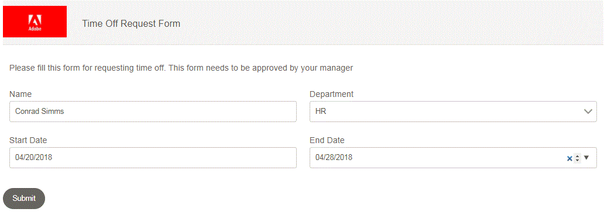

# Submitting Adaptive Form to AEM Workflow {#submitting-adaptive-form-to-aem-workflow}

In this article, we will look at a simple workflow used for requesting Paid Time Off. The business requirements are as follows:

* User A requests time off by filling in an adaptive form. 
* The form is routed to AEM admin user(In real life it will be routed to the submitter's manager)
* Admin opens the form. Admin should not be able to edit any information filled by the submitter. 
* Approver section should be visible to the approver(In this case it is the AEM admin user).

To accomplish the above requirement, we use a hidden field called **initialstep** in the form and its default value is set to Yes.When the form is submitted, the first step in the workflow sets the value of initialstep to No. The form has business rules to hide and show the appropriate sections based on the initialstep value.

>[Video - Configure Form to Trigger AEM Workflow](https://video.tv.adobe.com/v/28406?quality=9)

>[Video - Walkthrough of the workflow](https://video.tv.adobe.com/v/28407?quality=9)

**Submitter's view of the Time Off Request form**

**Approver view of the form**

In the approver view, the approver is not able to edit the submitted data. There is also a new section meant for Approvers only.

To test this workflow on your system, please follow the steps mentioned below:
* [Deploy the SetValue Custom OSGI Bundle](https://forms.enablementadobe.com/content/DemoServerBundles/SetValueApp.core-1.0-SNAPSHOT.jar)
* [Import the assets related to this article into AEM](assets/helpxworkflow.zip) 
* Open the [Time Off Request form](http://localhost:4502/content/dam/formsanddocuments/helpx/timeoffrequestform/jcr:content?wcmmode=disabled)
* Fill in the details and submit
* Open the [inbox](http://localhost:4502/mnt/overlay/cq/inbox/content/inbox.html). You should see a new task assigned. Open the form. The submitter's data should be read-only and a new approver section should be visible.
* Explore the [workflow model](http://localhost:4502/editor.html/conf/global/settings/workflow/models/helpxworkflow.html)
* Explore the process step. This is the step which sets the value of initialstep to No.
