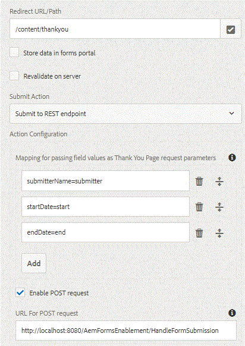

# Submitting To Thank You Page {#submitting-to-thank-you-page}

Submit to REST endpoint option passes the data filled in the form to a configured confirmation page as part of the HTTP GET request. You can add the name of the fields to request. The format of the request is:

\{fieldName\} = \{parameterName\}. For example, the submitterName is the name of an adaptive form field and submitter is the name of the parameter. In thank you page, you can access the submitter parameter using request.getParameter("submitter") to get hold of the submitter name field's value.

submitterName=submitter

In the screenshot below, we are submitting the adaptive form to thank you page located at /content/thankyou. To this thank you page, we are passing 3 request attributes which will hold the form field values.

You can also submit to the external endpoint via POST. To accomplish that, you just have to select the "enable post request" checkbox and provide the URL for the external endpoint. When you submit your form, you will get thank you page and the POST endpoint will be invoked simultaneously.

To test this capability on your server, please follow the instructions mentioned below:

* Import the [assets file associated with this article into AEM using the package manager](assets/submittingtorestendpoint.zip)
* Point your browser to the [Time Off Request Form](http://localhost:4502/content/dam/formsanddocuments/helpx/timeoffrequestform/jcr:content?wcmmode=disabled)
* Fill in the required field and submit the form
* You should get thank you page with your information populated on the page
