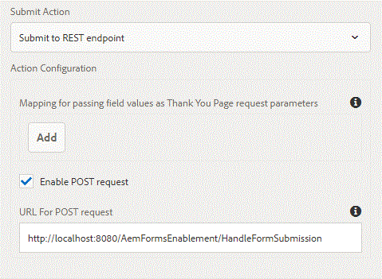

# Submitting Adaptive Form to External Server {#submitting-adaptive-form-to-external-server}

Use Submit to REST Endpoint action to post the submitted data to a REST URL. The URL can be of an internal (the server on which the form is rendered) or an external server.

Typically, customers would want to submit the form data to an external server for further processing.

To post data to an internal server, provide a path of the resource. The data is posted the path of the resource. For example, </content/restEndPoint> . For such post requests, the authentication information of submit request is used.

To post data to an external server, provide a URL. The format of the URL is <http://host:port/path_to_rest_end_point>. Ensure that you have configured the path to handle the POST request anonymously.

For the purpose of this article, I have written a simple war file that can be deployed on your tomcat instance. Assuming your tomcat is running on port 8080, the POST url is going to be

<http://localhost:8080/AemFormsEnablement/HandleFormSubmission>

when you configure your Adaptive Form to submit to this endpoint, the form data and the attachments if any can be extracted in the servlet by the following code

```java
System.out.println("form was submitted");
Part attachment = request.getPart("attachments");
if(attachment!=null)
{
    System.out.println("The content type of the attachment added is "+attachment.getContentType());
}
Enumeration<String> params = request.getParameterNames();
while(params.hasMoreElements())
{
String paramName = params.nextElement();
System.out.println("The param Name is "+paramName);
String data = request.getParameter(paramName);System.out.println("The data  is "+data);
}
```

 
To test this on your server please do the following

1. Install Tomcat if you do not have it already. [Instructions to install tomcat are available here](https://helpx.adobe.com/experience-manager/kt/forms/using/preparing-datasource-for-form-data-model-tutorial-use.html)
1. Download the [zip file](assets/aemformsenablement.zip) associated with this article. Unzip the file to get the war file.
1. Deploy the war file in your tomcat server.
1. Create a simple Adaptive Form with file attachment component and configure its submit action as shown in the screenshot above. The POST URL is <http://localhost:8080/AemFormsEnablement/HandleFormSubmission>. If your AEM and tomcat are not running on localhost, please change the URL accordingly.
1. To enable multipart form data submission to tomcat, please add the following attribute to the context element of the &lt;tomcatInstallDir&gt;\conf\context.xml and restart your Tomcat server.
1. **&lt;Context allowCasualMultipartParsing="true"&gt;**
1. Preview your Adaptive Form,add a attachment and submit. Check the tomcat console window for messages.
