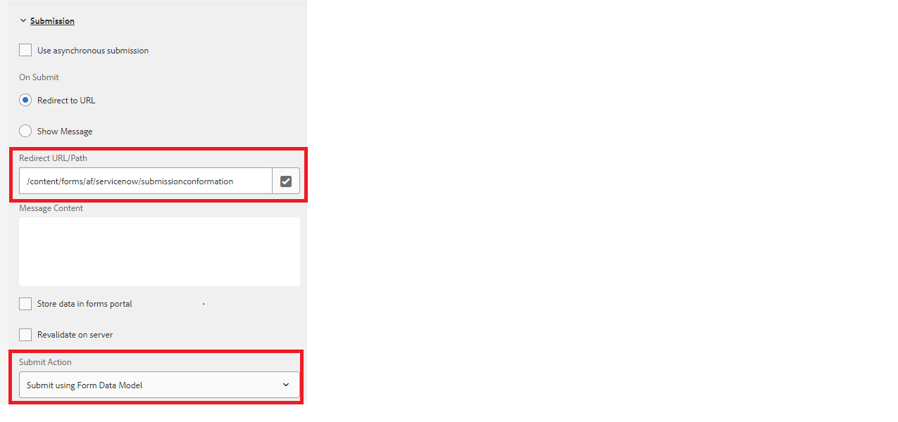

# Customize thank you page

When you are submitting an adaptive form to a REST endpoint, you would want to show a confirmation message letting the user know that their form submission was successful. The POST response contains details about the submission such as submission id and a well designed confirmation message includes the submission ID contributing to a better user experience. This response can be displayed in the thank you page configured with your adaptive form.

The following screen shot shows a form is being submitted using Form Data Model Submit action with a thank you page configured



The POST of an Form Data Model will always return an JSON object in the response. This JSON is available in the Thank You page url as an query parameter called _fdmSubmitResult_. You can parse this query parameter and display the JSON elements in the thank you page. 
The following sample code parses the JSON response to extract the value of the number field. The appropriate xml is then constructed and passed in the slingRequest to populate the form. This code is typically written in the jsp of the page component associated with the Adaptive Form template.

```java
if(request.getParameter("fdmSubmitResult")!=null)
{
    String fdmSubmitResult =  request.getParameter("fdmSubmitResult");
    String status = request.getParameter("status");
    com.google.gson.JsonObject jsonObject = com.google.gson.JsonParser.parseString(fdmSubmitResult).getAsJsonObject();
    String caseNumber = jsonObject.get("result").getAsJsonObject().get("number").getAsString();
    slingRequest.setAttribute("data","<afData><afUnboundData><data><caseNumber>"+caseNumber+"</caseNumber><status>"+status+"</status></data></afUnboundData></afData>");
}

```

It is recommended to base your Thank You page on a new adaptive form template which allows you to write the custom code to extract the response from the query parameters.

## Test the solution

Create an Adaptive Form and configure to submit the form using the form data model submit action. 
[Deploy the sample adaptive form template](assets/thank-you-page-template.zip)
Create an thank you form based on this template
Associate this thank you page with your main form
Modify the jsp code in the [createXml.jsp](http://localhost:4502/apps/thank-you-page-template/component/page/thankyoupage/createxml.jsp) to build the xml needed to prefill your adaptive form.
Preview and submit your adaptive form. 
The thank you page should be displayed and prepopulated with data as specified in the XML
